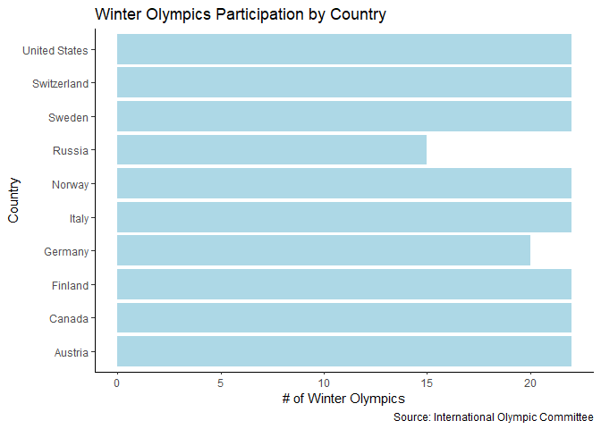
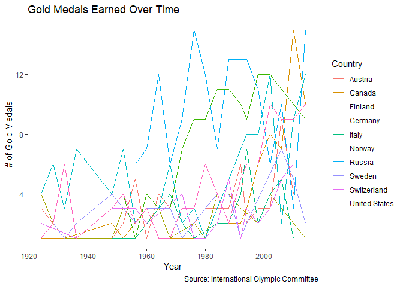
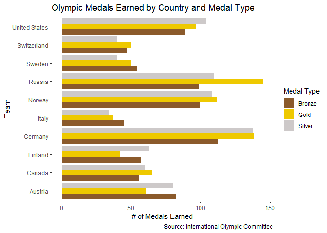
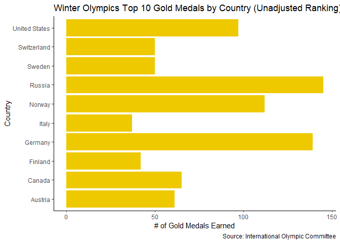
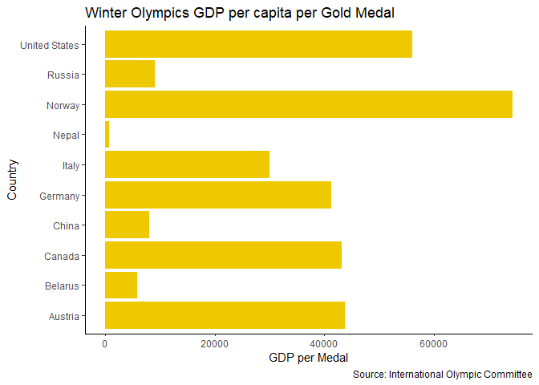
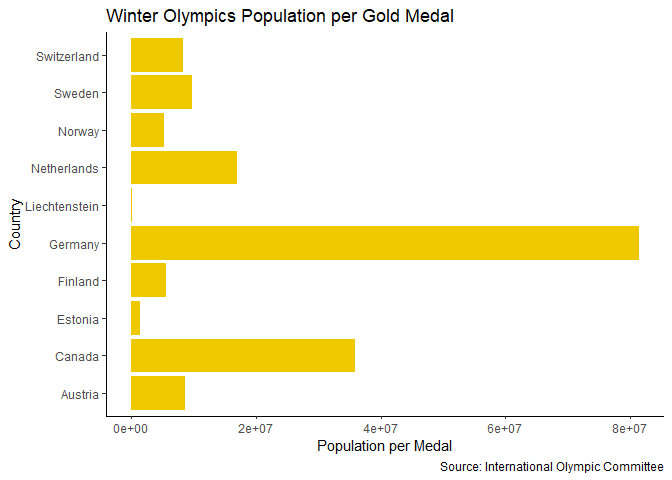
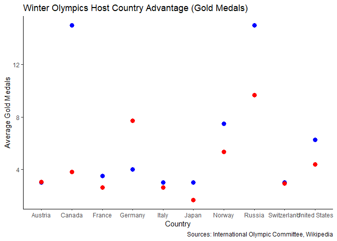
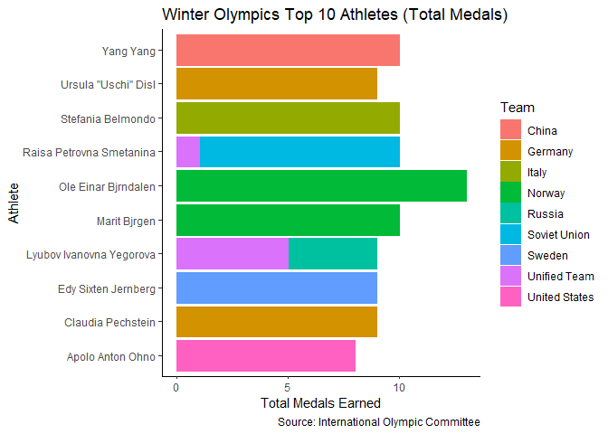
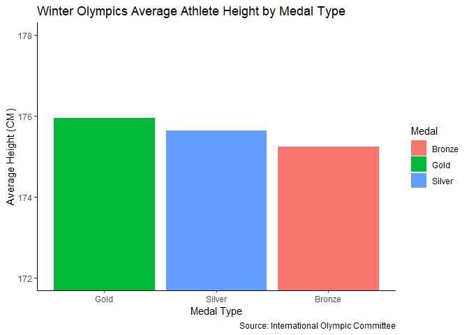

Winter Olympics Medals over Time
================================


## 1. Medal Counts over Time

### a)

I have decided to merge all the designations for the same country to match the gdp_pop table. I have done this by recoding NOC to match the designation's origin country NOC code.This was only done for Russia and Germany since only top 10 countries are being used in the visualizations.

To prevent the issue of counting multiple medals for team events, I have kept distinct values in terms of Sex, Team, Game, and Event (everything else included in distinct() function was to maintain variables from athletes_events)


```r
library(ggplot2)
library(tidyverse)
```

```
## Warning: package 'tidyverse' was built under R version 4.1.2
```

```
## -- Attaching packages --------------------------------------- tidyverse 1.3.1 --
```

```
## v tibble  3.1.4     v dplyr   1.0.7
## v tidyr   1.1.4     v stringr 1.4.0
## v readr   2.1.2     v forcats 0.5.1
## v purrr   0.3.4
```

```
## Warning: package 'readr' was built under R version 4.1.2
```

```
## Warning: package 'forcats' was built under R version 4.1.2
```

```
## -- Conflicts ------------------------------------------ tidyverse_conflicts() --
## x dplyr::filter() masks stats::filter()
## x dplyr::lag()    masks stats::lag()
```

```r
athletes_events <- read.csv("C:/1columbia/dv/assignment-1---winter-olympics-dustintdn/data/athletes_and_events.csv")
gdp_pop <- read.csv("C:/1columbia/dv/assignment-1---winter-olympics-dustintdn/data/gdp_pop.csv")
noc_regions <- read.csv("C:/1columbia/dv/assignment-1---winter-olympics-dustintdn/data/noc_regions.csv")

#recoding: all russian teams = Russia, all german teams = Germany

athletes_events$NOC[athletes_events$NOC == "URS"] <- "RUS"
athletes_events$NOC[athletes_events$NOC == "FRG"] <- "GER"
athletes_events$NOC[athletes_events$NOC == "GDR"] <- "GER"
athletes_events$NOC[athletes_events$NOC == "EUA"] <- "GER"

#removing duplicate medals for team-events

athletes <- distinct(athletes_events, Sex, Team, NOC, Games, Year, Season, City, Sport, Event, Medal)
merge1 <- left_join(athletes, noc_regions)
```

```
## Joining, by = "NOC"
```

```r
dataset <- left_join(merge1, gdp_pop, by=c("NOC" = "Code"))
```

### b)


```r
top10winter <- dataset %>%
  drop_na(Medal) %>%
  filter(Season == 'Winter') %>%
  group_by(Country) %>%
  summarize(total = sum(Medal=='Gold')) %>%
  arrange(desc(total)) %>%
  mutate(rank = row_number()) %>%
  filter(rank <= 10) %>%
  ungroup() %>%
  select(Country) %>%
  unlist() %>%
  c()

#total nmber of winter olympics
dataset %>%
  filter(Season== 'Winter',Country %in% top10winter) %>%
  group_by(Country, Year) %>%
  summarize(total = length(unique(Year))) %>%
  ggplot(., aes(x=Country, y=total)) +
  geom_col(fill = 'lightblue') +
  coord_flip() +
  labs(x = "Country",
       y = "# of Winter Olympics",
       title = "Winter Olympics Participation by Country", caption="Source: International Olympic Committee") +
  theme_classic()
```

```
## `summarise()` has grouped output by 'Country'. You can override using the `.groups` argument.
```

<!-- -->

This table displays the number of times the top 10 gold-medal-earning countries had participated in the Winter Olympics.


```r
dataset %>%
  drop_na(Medal) %>%
  filter(Season=="Winter",Country %in% top10winter) %>%
  filter(Medal =='Gold') %>%
  group_by(Country, Medal, Year) %>%
  tally() %>%
  ggplot(., aes(x=Year, y=n, group=Country, color = Country)) +
  geom_line() +
  labs(x = "Year",
       y = "# of Gold Medals",
       title = "Gold Medals Earned Over Time", caption="Source: International Olympic Committee") +
  theme_classic()
```

<!-- -->

Line graph displays the gold medals each country has earned every Winter Olympics


```r
dataset %>%
  drop_na(Medal) %>%
  filter(Season== "Winter",Country %in% top10winter) %>%
  group_by(Country, Medal) %>%
  tally() %>%
  ggplot(., aes(x=Country, y=n, fill=Medal )) +
  coord_flip() +
  geom_bar(position="dodge", stat="identity") +
  labs(x = "Team",
       y = "# of Medals Earned",
       title = "Olympic Medals Earned by Country and Medal Type", caption="Source: International Olympic Committee") +
  scale_fill_manual('Medal Type', values=c('tan4', 'gold2', 'snow3')) +
  theme_classic()
```

<!-- -->

This table shows the medal counts by medal type that each team has earned all-time.

## 2. Medal Counts adjusted by Population, GDP

### a) Unadjusted ranking (top 10 in gold medals)


```r
dataset %>%
  filter(Season== 'Winter', Medal== 'Gold', Country %in% top10winter) %>%
  group_by(Country) %>%
  summarize(total = sum(Medal=='Gold')) %>%
  ggplot(., aes(x=Country, y=total)) +
  geom_col(fill = 'gold2') +
  coord_flip() +
  labs(x = "Country",
       y = "# of Gold Medals Earned",
       title = "Winter Olympics Top 10 Gold Medals by Country (Unadjusted Ranking)", caption="Source: International Olympic Committee") +
  theme_classic()
```

<!-- -->

Since we are going by gold medal ranking, this bar chat is essentially the same as the previous visual (grouped bar chart) but with gold medals only. 

### b) Ranking by GDP per capita


```r
top10winter_gdp_capita <- dataset %>%
  drop_na(GDP.per.Capita, Medal) %>%
  filter(Season == "Winter", Medal=="Gold") %>%
  group_by(Country) %>%
  summarise(medalbygdp = (GDP.per.Capita)/(sum(Medal=='Gold')), .groups='drop') %>%
  distinct(Country, medalbygdp) %>%
  arrange(medalbygdp) %>%
  mutate(rank = row_number()) %>%
  filter(rank<= 10) %>%
  ungroup() %>%
  select(Country) %>%
  unlist() %>%
  c()

dataset %>%
  filter(Season== 'Winter', Medal== 'Gold', Country %in% top10winter_gdp_capita) %>%
  group_by(Country) %>%
  summarize(total = (GDP.per.Capita)/(sum(Medal=='Gold'))) %>%
  ggplot(., aes(x=Country, y=total)) +
  geom_col(fill = 'gold2') +
  coord_flip() +
  labs(x = "Country",
       y = "GDP per Medal",
       title = "Winter Olympics GDP per capita per Gold Medal", caption="Source: International Olympic Committee") +
  theme_classic()
```

```
## `summarise()` has grouped output by 'Country'. You can override using the `.groups` argument.
```

<!-- -->

This ranking is done so that highest ranking country is the one with the lowest ratio of Gold Medals per GDP per capita. This is because a ratio approaching 0 means a country has a high medal count with a low GDP per capita. This is under the assumption that greater GDP = greater # of medals. 

### c) Ranking by Population


```r
top10winter_pop <- dataset %>%
  drop_na(Population, Medal) %>%
  filter(Season == "Winter", Medal=="Gold") %>%
  group_by(Country) %>%
  summarise(medalbypop = (Population)/(sum(Medal=='Gold')), .groups='drop') %>%
  distinct(Country, medalbypop) %>%
  arrange(medalbypop) %>%
  mutate(rank = row_number()) %>%
  filter(rank<= 10) %>%
  ungroup() %>%
  select(Country) %>%
  unlist() %>%
  c()

dataset %>%
  filter(Season== 'Winter', Medal== 'Gold', Country %in% top10winter_pop) %>%
  group_by(Country) %>%
  summarize(total = (Population)/(sum(Medal=='Gold'))) %>%
  ggplot(., aes(x=Country, y=total)) +
  geom_col(fill = 'gold2') +
  coord_flip() +
  labs(x = "Country",
       y = "Population per Medal",
       title = "Winter Olympics Population per Gold Medal", caption="Source: International Olympic Committee") +
  theme_classic()
```

```
## `summarise()` has grouped output by 'Country'. You can override using the `.groups` argument.
```

<!-- -->

Liechtenstein only has two golden medals with a population of 37,531.

## 3. Host Country Advantage

Data preparation for host country advantage visualizations


```r
library(rvest)
```

```
## Warning: package 'rvest' was built under R version 4.1.2
```

```
## 
## Attaching package: 'rvest'
```

```
## The following object is masked from 'package:readr':
## 
##     guess_encoding
```

```r
library(stringr)
library(tidyverse)
wiki_hosts <- read_html("https://en.wikipedia.org/wiki/List_of_Olympic_Games_host_cities")
hosts <- html_table(html_nodes(wiki_hosts, "table")[[2]], fill=TRUE)[-1]
hosts <- hosts %>% filter(Winter != "") %>%
  select(City, Country, Year)

hosts <- select(hosts, Year, Country, City)
hosts <- rename(hosts, HostCountry = Country)
hosts <- rename(hosts, HostCity = City)
hosts$HostCountry[hosts$HostCountry == "Russia[h]"] <- "Russia"
hosts$HostCity[hosts$HostCity == "Innsbruck[g]"] <- "Innsbruck"
data_prep <- filter(dataset, Season == "Winter")
host_dataset <- left_join(data_prep, hosts, by=c("Year" = "Year"))
```


```r
avg_medals <- host_dataset %>%
  filter(Country %in% hosts$HostCountry, Medal =="Gold", Country != "China") %>%
  group_by(Country) %>%
  summarise(avgtotal = sum(Medal=="Gold")/length(unique(Year)))


avg_medals_hosting <- host_dataset %>%
  filter(Country == HostCountry, Medal=="Gold") %>%
  group_by(Country) %>%
  summarise(avgtotal = sum(Medal=="Gold")/length(unique(Year)))
  
ggplot(avg_medals_hosting, aes(x=Country, y=avgtotal)) + 
  geom_point(data=avg_medals_hosting, size=3, color="blue") + 
  geom_point(data=avg_medals, aes(x=Country, y=avgtotal), size=3, color="red" ) +
  scale_colour_manual(values=c('Average Gold Medals Earned (Total)'='blue', 'Average Gold Medals Earned (Hosting)'='red')) +
  labs(x = "Country",
       y = "Average Gold Medals",
       title = "Winter Olympics Host Country Advantage (Gold Medals)",caption="Sources: International Olympic Committee, Wikipedia") +
  theme_classic()
```

<!-- -->

You can see that for a majority of hosting countries (7/10), there was a higher average gold medals earned when they had hosted the Olympics compared to their all-time average. The only case in which hosting led to a lower average gold medal attainment was for Germany, but this could partially be due to the fact that Germany's figure is a combination of five designations over time. 

## 4. Most Successful Athletes


```r
top_medalists <- athletes_events %>%
  drop_na(Medal) %>%
  filter(Season =="Winter") %>%
  group_by(Name) %>%
  summarise(total = sum(Medal!="")) %>%
  arrange(desc(total)) %>%
  mutate(rank = row_number()) %>%
  filter(rank<= 10) %>%
  ungroup() %>%
  select(Name) %>%
  unlist() %>%
  c()

athletes_events %>%
  drop_na(Medal) %>%
  filter(Name %in% top_medalists) %>%
  group_by(Name, Team) %>%
  summarise(total = sum(Medal!="")) %>%
  ggplot(., aes(x=Name, y=total, color=Team, fill=Team)) +
  geom_col() +
  coord_flip() +
  labs(x = "Athlete",
       y = "Total Medals Earned",
       title = "Winter Olympics Top 10 Athletes (Total Medals)", caption="Source: International Olympic Committee") +
  theme_classic()
```

```
## `summarise()` has grouped output by 'Name'. You can override using the `.groups` argument.
```

<!-- -->

This barplot highlights athletes with the greatest total medals earned (bronze, silver, gold = 1). The color represents there team designation for the number of medals they had earned.


```r
athletes_events %>%
  drop_na(Medal) %>%
  drop_na(Height) %>%
  drop_na(Weight) %>%
  filter(Season=="Winter") %>%
  group_by(Medal) %>%
  summarise(avgheight= mean(Height), avgweight = mean(Weight)) %>%
  ggplot(., aes(x=reorder(Medal, -avgheight), y=avgheight, fill=Medal)) +
  geom_col() + coord_cartesian(ylim = c(172, 178))+
  scale_y_continuous(breaks = seq(172, 178, by = 2)) +
  labs(x = "Medal Type",
       y = "Average Height (CM)",
       title = "Winter Olympics Average Athlete Height by Medal Type", caption="Source: International Olympic Committee") +
  theme_classic()
```

<!-- -->

There is a thin correlation between earning a higher level medal and athlete height. Keep in mind the y-axis scale of the graph is very small to show the differences in the average heights of each medalist category. There is only about a one centimeter range in average heights! So it could also be said that 175CM is the ideal medalist height(?)

## 5. Make two plots interactive

#Line Graph with Plotly


```r
library(plotly)
```

```
## Warning: package 'plotly' was built under R version 4.1.2
```

```
## 
## Attaching package: 'plotly'
```

```
## The following object is masked from 'package:ggplot2':
## 
##     last_plot
```

```
## The following object is masked from 'package:stats':
## 
##     filter
```

```
## The following object is masked from 'package:graphics':
## 
##     layout
```

```r
int_line <- dataset %>%
  drop_na(Medal) %>%
  filter(Season=="Winter",Country %in% top10winter) %>%
  filter(Medal =='Gold') %>%
  group_by(Country, Medal, Year) %>%
  tally() %>%
  plot_ly(x = ~Year, y= ~n) %>%
  add_lines(alpha = .9, name = ~Country, color = ~Country, hoverinfo = "yes") %>%
  layout(title = "Gold Medals Earned Over Time", 
         xaxis = list(title = "Year", zeroline = FALSE),
         yaxis = list(title = "# of Gold Medals Earned",zeroline = FALSE))

int_line
```

```
## Warning in RColorBrewer::brewer.pal(N, "Set2"): n too large, allowed maximum for palette Set2 is 8
## Returning the palette you asked for with that many colors
```

```
## Warning in RColorBrewer::brewer.pal(N, "Set2"): n too large, allowed maximum for palette Set2 is 8
## Returning the palette you asked for with that many colors
```

```{=html}
<div id="htmlwidget-c0395cf898844101d5e6" style="width:672px;height:480px;" class="plotly html-widget"></div>
<script type="application/json" data-for="htmlwidget-c0395cf898844101d5e6">{"x":{"visdat":{"23d03c944015":["function () ","plotlyVisDat"]},"cur_data":"23d03c944015","attrs":{"23d03c944015":{"x":{},"y":{},"alpha_stroke":1,"sizes":[10,100],"spans":[1,20],"type":"scatter","mode":"lines","alpha":0.9,"name":{},"color":{},"hoverinfo":"yes","inherit":true}},"layout":{"margin":{"b":40,"l":60,"t":25,"r":10},"title":"Gold Medals Earned Over Time","xaxis":{"domain":[0,1],"automargin":true,"title":"Year","zeroline":false},"yaxis":{"domain":[0,1],"automargin":true,"title":"# of Gold Medals Earned","zeroline":false},"hovermode":"closest","showlegend":true},"source":"A","config":{"modeBarButtonsToAdd":["hoverclosest","hovercompare"],"showSendToCloud":false},"data":[{"x":[1924,1932,1936,1948,1952,1956,1960,1964,1968,1972,1976,1980,1988,1992,1994,1998,2002,2006,2010,2014],"y":[3,1,1,1,2,5,1,4,3,1,2,3,3,6,2,3,3,9,4,4],"type":"scatter","mode":"lines","name":"Austria","hoverinfo":["yes","yes","yes","yes","yes","yes","yes","yes","yes","yes","yes","yes","yes","yes","yes","yes","yes","yes","yes","yes"],"marker":{"color":"rgba(102,194,165,0.9)","line":{"color":"rgba(102,194,165,1)"}},"textfont":{"color":"rgba(102,194,165,0.9)"},"error_y":{"color":"rgba(102,194,165,0.9)"},"error_x":{"color":"rgba(102,194,165,0.9)"},"line":{"color":"rgba(102,194,165,0.9)"},"xaxis":"x","yaxis":"y","frame":null},{"x":[1924,1928,1932,1948,1952,1960,1964,1968,1976,1984,1992,1994,1998,2002,2006,2010,2014],"y":[1,1,1,2,1,3,1,1,1,2,2,3,6,8,7,15,10],"type":"scatter","mode":"lines","name":"Canada","hoverinfo":["yes","yes","yes","yes","yes","yes","yes","yes","yes","yes","yes","yes","yes","yes","yes","yes","yes"],"marker":{"color":"rgba(228,156,113,0.9)","line":{"color":"rgba(228,156,113,1)"}},"textfont":{"color":"rgba(228,156,113,0.9)"},"error_y":{"color":"rgba(228,156,113,0.9)"},"error_x":{"color":"rgba(228,156,113,0.9)"},"line":{"color":"rgba(228,156,113,0.9)"},"xaxis":"x","yaxis":"y","frame":null},{"x":[1924,1928,1932,1936,1948,1952,1956,1960,1964,1968,1976,1980,1984,1988,1992,1998,2002,2014],"y":[4,2,1,1,1,3,3,2,3,1,2,1,4,4,3,2,4,1],"type":"scatter","mode":"lines","name":"Finland","hoverinfo":["yes","yes","yes","yes","yes","yes","yes","yes","yes","yes","yes","yes","yes","yes","yes","yes","yes","yes"],"marker":{"color":"rgba(201,152,157,0.9)","line":{"color":"rgba(201,152,157,1)"}},"textfont":{"color":"rgba(201,152,157,0.9)"},"error_y":{"color":"rgba(201,152,157,0.9)"},"error_x":{"color":"rgba(201,152,157,0.9)"},"line":{"color":"rgba(201,152,157,0.9)"},"xaxis":"x","yaxis":"y","frame":null},{"x":[1936,1952,1956,1960,1964,1968,1972,1976,1980,1984,1988,1992,1994,1998,2002,2006,2010,2014],"y":[4,4,1,4,3,3,7,9,9,11,11,10,9,12,12,11,10,9],"type":"scatter","mode":"lines","name":"Germany","hoverinfo":["yes","yes","yes","yes","yes","yes","yes","yes","yes","yes","yes","yes","yes","yes","yes","yes","yes","yes"],"marker":{"color":"rgba(175,154,200,0.9)","line":{"color":"rgba(175,154,200,1)"}},"textfont":{"color":"rgba(175,154,200,0.9)"},"error_y":{"color":"rgba(175,154,200,0.9)"},"error_x":{"color":"rgba(175,154,200,0.9)"},"line":{"color":"rgba(175,154,200,0.9)"},"xaxis":"x","yaxis":"y","frame":null},{"x":[1948,1952,1956,1968,1972,1976,1984,1988,1992,1994,1998,2002,2006,2010],"y":[1,1,1,4,2,1,2,2,4,7,2,4,5,1],"type":"scatter","mode":"lines","name":"Italy","hoverinfo":["yes","yes","yes","yes","yes","yes","yes","yes","yes","yes","yes","yes","yes","yes"],"marker":{"color":"rgba(226,148,184,0.9)","line":{"color":"rgba(226,148,184,1)"}},"textfont":{"color":"rgba(226,148,184,0.9)"},"error_y":{"color":"rgba(226,148,184,0.9)"},"error_x":{"color":"rgba(226,148,184,0.9)"},"line":{"color":"rgba(226,148,184,0.9)"},"xaxis":"x","yaxis":"y","frame":null},{"x":[1924,1928,1932,1936,1948,1952,1956,1960,1964,1968,1972,1976,1980,1984,1992,1994,1998,2002,2006,2010,2014],"y":[4,6,3,7,4,7,2,3,3,6,2,3,1,3,7,8,8,12,2,9,12],"type":"scatter","mode":"lines","name":"Norway","hoverinfo":["yes","yes","yes","yes","yes","yes","yes","yes","yes","yes","yes","yes","yes","yes","yes","yes","yes","yes","yes","yes","yes"],"marker":{"color":"rgba(176,208,99,0.9)","line":{"color":"rgba(176,208,99,1)"}},"textfont":{"color":"rgba(176,208,99,0.9)"},"error_y":{"color":"rgba(176,208,99,0.9)"},"error_x":{"color":"rgba(176,208,99,0.9)"},"line":{"color":"rgba(176,208,99,0.9)"},"xaxis":"x","yaxis":"y","frame":null},{"x":[1956,1960,1964,1968,1972,1976,1980,1984,1988,1994,1998,2002,2006,2010,2014],"y":[6,7,12,6,9,15,12,7,13,13,11,6,10,3,15],"type":"scatter","mode":"lines","name":"Russia","hoverinfo":["yes","yes","yes","yes","yes","yes","yes","yes","yes","yes","yes","yes","yes","yes","yes"],"marker":{"color":"rgba(227,217,62,0.9)","line":{"color":"rgba(227,217,62,1)"}},"textfont":{"color":"rgba(227,217,62,0.9)"},"error_y":{"color":"rgba(227,217,62,0.9)"},"error_x":{"color":"rgba(227,217,62,0.9)"},"line":{"color":"rgba(227,217,62,0.9)"},"xaxis":"x","yaxis":"y","frame":null},{"x":[1924,1928,1932,1936,1948,1956,1960,1964,1968,1972,1980,1984,1988,1992,1994,2006,2010,2014],"y":[1,2,1,2,4,2,3,3,3,1,3,4,4,1,2,7,5,2],"type":"scatter","mode":"lines","name":"Sweden","hoverinfo":["yes","yes","yes","yes","yes","yes","yes","yes","yes","yes","yes","yes","yes","yes","yes","yes","yes","yes"],"marker":{"color":"rgba(245,207,100,0.9)","line":{"color":"rgba(245,207,100,1)"}},"textfont":{"color":"rgba(245,207,100,0.9)"},"error_y":{"color":"rgba(245,207,100,0.9)"},"error_x":{"color":"rgba(245,207,100,0.9)"},"line":{"color":"rgba(245,207,100,0.9)"},"xaxis":"x","yaxis":"y","frame":null},{"x":[1924,1936,1948,1956,1960,1972,1976,1980,1984,1988,1992,1994,1998,2002,2006,2010,2014],"y":[2,1,3,3,2,4,1,1,2,5,1,3,2,3,5,6,6],"type":"scatter","mode":"lines","name":"Switzerland","hoverinfo":["yes","yes","yes","yes","yes","yes","yes","yes","yes","yes","yes","yes","yes","yes","yes","yes","yes"],"marker":{"color":"rgba(219,192,155,0.9)","line":{"color":"rgba(219,192,155,1)"}},"textfont":{"color":"rgba(219,192,155,0.9)"},"error_y":{"color":"rgba(219,192,155,0.9)"},"error_x":{"color":"rgba(219,192,155,0.9)"},"line":{"color":"rgba(219,192,155,0.9)"},"xaxis":"x","yaxis":"y","frame":null},{"x":[1924,1928,1932,1936,1948,1952,1956,1960,1964,1968,1972,1976,1980,1984,1988,1992,1994,1998,2002,2006,2010,2014],"y":[1,2,6,1,3,4,2,3,1,1,3,3,6,4,2,5,6,6,10,9,9,10],"type":"scatter","mode":"lines","name":"United States","hoverinfo":["yes","yes","yes","yes","yes","yes","yes","yes","yes","yes","yes","yes","yes","yes","yes","yes","yes","yes","yes","yes","yes","yes"],"marker":{"color":"rgba(179,179,179,0.9)","line":{"color":"rgba(179,179,179,1)"}},"textfont":{"color":"rgba(179,179,179,0.9)"},"error_y":{"color":"rgba(179,179,179,0.9)"},"error_x":{"color":"rgba(179,179,179,0.9)"},"line":{"color":"rgba(179,179,179,0.9)"},"xaxis":"x","yaxis":"y","frame":null}],"highlight":{"on":"plotly_click","persistent":false,"dynamic":false,"selectize":false,"opacityDim":0.2,"selected":{"opacity":1},"debounce":0},"shinyEvents":["plotly_hover","plotly_click","plotly_selected","plotly_relayout","plotly_brushed","plotly_brushing","plotly_clickannotation","plotly_doubleclick","plotly_deselect","plotly_afterplot","plotly_sunburstclick"],"base_url":"https://plot.ly"},"evals":[],"jsHooks":[]}</script>
```

The interactive line graph from question #2. This interactive graph is more insightful because hovering shows the number of gold medals earned by country for each year. This may have otherwise been difficult to discern from the static graphic. 

#Bar Graph  with ggplotly


```r
int_bar <- dataset %>%
  drop_na(Medal) %>%
  filter(Season== "Winter",Country %in% top10winter) %>%
  group_by(Country, Medal) %>%
  tally() %>%
  ggplot(., aes(x=Country, y=n, fill=Medal )) +
  coord_flip() +
  geom_bar(position="dodge", stat="identity") +
  labs(x = "Team",
       y = "# of Medals Earned",
       title = "Olympic Medals Earned by Country and Medal Type", caption="Source: International Olympic Committee") +
  scale_fill_manual('Medal Type', values=c('tan4', 'gold2', 'snow3')) +
  theme_classic()

ggplotly(int_bar)
```

```{=html}
<div id="htmlwidget-121be5bf709c0f702d2f" style="width:672px;height:480px;" class="plotly html-widget"></div>
<script type="application/json" data-for="htmlwidget-121be5bf709c0f702d2f">{"x":{"data":[{"orientation":"h","width":[0.3,0.3,0.3,0.3,0.300000000000001,0.300000000000001,0.300000000000001,0.299999999999999,0.300000000000001,0.300000000000001],"base":[0,0,0,0,0,0,0,0,0,0],"x":[82,56,57,113,45,100,99,54,47,89],"y":[0.7,1.7,2.7,3.7,4.7,5.7,6.7,7.7,8.7,9.7],"text":["Country: Austria<br />n:  82<br />Medal: Bronze","Country: Canada<br />n:  56<br />Medal: Bronze","Country: Finland<br />n:  57<br />Medal: Bronze","Country: Germany<br />n: 113<br />Medal: Bronze","Country: Italy<br />n:  45<br />Medal: Bronze","Country: Norway<br />n: 100<br />Medal: Bronze","Country: Russia<br />n:  99<br />Medal: Bronze","Country: Sweden<br />n:  54<br />Medal: Bronze","Country: Switzerland<br />n:  47<br />Medal: Bronze","Country: United States<br />n:  89<br />Medal: Bronze"],"type":"bar","textposition":"none","marker":{"autocolorscale":false,"color":"rgba(139,90,43,1)","line":{"width":1.88976377952756,"color":"transparent"}},"name":"Bronze","legendgroup":"Bronze","showlegend":true,"xaxis":"x","yaxis":"y","hoverinfo":"text","frame":null},{"orientation":"h","width":[0.3,0.3,0.3,0.3,0.300000000000001,0.300000000000001,0.300000000000001,0.300000000000001,0.300000000000001,0.300000000000001],"base":[0,0,0,0,0,0,0,0,0,0],"x":[61,65,42,139,37,112,145,50,50,97],"y":[1,2,3,4,5,6,7,8,9,10],"text":["Country: Austria<br />n:  61<br />Medal: Gold","Country: Canada<br />n:  65<br />Medal: Gold","Country: Finland<br />n:  42<br />Medal: Gold","Country: Germany<br />n: 139<br />Medal: Gold","Country: Italy<br />n:  37<br />Medal: Gold","Country: Norway<br />n: 112<br />Medal: Gold","Country: Russia<br />n: 145<br />Medal: Gold","Country: Sweden<br />n:  50<br />Medal: Gold","Country: Switzerland<br />n:  50<br />Medal: Gold","Country: United States<br />n:  97<br />Medal: Gold"],"type":"bar","textposition":"none","marker":{"autocolorscale":false,"color":"rgba(238,201,0,1)","line":{"width":1.88976377952756,"color":"transparent"}},"name":"Gold","legendgroup":"Gold","showlegend":true,"xaxis":"x","yaxis":"y","hoverinfo":"text","frame":null},{"orientation":"h","width":[0.3,0.3,0.3,0.300000000000001,0.300000000000001,0.300000000000001,0.300000000000001,0.300000000000001,0.300000000000001,0.300000000000001],"base":[0,0,0,0,0,0,0,0,0,0],"x":[80,60,63,138,34,108,110,40,40,104],"y":[1.3,2.3,3.3,4.3,5.3,6.3,7.3,8.3,9.3,10.3],"text":["Country: Austria<br />n:  80<br />Medal: Silver","Country: Canada<br />n:  60<br />Medal: Silver","Country: Finland<br />n:  63<br />Medal: Silver","Country: Germany<br />n: 138<br />Medal: Silver","Country: Italy<br />n:  34<br />Medal: Silver","Country: Norway<br />n: 108<br />Medal: Silver","Country: Russia<br />n: 110<br />Medal: Silver","Country: Sweden<br />n:  40<br />Medal: Silver","Country: Switzerland<br />n:  40<br />Medal: Silver","Country: United States<br />n: 104<br />Medal: Silver"],"type":"bar","textposition":"none","marker":{"autocolorscale":false,"color":"rgba(205,201,201,1)","line":{"width":1.88976377952756,"color":"transparent"}},"name":"Silver","legendgroup":"Silver","showlegend":true,"xaxis":"x","yaxis":"y","hoverinfo":"text","frame":null}],"layout":{"margin":{"t":43.7625570776256,"r":7.30593607305936,"b":40.1826484018265,"l":101.552511415525},"plot_bgcolor":"rgba(255,255,255,1)","paper_bgcolor":"rgba(255,255,255,1)","font":{"color":"rgba(0,0,0,1)","family":"","size":14.6118721461187},"title":{"text":"Olympic Medals Earned by Country and Medal Type","font":{"color":"rgba(0,0,0,1)","family":"","size":17.5342465753425},"x":0,"xref":"paper"},"xaxis":{"domain":[0,1],"automargin":true,"type":"linear","autorange":false,"range":[-7.25,152.25],"tickmode":"array","ticktext":["0","50","100","150"],"tickvals":[0,50,100,150],"categoryorder":"array","categoryarray":["0","50","100","150"],"nticks":null,"ticks":"outside","tickcolor":"rgba(51,51,51,1)","ticklen":3.65296803652968,"tickwidth":0.66417600664176,"showticklabels":true,"tickfont":{"color":"rgba(77,77,77,1)","family":"","size":11.689497716895},"tickangle":-0,"showline":true,"linecolor":"rgba(0,0,0,1)","linewidth":0.66417600664176,"showgrid":false,"gridcolor":null,"gridwidth":0,"zeroline":false,"anchor":"y","title":{"text":"# of Medals Earned","font":{"color":"rgba(0,0,0,1)","family":"","size":14.6118721461187}},"hoverformat":".2f"},"yaxis":{"domain":[0,1],"automargin":true,"type":"linear","autorange":false,"range":[0.4,10.6],"tickmode":"array","ticktext":["Austria","Canada","Finland","Germany","Italy","Norway","Russia","Sweden","Switzerland","United States"],"tickvals":[1,2,3,4,5,6,7,8,9,10],"categoryorder":"array","categoryarray":["Austria","Canada","Finland","Germany","Italy","Norway","Russia","Sweden","Switzerland","United States"],"nticks":null,"ticks":"outside","tickcolor":"rgba(51,51,51,1)","ticklen":3.65296803652968,"tickwidth":0.66417600664176,"showticklabels":true,"tickfont":{"color":"rgba(77,77,77,1)","family":"","size":11.689497716895},"tickangle":-0,"showline":true,"linecolor":"rgba(0,0,0,1)","linewidth":0.66417600664176,"showgrid":false,"gridcolor":null,"gridwidth":0,"zeroline":false,"anchor":"x","title":{"text":"Team","font":{"color":"rgba(0,0,0,1)","family":"","size":14.6118721461187}},"hoverformat":".2f"},"shapes":[{"type":"rect","fillcolor":null,"line":{"color":null,"width":0,"linetype":[]},"yref":"paper","xref":"paper","x0":0,"x1":1,"y0":0,"y1":1}],"showlegend":true,"legend":{"bgcolor":"rgba(255,255,255,1)","bordercolor":"transparent","borderwidth":1.88976377952756,"font":{"color":"rgba(0,0,0,1)","family":"","size":11.689497716895},"title":{"text":"Medal Type","font":{"color":"rgba(0,0,0,1)","family":"","size":14.6118721461187}}},"hovermode":"closest","barmode":"relative"},"config":{"doubleClick":"reset","modeBarButtonsToAdd":["hoverclosest","hovercompare"],"showSendToCloud":false},"source":"A","attrs":{"23d0236355a5":{"x":{},"y":{},"fill":{},"type":"bar"}},"cur_data":"23d0236355a5","visdat":{"23d0236355a5":["function (y) ","x"]},"highlight":{"on":"plotly_click","persistent":false,"dynamic":false,"selectize":false,"opacityDim":0.2,"selected":{"opacity":1},"debounce":0},"shinyEvents":["plotly_hover","plotly_click","plotly_selected","plotly_relayout","plotly_brushed","plotly_brushing","plotly_clickannotation","plotly_doubleclick","plotly_deselect","plotly_afterplot","plotly_sunburstclick"],"base_url":"https://plot.ly"},"evals":[],"jsHooks":[]}</script>
```

Interactive stacked bar graph.

##6. Data Table

The data table below shows the total number of each medal type that every Winter Olympic athlete has earned up to 2014.


```r
library(DT)
```

```
## Warning: package 'DT' was built under R version 4.1.2
```

```r
table_data <- athletes_events %>%
  drop_na(Medal) %>%
  filter(Season =="Winter") %>%
  group_by(Name, Medal) %>%
  tally() %>%
  spread(Medal, n)

datatable(table_data) %>%
  formatStyle('Bronze', color = "white", backgroundColor = '#8f7143', fontWeight='bold') %>%
  formatStyle('Silver', color = "white", backgroundColor = 'grey', fontWeight='bold') %>%
  formatStyle('Gold', color = "white", backgroundColor = 'goldenrod', fontWeight='bold')
```

```{=html}
<div id="htmlwidget-08eaa23d19507dfd29a8" style="width:100%;height:auto;" class="datatables html-widget"></div>
<script type="application/json" data-for="htmlwidget-08eaa23d19507dfd29a8">{"x":{"filter":"none","vertical":false,"data":[["1","2","3","4","5","6","7","8","9","10","11","12","13","14","15","16","17","18","19","20","21","22","23","24","25","26","27","28","29","30","31","32","33","34","35","36","37","38","39","40","41","42","43","44","45","46","47","48","49","50","51","52","53","54","55","56","57","58","59","60","61","62","63","64","65","66","67","68","69","70","71","72","73","74","75","76","77","78","79","80","81","82","83","84","85","86","87","88","89","90","91","92","93","94","95","96","97","98","99","100","101","102","103","104","105","106","107","108","109","110","111","112","113","114","115","116","117","118","119","120","121","122","123","124","125","126","127","128","129","130","131","132","133","134","135","136","137","138","139","140","141","142","143","144","145","146","147","148","149","150","151","152","153","154","155","156","157","158","159","160","161","162","163","164","165","166","167","168","169","170","171","172","173","174","175","176","177","178","179","180","181","182","183","184","185","186","187","188","189","190","191","192","193","194","195","196","197","198","199","200","201","202","203","204","205","206","207","208","209","210","211","212","213","214","215","216","217","218","219","220","221","222","223","224","225","226","227","228","229","230","231","232","233","234","235","236","237","238","239","240","241","242","243","244","245","246","247","248","249","250","251","252","253","254","255","256","257","258","259","260","261","262","263","264","265","266","267","268","269","270","271","272","273","274","275","276","277","278","279","280","281","282","283","284","285","286","287","288","289","290","291","292","293","294","295","296","297","298","299","300","301","302","303","304","305","306","307","308","309","310","311","312","313","314","315","316","317","318","319","320","321","322","323","324","325","326","327","328","329","330","331","332","333","334","335","336","337","338","339","340","341","342","343","344","345","346","347","348","349","350","351","352","353","354","355","356","357","358","359","360","361","362","363","364","365","366","367","368","369","370","371","372","373","374","375","376","377","378","379","380","381","382","383","384","385","386","387","388","389","390","391","392","393","394","395","396","397","398","399","400","401","402","403","404","405","406","407","408","409","410","411","412","413","414","415","416","417","418","419","420","421","422","423","424","425","426","427","428","429","430","431","432","433","434","435","436","437","438","439","440","441","442","443","444","445","446","447","448","449","450","451","452","453","454","455","456","457","458","459","460","461","462","463","464","465","466","467","468","469","470","471","472","473","474","475","476","477","478","479","480","481","482","483","484","485","486","487","488","489","490","491","492","493","494","495","496","497","498","499","500","501","502","503","504","505","506","507","508","509","510","511","512","513","514","515","516","517","518","519","520","521","522","523","524","525","526","527","528","529","530","531","532","533","534","535","536","537","538","539","540","541","542","543","544","545","546","547","548","549","550","551","552","553","554","555","556","557","558","559","560","561","562","563","564","565","566","567","568","569","570","571","572","573","574","575","576","577","578","579","580","581","582","583","584","585","586","587","588","589","590","591","592","593","594","595","596","597","598","599","600","601","602","603","604","605","606","607","608","609","610","611","612","613","614","615","616","617","618","619","620","621","622","623","624","625","626","627","628","629","630","631","632","633","634","635","636","637","638","639","640","641","642","643","644","645","646","647","648","649","650","651","652","653","654","655","656","657","658","659","660","661","662","663","664","665","666","667","668","669","670","671","672","673","674","675","676","677","678","679","680","681","682","683","684","685","686","687","688","689","690","691","692","693","694","695","696","697","698","699","700","701","702","703","704","705","706","707","708","709","710","711","712","713","714","715","716","717","718","719","720","721","722","723","724","725","726","727","728","729","730","731","732","733","734","735","736","737","738","739","740","741","742","743","744","745","746","747","748","749","750","751","752","753","754","755","756","757","758","759","760","761","762","763","764","765","766","767","768","769","770","771","772","773","774","775","776","777","778","779","780","781","782","783","784","785","786","787","788","789","790","791","792","793","794","795","796","797","798","799","800","801","802","803","804","805","806","807","808","809","810","811","812","813","814","815","816","817","818","819","820","821","822","823","824","825","826","827","828","829","830","831","832","833","834","835","836","837","838","839","840","841","842","843","844","845","846","847","848","849","850","851","852","853","854","855","856","857","858","859","860","861","862","863","864","865","866","867","868","869","870","871","872","873","874","875","876","877","878","879","880","881","882","883","884","885","886","887","888","889","890","891","892","893","894","895","896","897","898","899","900","901","902","903","904","905","906","907","908","909","910","911","912","913","914","915","916","917","918","919","920","921","922","923","924","925","926","927","928","929","930","931","932","933","934","935","936","937","938","939","940","941","942","943","944","945","946","947","948","949","950","951","952","953","954","955","956","957","958","959","960","961","962","963","964","965","966","967","968","969","970","971","972","973","974","975","976","977","978","979","980","981","982","983","984","985","986","987","988","989","990","991","992","993","994","995","996","997","998","999","1000","1001","1002","1003","1004","1005","1006","1007","1008","1009","1010","1011","1012","1013","1014","1015","1016","1017","1018","1019","1020","1021","1022","1023","1024","1025","1026","1027","1028","1029","1030","1031","1032","1033","1034","1035","1036","1037","1038","1039","1040","1041","1042","1043","1044","1045","1046","1047","1048","1049","1050","1051","1052","1053","1054","1055","1056","1057","1058","1059","1060","1061","1062","1063","1064","1065","1066","1067","1068","1069","1070","1071","1072","1073","1074","1075","1076","1077","1078","1079","1080","1081","1082","1083","1084","1085","1086","1087","1088","1089","1090","1091","1092","1093","1094","1095","1096","1097","1098","1099","1100","1101","1102","1103","1104","1105","1106","1107","1108","1109","1110","1111","1112","1113","1114","1115","1116","1117","1118","1119","1120","1121","1122","1123","1124","1125","1126","1127","1128","1129","1130","1131","1132","1133","1134","1135","1136","1137","1138","1139","1140","1141","1142","1143","1144","1145","1146","1147","1148","1149","1150","1151","1152","1153","1154","1155","1156","1157","1158","1159","1160","1161","1162","1163","1164","1165","1166","1167","1168","1169","1170","1171","1172","1173","1174","1175","1176","1177","1178","1179","1180","1181","1182","1183","1184","1185","1186","1187","1188","1189","1190","1191","1192","1193","1194","1195","1196","1197","1198","1199","1200","1201","1202","1203","1204","1205","1206","1207","1208","1209","1210","1211","1212","1213","1214","1215","1216","1217","1218","1219","1220","1221","1222","1223","1224","1225","1226","1227","1228","1229","1230","1231","1232","1233","1234","1235","1236","1237","1238","1239","1240","1241","1242","1243","1244","1245","1246","1247","1248","1249","1250","1251","1252","1253","1254","1255","1256","1257","1258","1259","1260","1261","1262","1263","1264","1265","1266","1267","1268","1269","1270","1271","1272","1273","1274","1275","1276","1277","1278","1279","1280","1281","1282","1283","1284","1285","1286","1287","1288","1289","1290","1291","1292","1293","1294","1295","1296","1297","1298","1299","1300","1301","1302","1303","1304","1305","1306","1307","1308","1309","1310","1311","1312","1313","1314","1315","1316","1317","1318","1319","1320","1321","1322","1323","1324","1325","1326","1327","1328","1329","1330","1331","1332","1333","1334","1335","1336","1337","1338","1339","1340","1341","1342","1343","1344","1345","1346","1347","1348","1349","1350","1351","1352","1353","1354","1355","1356","1357","1358","1359","1360","1361","1362","1363","1364","1365","1366","1367","1368","1369","1370","1371","1372","1373","1374","1375","1376","1377","1378","1379","1380","1381","1382","1383","1384","1385","1386","1387","1388","1389","1390","1391","1392","1393","1394","1395","1396","1397","1398","1399","1400","1401","1402","1403","1404","1405","1406","1407","1408","1409","1410","1411","1412","1413","1414","1415","1416","1417","1418","1419","1420","1421","1422","1423","1424","1425","1426","1427","1428","1429","1430","1431","1432","1433","1434","1435","1436","1437","1438","1439","1440","1441","1442","1443","1444","1445","1446","1447","1448","1449","1450","1451","1452","1453","1454","1455","1456","1457","1458","1459","1460","1461","1462","1463","1464","1465","1466","1467","1468","1469","1470","1471","1472","1473","1474","1475","1476","1477","1478","1479","1480","1481","1482","1483","1484","1485","1486","1487","1488","1489","1490","1491","1492","1493","1494","1495","1496","1497","1498","1499","1500","1501","1502","1503","1504","1505","1506","1507","1508","1509","1510","1511","1512","1513","1514","1515","1516","1517","1518","1519","1520","1521","1522","1523","1524","1525","1526","1527","1528","1529","1530","1531","1532","1533","1534","1535","1536","1537","1538","1539","1540","1541","1542","1543","1544","1545","1546","1547","1548","1549","1550","1551","1552","1553","1554","1555","1556","1557","1558","1559","1560","1561","1562","1563","1564","1565","1566","1567","1568","1569","1570","1571","1572","1573","1574","1575","1576","1577","1578","1579","1580","1581","1582","1583","1584","1585","1586","1587","1588","1589","1590","1591","1592","1593","1594","1595","1596","1597","1598","1599","1600","1601","1602","1603","1604","1605","1606","1607","1608","1609","1610","1611","1612","1613","1614","1615","1616","1617","1618","1619","1620","1621","1622","1623","1624","1625","1626","1627","1628","1629","1630","1631","1632","1633","1634","1635","1636","1637","1638","1639","1640","1641","1642","1643","1644","1645","1646","1647","1648","1649","1650","1651","1652","1653","1654","1655","1656","1657","1658","1659","1660","1661","1662","1663","1664","1665","1666","1667","1668","1669","1670","1671","1672","1673","1674","1675","1676","1677","1678","1679","1680","1681","1682","1683","1684","1685","1686","1687","1688","1689","1690","1691","1692","1693","1694","1695","1696","1697","1698","1699","1700","1701","1702","1703","1704","1705","1706","1707","1708","1709","1710","1711","1712","1713","1714","1715","1716","1717","1718","1719","1720","1721","1722","1723","1724","1725","1726","1727","1728","1729","1730","1731","1732","1733","1734","1735","1736","1737","1738","1739","1740","1741","1742","1743","1744","1745","1746","1747","1748","1749","1750","1751","1752","1753","1754","1755","1756","1757","1758","1759","1760","1761","1762","1763","1764","1765","1766","1767","1768","1769","1770","1771","1772","1773","1774","1775","1776","1777","1778","1779","1780","1781","1782","1783","1784","1785","1786","1787","1788","1789","1790","1791","1792","1793","1794","1795","1796","1797","1798","1799","1800","1801","1802","1803","1804","1805","1806","1807","1808","1809","1810","1811","1812","1813","1814","1815","1816","1817","1818","1819","1820","1821","1822","1823","1824","1825","1826","1827","1828","1829","1830","1831","1832","1833","1834","1835","1836","1837","1838","1839","1840","1841","1842","1843","1844","1845","1846","1847","1848","1849","1850","1851","1852","1853","1854","1855","1856","1857","1858","1859","1860","1861","1862","1863","1864","1865","1866","1867","1868","1869","1870","1871","1872","1873","1874","1875","1876","1877","1878","1879","1880","1881","1882","1883","1884","1885","1886","1887","1888","1889","1890","1891","1892","1893","1894","1895","1896","1897","1898","1899","1900","1901","1902","1903","1904","1905","1906","1907","1908","1909","1910","1911","1912","1913","1914","1915","1916","1917","1918","1919","1920","1921","1922","1923","1924","1925","1926","1927","1928","1929","1930","1931","1932","1933","1934","1935","1936","1937","1938","1939","1940","1941","1942","1943","1944","1945","1946","1947","1948","1949","1950","1951","1952","1953","1954","1955","1956","1957","1958","1959","1960","1961","1962","1963","1964","1965","1966","1967","1968","1969","1970","1971","1972","1973","1974","1975","1976","1977","1978","1979","1980","1981","1982","1983","1984","1985","1986","1987","1988","1989","1990","1991","1992","1993","1994","1995","1996","1997","1998","1999","2000","2001","2002","2003","2004","2005","2006","2007","2008","2009","2010","2011","2012","2013","2014","2015","2016","2017","2018","2019","2020","2021","2022","2023","2024","2025","2026","2027","2028","2029","2030","2031","2032","2033","2034","2035","2036","2037","2038","2039","2040","2041","2042","2043","2044","2045","2046","2047","2048","2049","2050","2051","2052","2053","2054","2055","2056","2057","2058","2059","2060","2061","2062","2063","2064","2065","2066","2067","2068","2069","2070","2071","2072","2073","2074","2075","2076","2077","2078","2079","2080","2081","2082","2083","2084","2085","2086","2087","2088","2089","2090","2091","2092","2093","2094","2095","2096","2097","2098","2099","2100","2101","2102","2103","2104","2105","2106","2107","2108","2109","2110","2111","2112","2113","2114","2115","2116","2117","2118","2119","2120","2121","2122","2123","2124","2125","2126","2127","2128","2129","2130","2131","2132","2133","2134","2135","2136","2137","2138","2139","2140","2141","2142","2143","2144","2145","2146","2147","2148","2149","2150","2151","2152","2153","2154","2155","2156","2157","2158","2159","2160","2161","2162","2163","2164","2165","2166","2167","2168","2169","2170","2171","2172","2173","2174","2175","2176","2177","2178","2179","2180","2181","2182","2183","2184","2185","2186","2187","2188","2189","2190","2191","2192","2193","2194","2195","2196","2197","2198","2199","2200","2201","2202","2203","2204","2205","2206","2207","2208","2209","2210","2211","2212","2213","2214","2215","2216","2217","2218","2219","2220","2221","2222","2223","2224","2225","2226","2227","2228","2229","2230","2231","2232","2233","2234","2235","2236","2237","2238","2239","2240","2241","2242","2243","2244","2245","2246","2247","2248","2249","2250","2251","2252","2253","2254","2255","2256","2257","2258","2259","2260","2261","2262","2263","2264","2265","2266","2267","2268","2269","2270","2271","2272","2273","2274","2275","2276","2277","2278","2279","2280","2281","2282","2283","2284","2285","2286","2287","2288","2289","2290","2291","2292","2293","2294","2295","2296","2297","2298","2299","2300","2301","2302","2303","2304","2305","2306","2307","2308","2309","2310","2311","2312","2313","2314","2315","2316","2317","2318","2319","2320","2321","2322","2323","2324","2325","2326","2327","2328","2329","2330","2331","2332","2333","2334","2335","2336","2337","2338","2339","2340","2341","2342","2343","2344","2345","2346","2347","2348","2349","2350","2351","2352","2353","2354","2355","2356","2357","2358","2359","2360","2361","2362","2363","2364","2365","2366","2367","2368","2369","2370","2371","2372","2373","2374","2375","2376","2377","2378","2379","2380","2381","2382","2383","2384","2385","2386","2387","2388","2389","2390","2391","2392","2393","2394","2395","2396","2397","2398","2399","2400","2401","2402","2403","2404","2405","2406","2407","2408","2409","2410","2411","2412","2413","2414","2415","2416","2417","2418","2419","2420","2421","2422","2423","2424","2425","2426","2427","2428","2429","2430","2431","2432","2433","2434","2435","2436","2437","2438","2439","2440","2441","2442","2443","2444","2445","2446","2447","2448","2449","2450","2451","2452","2453","2454","2455","2456","2457","2458","2459","2460","2461","2462","2463","2464","2465","2466","2467","2468","2469","2470","2471","2472","2473","2474","2475","2476","2477","2478","2479","2480","2481","2482","2483","2484","2485","2486","2487","2488","2489","2490","2491","2492","2493","2494","2495","2496","2497","2498","2499","2500","2501","2502","2503","2504","2505","2506","2507","2508","2509","2510","2511","2512","2513","2514","2515","2516","2517","2518","2519","2520","2521","2522","2523","2524","2525","2526","2527","2528","2529","2530","2531","2532","2533","2534","2535","2536","2537","2538","2539","2540","2541","2542","2543","2544","2545","2546","2547","2548","2549","2550","2551","2552","2553","2554","2555","2556","2557","2558","2559","2560","2561","2562","2563","2564","2565","2566","2567","2568","2569","2570","2571","2572","2573","2574","2575","2576","2577","2578","2579","2580","2581","2582","2583","2584","2585","2586","2587","2588","2589","2590","2591","2592","2593","2594","2595","2596","2597","2598","2599","2600","2601","2602","2603","2604","2605","2606","2607","2608","2609","2610","2611","2612","2613","2614","2615","2616","2617","2618","2619","2620","2621","2622","2623","2624","2625","2626","2627","2628","2629","2630","2631","2632","2633","2634","2635","2636","2637","2638","2639","2640","2641","2642","2643","2644","2645","2646","2647","2648","2649","2650","2651","2652","2653","2654","2655","2656","2657","2658","2659","2660","2661","2662","2663","2664","2665","2666","2667","2668","2669","2670","2671","2672","2673","2674","2675","2676","2677","2678","2679","2680","2681","2682","2683","2684","2685","2686","2687","2688","2689","2690","2691","2692","2693","2694","2695","2696","2697","2698","2699","2700","2701","2702","2703","2704","2705","2706","2707","2708","2709","2710","2711","2712","2713","2714","2715","2716","2717","2718","2719","2720","2721","2722","2723","2724","2725","2726","2727","2728","2729","2730","2731","2732","2733","2734","2735","2736","2737","2738","2739","2740","2741","2742","2743","2744","2745","2746","2747","2748","2749","2750","2751","2752","2753","2754","2755","2756","2757","2758","2759","2760","2761","2762","2763","2764","2765","2766","2767","2768","2769","2770","2771","2772","2773","2774","2775","2776","2777","2778","2779","2780","2781","2782","2783","2784","2785","2786","2787","2788","2789","2790","2791","2792","2793","2794","2795","2796","2797","2798","2799","2800","2801","2802","2803","2804","2805","2806","2807","2808","2809","2810","2811","2812","2813","2814","2815","2816","2817","2818","2819","2820","2821","2822","2823","2824","2825","2826","2827","2828","2829","2830","2831","2832","2833","2834","2835","2836","2837","2838","2839","2840","2841","2842","2843","2844","2845","2846","2847","2848","2849","2850","2851","2852","2853","2854","2855","2856","2857","2858","2859","2860","2861","2862","2863","2864","2865","2866","2867","2868","2869","2870","2871","2872","2873","2874","2875","2876","2877","2878","2879","2880","2881","2882","2883","2884","2885","2886","2887","2888","2889","2890","2891","2892","2893","2894","2895","2896","2897","2898","2899","2900","2901","2902","2903","2904","2905","2906","2907","2908","2909","2910","2911","2912","2913","2914","2915","2916","2917","2918","2919","2920","2921","2922","2923","2924","2925","2926","2927","2928","2929","2930","2931","2932","2933","2934","2935","2936","2937","2938","2939","2940","2941","2942","2943","2944","2945","2946","2947","2948","2949","2950","2951","2952","2953","2954","2955","2956","2957","2958","2959","2960","2961","2962","2963","2964","2965","2966","2967","2968","2969","2970","2971","2972","2973","2974","2975","2976","2977","2978","2979","2980","2981","2982","2983","2984","2985","2986","2987","2988","2989","2990","2991","2992","2993","2994","2995","2996","2997","2998","2999","3000","3001","3002","3003","3004","3005","3006","3007","3008","3009","3010","3011","3012","3013","3014","3015","3016","3017","3018","3019","3020","3021","3022","3023","3024","3025","3026","3027","3028","3029","3030","3031","3032","3033","3034","3035","3036","3037","3038","3039","3040","3041","3042","3043","3044","3045","3046","3047","3048","3049","3050","3051","3052","3053","3054","3055","3056","3057","3058","3059","3060","3061","3062","3063","3064","3065","3066","3067","3068","3069","3070","3071","3072","3073","3074","3075","3076","3077","3078","3079","3080","3081","3082","3083","3084","3085","3086","3087","3088","3089","3090","3091","3092","3093","3094","3095","3096","3097","3098","3099","3100","3101","3102","3103","3104","3105","3106","3107","3108","3109","3110","3111","3112","3113","3114","3115","3116","3117","3118","3119","3120","3121","3122","3123","3124","3125","3126","3127","3128","3129","3130","3131","3132","3133","3134","3135","3136","3137","3138","3139","3140","3141","3142","3143","3144","3145","3146","3147","3148","3149","3150","3151","3152","3153","3154","3155","3156","3157","3158","3159","3160","3161","3162","3163","3164","3165","3166","3167","3168","3169","3170","3171","3172","3173","3174","3175","3176","3177","3178","3179","3180","3181","3182","3183","3184","3185","3186","3187","3188","3189","3190","3191","3192","3193","3194","3195","3196","3197","3198","3199","3200","3201","3202","3203","3204","3205","3206","3207","3208","3209","3210","3211","3212","3213","3214","3215","3216","3217","3218","3219","3220","3221","3222","3223","3224","3225","3226","3227","3228","3229","3230","3231","3232","3233","3234","3235","3236","3237","3238","3239","3240","3241","3242","3243","3244","3245","3246","3247","3248","3249","3250","3251","3252","3253","3254","3255","3256","3257","3258","3259","3260","3261","3262","3263","3264","3265","3266","3267","3268","3269","3270","3271","3272","3273","3274","3275","3276","3277","3278","3279","3280","3281","3282","3283","3284","3285","3286","3287","3288","3289","3290","3291","3292","3293","3294","3295","3296","3297","3298","3299","3300","3301","3302","3303","3304","3305","3306","3307","3308","3309","3310","3311","3312","3313","3314","3315","3316","3317","3318","3319","3320","3321","3322","3323","3324","3325","3326","3327","3328","3329","3330","3331","3332","3333","3334","3335","3336","3337","3338","3339","3340","3341","3342","3343","3344","3345","3346","3347","3348","3349","3350","3351","3352","3353","3354","3355","3356","3357","3358","3359","3360","3361","3362","3363","3364","3365","3366","3367","3368","3369","3370","3371","3372","3373","3374","3375","3376","3377","3378","3379","3380","3381","3382","3383","3384","3385","3386","3387","3388","3389","3390","3391","3392","3393","3394","3395","3396","3397","3398","3399","3400","3401","3402","3403","3404","3405","3406","3407","3408","3409","3410","3411","3412","3413","3414","3415","3416","3417","3418","3419","3420","3421","3422","3423","3424","3425","3426","3427","3428","3429","3430","3431","3432","3433","3434","3435","3436","3437","3438","3439","3440","3441","3442","3443","3444","3445","3446","3447","3448","3449","3450","3451","3452","3453","3454","3455","3456","3457","3458","3459","3460","3461","3462","3463","3464","3465","3466","3467","3468","3469","3470","3471","3472","3473","3474","3475","3476","3477","3478","3479","3480","3481","3482","3483","3484","3485","3486","3487","3488","3489","3490","3491","3492","3493","3494","3495","3496","3497","3498","3499","3500","3501","3502","3503","3504","3505","3506","3507","3508","3509","3510","3511","3512","3513","3514","3515","3516","3517","3518","3519","3520","3521","3522","3523","3524","3525","3526","3527","3528","3529","3530","3531","3532","3533","3534","3535","3536","3537","3538","3539","3540","3541","3542","3543","3544","3545","3546","3547","3548","3549","3550","3551","3552","3553","3554","3555","3556","3557","3558","3559","3560","3561","3562","3563","3564","3565","3566","3567","3568","3569","3570","3571","3572","3573","3574","3575","3576","3577","3578","3579","3580","3581","3582","3583","3584","3585","3586","3587","3588","3589","3590","3591","3592","3593","3594","3595","3596","3597","3598","3599","3600","3601","3602","3603","3604","3605","3606","3607","3608","3609","3610","3611","3612","3613","3614","3615","3616","3617","3618","3619","3620","3621","3622","3623","3624","3625","3626","3627","3628","3629","3630","3631","3632","3633","3634","3635","3636","3637","3638","3639","3640","3641","3642","3643","3644","3645","3646","3647","3648","3649","3650","3651","3652","3653","3654","3655","3656","3657","3658","3659","3660","3661","3662","3663","3664","3665","3666","3667","3668","3669","3670","3671","3672","3673","3674","3675","3676"],["Aaron Michael Miller","Adam David Vernon Foote","Adam Enright","Adam Henryk Maysz","Adam Richard Deadmarsh","Adelina Dmitriyevna Sotnikova","Adolf Koxeder","Adrian Mark Aucoin","Adriana Johanna \"Ria\" Visser","Adriano Frassinelli","Adrie \"Ard\" Schenk","Adrien Louis Albert Vandelle","Adrien Plavsic","Aino-Kaisa Saarinen","Aja L. Evans","Aki-Petteri Arvid \"Aki\" Berg","Aki Tapani Karvonen","Akira Kuroiwa","Akito Watabe","Akitsugu Konno","Aksel Lund Svindal","Aku \"August\" Eskelinen","Alain Calmat","Alan Morgan \"Al\" Washbond","Alana Olga Blahoski","Alanna Kraus (-Handley)","Albert Geromini","Albert Giger","Albert Gordon \"Bert\" Duncanson","Albert John \"Bert\" McCaffrey","Albert Madrin","Albert Mikhaylovich Demchenko","Albert Romo \"Ab\" Renaud","Albertina Iosifovna \"Berta\" Kolokoltseva (Zlobina-)","Alberto Tomba","Albina Khamitovna Akhatova","Ale Hemsk","Ale Kotalk","Ale Valenta","Aleksander Barkov","Aleksandr Aleksandrovich Chernykh","Aleksandr Aleksandrovich Smyshlyayev","Aleksandr Aleksandrovich Zavyalov","Aleksandr Andreyevich Bessmertnykh","Aleksandr Davletovich Almetov","Aleksandr Eduardovich Panzhinsky","Aleksandr Gennadiyevich Mogilny","Aleksandr Gennadyevich Legkov","Aleksandr Gennadyevich Zaytsev","Aleksandr Georgiyevich Gorshkov","Aleksandr Ivanovich Tikhonov","Aleksandr Konstantinovich Pashkov","Aleksandr Matveyevich Yelizarov","Aleksandr Nikolayevich Golikov","Aleksandr Nikolayevich Maltsev","Aleksandr Nikolayevich Sidelnikov","Aleksandr Nikolayevich Uvarov","Aleksandr Pavlovich Ragulin","Aleksandr Petrovich Gerasimov","Aleksandr Sergeyevich Yakushev","Aleksandr Vasilyevich Privalov","Aleksandr Vikentyevich Skvortsov","Aleksandr Viktorovich Kozhevnikov","Aleksandr Vladimirovich Belyakov","Aleksandr Vladimirovich Denisyev","Aleksandr Vladimirovich Gusev","Aleksandr Vladimirovich Popov","Aleksandr Vladimirovich Tretyakov","Aleksandr Vyacheslavovich \"Sasha\" Zhulin","Aleksandr Vyacheslavovich Golubyov","Aleksandr Yudayevich Gorelik","Aleksandr Yuryevich Zubkov","Aleksey Aleksandrovich Negodaylo","Aleksey Alekseyevich Morozov","Aleksey Alekseyevich Prokurorov","Aleksey Anatolyevich Volkov","Aleksey Gennadyevich Grishin","Aleksey Ivanovich Kuznetsov","Aleksey Ivanovich Voyevoda","Aleksey Konstantinovich Yagudin","Aleksey Mikhaylovich Guryshev","Aleksey Nikolayevich Seliverstov","Aleksey Nikolayevich Ulanov","Aleksey Nikolayevich Zhitnik","Aleksey Petrovich Aydarov","Aleksey Valeryevich Yashin","Aleksey Vasilyevich Gusarov","Aleksey Viktorovich Kasatonov","Aleksey Vyacheslavovich Kovalyov","Aleksey Yevgenyevich Petukhov","Aleksey Yevgenyevich Urmanov","Aleksey Yuryevich Zhamnov","Alenka Dovan","Alessandro Pittin","Alevtina Pavlovna Kolchina (Leontyeva-)","Alevtina Sergeyevna Olyunina-Smirnova (-Panarina)","Alex Baumann","Alex Deibold","Alex Izykowski","Alexander \"Alex\" Pietrangelo","Alexander \"Sandy\" Archer","Alexander Brengle \"Alex\" Hurd","Alexander Lennart Steen","Alexander Rdiger","Alexander Resch","Alexander Whitmore Colquhoun Richardson","Alexandra \"Alex\" Carpenter","Alexandra Meissnitzer","Alexandra Pauline \"Sasha\" Cohen","Alexandre \"Alex\" Bilodeau","Alexandrea Andrea \"Alex\" Coomber (Hamilton-)","Alexis Pinturault","Alf Ivar Eriksen","Alf Petter Hugsted","Alf Steen Andersen","Alf Tomas Jonsson","Alf Tommy Samuelsson","Alfons Julen","Alfred \"Freddy\" Mansveld","Alfred \"Fredel\" Klin","Alfred \"Fredy\" Bieler","Alfred Aufdenblatten","Alfred Berger","Alfred Heinrich","Alfred Iosifovich Kuchevsky","Alfred Matt","Alfred Neveu","Alfred Schlppi","Algimantas alna","Alina Mller","Alisa Peta Camplin (-Warner)","Aljona Sawtchenko","Alla Petrovna Tsuper","Allan \"Al\" MacInnis","Allan Ruggles \"Al\" Purvis","Allar Levandi","Allen Alfred \"Al\" Van","Allen Gerald \"Gerry\" Pinder","Allin Paul Savage","Allison Baver","Allison Jaime \"A. J.\" Mleczko (-Griswold)","Alois Klin","Alois Schloder","Alphonse Albert LaCroix","Alv Gjestvang","Alyona Igorevna Zavarzina","Alyona Viktorovna Sidko","Alyson \"Aly\" Dudek","Amanda Kessel","Amanda Overland","Ambrosi Hoffmann","Amelie Kober","Amlie Goulet-Nadon","Amy Eileen Peterson (-Peck)","Amy Joy Williams","Amy Nixon (-Westlund)","an Koir","An Sang-Mi","An Yulong","Anastasia Vladimirovna Kuzmina (Shipulina-)","Anatoly Anatolyevich Semyonov","Anatoly Ivanovich Shelyukhin","Anatoly Nikolayevich Alyabyev","Anatoly Semyonovich Ionov","Anatoly Vasilyevich Firsov","Anders Aukland","Anders Bardal","Anders Gunnar Samuelsson","Anders Jacobsen","Anders Niclas Hvelid","Anders Olsen Haugen","Anders Patrik Berglund","Anders Per-Johan Axelsson","Andr Filippini","Andr Florschtz","Andr Hoffmann","Andr Lange","Andre Marguerite Blanche Brunet-Joly","Andre Peter Gambucci","Andrea Bario Mead-Lawrence","Andrea Ehrig-Schne-Mitscherlich","Andrea Fischbacher","Andrea Henkel (-Burke)","Andrea Huber","Andrea Kilbourne (-Hill)","Andrea Kkesy (-Bernolk)","Andrea Tagwerker","Andreas \"Anderl\" Molterer","Andreas \"Anderl\" Ostler","Andreas \"Andi\" Goldberger","Andreas \"Andi\" Grnenfelder","Andreas \"Andi\" Schwaller","Andreas \"Andi\" Wenzel","Andreas \"Sonny\" Schnbchler","Andreas Felder","Andreas Kirchner","Andreas Kofler","Andreas Kunz","Andreas Linger","Andreas Matt","Andreas Schaad","Andreas Schifferer","Andreas Schltter","Andreas Wank","Andreas Wellinger","Andreas Widhlzl","Andreas Zingerle","Andrew Alexander \"Andy\" Gabel","Andrew John Murtha","Andrew Weibrecht","Andrey Aleksandrovich Suraykin","Andrey Anatolyevich Bukin","Andrey Nikolayevich Kovalenko","Andrey Olegovich Minenkov","Andrey Valentinovich Khomutov","Andrey Vasilyevich Nikolishin","Andrey Viktorovich Trefilov","Andrey Vyacheslavovich Lomakin","Andris ics","Andrs Sallay","Andrus Veerpalu","Anett Ptzsch (-Witt, -Rauschenbach)","Anette Be (-Libk-)","Anette Charlotte Norberg","Anfisa Anatolyevna Reztsova (Romanova-)","Angela Cutrone","Angela Frautschi","Angela Marie Ruggiero","Angelika Dnhaupt","Angelika Neuner","Anita Moen-Guidon (-Moen Bonden)","Anita Wachter (-Salzgeber)","Anja Huber (-Selbach)","Anja Schneiderheinze (-Stckel)","Anja Sofia Tess Prson","Anja Stiefel","Anke Baier-Loef","Anke Karstens","Ann-Louise Carina Edstrand","Ann Elen Skjelbreid","Ann Kristin Aafedt Flatland","Anna-Carin Helena Cecilia Olofsson-Zidek","Anna-Lisa Eriksson (-Ejderfeldt, -Bergsten)","Anna-Maria Mller (-Murach)","Anna Christina Andersson","Anna Christine \"Anni\" Friesinger-Postma","Anna Fenninger (-Veith)","Anna Helene Ottosson (-Blixth)","Anna Ida Holmlund","Anna Ivanovna Bogaly-Titovets","Anna Johanna Geertruida Maria \"Annie\" Borckink","Anna Katarina Nyberg","Anna Katarina Timglas","Anna Louise Marmont","Anna Margret Haag (Hansson-)","Anna Maria Prytz","Anna Maria Svrd-Le Moine (Bergstrm-)","Anna Sloan","Anna Ulrika Maria Wennerstrm","Anna Viktoria Dahlberg-Olsson","Anne-Marie \"Annie\" Famose (-Bremont)","Anne Briand-Bouthiaux","Anne Elizabeth Henning (-Walker)","Anne Heggtveit (-Hamilton)","Anne Helin","Anne Jahren","Anne Kathryn Schleper","Anne Maria Kyllnen","Anne Marjut Astrid Rolig-Lukkarinen","Annelie Ulrica Lindstrm","Annelise Coberger","Annemarie \"Mirl\" Buchner (Fischer-)","Annemarie Moser-Prll","Annette Albertine Gerritsen","Annette Sikveland","Anni Helena Kivioja-Takalo","Annica Gunilla hln","Annie Perreault","Annina Rajahuhta","Anouk Leblanc-Boucher","Anssi Einar Koivuranta","Antarge Sherpa","Antero Pertti Elias Niittymki","Anthon Grimsmo","Anthony Francis \"Fran\" Huck","Anthony James Dillon \"Tony\" Nash","Anthony Lewis \"Tony\" Amonte","Antje Misersky-Harvey","Antoine Dnriaz","Antoinette Josefa Clara Meyer (-Molitor)","Anton \"Toni\" Innauer","Anton \"Toni\" Kehle","Anton \"Toni\" Morosani","Anton Engelbert \"Toni\" Sailer","Anton Julen","Anton Sergeyevich Kushnir","Anton Steiner","Anton Tarielyevich Sikharulidze","Anton Vladimirovich Shipulin","Anton Winkler","Antonella Confortola-Wyatt","Antonio Tartaglia","Ants Antson","Antti-Jussi Jormanpoika Niemi","Antti Abram Hyvrinen","Antti Akseli Laaksonen","Antti Eerkki Tyrvinen","Antti Ilari Trmnen","Antti Markus Miettinen","Antti Sakari Kuisma","Antti Sakari Pihlstrm","Anzhelika Alekseyevna Krylova","Apolo Anton Ohno","Archibald \"Archie\" Stinchcombe","Ari-Pekka Nikkola","Ari Juhani Sulander","Arianna Fernanda Follis","Arianna Fontana","Armand Isaac-Bndic","Armin Zggeler","Arnaud Bovolenta","Arnd Peiffer","Arne Dankers","Arne Leif Johansen","Arne Michael Thelvn","Arne Mikael Johansson","Arne Rustadstuen","Arnfinn Bergmann","Arnold \"Noldi\" Gartmann","Arnold Carl \"Arnie\" Oss, Jr.","Arnold Clas Robert Thunberg","Arnold Kadlec","Arnoldo Giovanni \"Arnold\" Martignoni","Arthur \"Art\" Hurst","Arthur Lawrence \"Jakie\" Nash","Arthur Walter \"Art\" Tyler","Arthur William Wakefield","Arto Ilmari Koivisto","Arto Kasperi Tiainen","Arto Sakari Ruotanen","Artur Valeryevich Dmitriyev","Arvis Vilkaste","Arvo Albert Viitanen","Ashleigh McIvor (-DeMerit)","Ashley Elisabeth Wagner","Aslaug Magna Dahl","Atina Ford (Johnston-)","Atje Keulen-Deelstra","Audun Grnvold","August Frederick \"Fred\" Kammer, Jr.","August Kiuru","August Max Otto Ludwig","Augustin \"Gustav\" Bubnk","Augustus Richard \"Gus\" Kenworthy","Aulis Arnold Kallakorpi (Nuutinen-)","Axel Khn","Axel Teichmann","Axel Theodor Wikstrm","Ayana Onozuka","Ayumu Hirano","Baldur Preiml","Balthasar Schwarm","Barbara-Maria \"Barbi\" Henneberger","Barbara \"Babsi\" Niedernhuber","Barbara Aileen Wagner (-Grogan, -Hofman)","Barbara Ann Cochran (-Williams)","Barbara Ann Roles (-Pursley, -Williams)","Barbara Ann Scott (-King)","Barbara Fusar Poli","Barbara Petzold (-Beyer)","Barbra Mette Stockfleth \"Babben\" Enger-Damon","Barbro Martinsson (-Grahn)","Bart Veldkamp","Beat Hefti","Beat Redi","Beat Seitz","Beatrix \"Trixi\" Schuba","Beatrix Suzetta Loughran (-Harvey)","Bedich erban","Bengt Fredrik Lindberg","Bengt Johan Lundholm","Bengt Lennart Norberg","Bengt Tomas Holmstrm","Benito Rigoni","Benjam Vanninen","Benjamin \"Ben\" Hebert","Benjamin Alexandro \"Ben\" Agosto","Benjamin Martin Karl","Benjamin Raich","Benny Tord Kohlberg","Bent nund Ramsfjell","Bente Skari-Martinsen","Berit Kristine Aunli-Kvello","Berit Mrdre-Lammedal","Bernard Francis \"Frank\" Dunster","Bernhard Germeshausen","Bernhard Glass","Bernhard Gruber","Bernhard Gstrein","Bernhard Lehmann","Bernhard Russi","Bernt Assar Rnnlund","Bernt Sverre Evensen","Bert-Ola Nordlander","Betsy Baxter Snite (-Riley)","Bettina Schmidt (-Neumann)","Bice Vanzetta","Bill Dale Disney","Bill Schuffenhauer","Binia Beeli (-Feltscher)","Birger Adolf Wasenius","Birger Ivar Holmqvist","Birger Johannes Ruud","Bjarne Lennart Andersson","Bjarne William Iversen","Bjarte Engen Vik","Bjrg Eva Jensen","Bjrn Einar Romren","Bjrn Henrik Lundqvist","Bjrn Johan Lind","Bjrn Kircheisen","Bjrn Lars Johannes Erik Ferry","Blaine Nathaniel Sexton","Blanca Fernndez Ochoa","Blanka Paul (-afrov)","Bo Abel Berglund","Bo Hilding Martin Lundstrm","Bo Leif Andersson","Bo Mikael Andersson","Bo Ragnar Ericsson","Bo Thomas Eriksson","Bob Johannes Carolus de Jong","Bodo Bittner","Bogdan Musiol","Bogg Per-Erik Larsson","Bohumil Modr","Bohuslav astn","Bohuslav Ebermann","Bondp Bengt Eriksson","Bonnie Kathleen Blair (-Cruikshank)","Boris Aleksandrovich Mayorov","Boris Andrianovich Stenin","Boris Arsenyevich Shilkov","Boris Mikhaylovich Zaytsev","Boris Olegovich Mironov","Boris Petrovich Mikhaylov","Boris Viktorovich Aleksandrov","Bradley \"Brad\" Jacobs","Bradley Raymond \"Brad\" Gushue","Bradley Wilfred \"Brad\" Schlegel","Brendan Frederick Shanahan","Brenden Morrow","Brent Seabrook","Brett Andrew Hull","Brett Camerota","Brian Alexander Glennie","Brian Anthony Boitano","Brian Carter Tutt","Brian Christopher Rafalski","Brian Ernest Orser","Brian Hansen","Brian Joseph Leetch","Brian Lee Rolston","Brian Lee Shimer","Brian Martin","Brian Savage","Brianna Decker","Brianne Alexandra Jenner","Brianne Lea McLaughlin","Brigitte Albrecht-Loretan","Brigitte Kck","Brigitte Oertli","Brigitte Totschnig (-Habersatter)","Brit Pettersen (-Tofte)","Britt Marianne Strandberg (-Lundn)","Bror Karl Stefan rnskog","Bruno Kernen","Bruno Mingeon","Bryon Wilson","Byeon Cheon-Sa","Byrle Sherwood Klinck","Caitlin A. \"Kitty\" Carruthers (-Conrad)","Caitlin Kinder Cahow","Carey Price","Carina Vogt","Carl-Erik Asplund","Carl-Gran berg","Carl Alfred Erhardt","Carl August Verner Kronlund","Carl Axel Fredrik Pettersson","Carl Christian Due-Boje","Carl Daniel Tjrnqvist","Carl Dwayne Norris","Carl Eduard Verheijen","Carl Henrik Fljt","Carl Henrik Zetterberg","Carl Marcus Joakim Hellner","Carl Oliver Ruud Hagelin","Carl Sture Mikael Andersson","Carl Victor \"Vic\" Lindquist","Carl Wilhelm Loui Eriksson","Carl Wilhelm Malkus Petersn","Carla MacLeod","Carlo Janka","Carol Elizabeth Heiss (-Jenkins)","Carola Anding (-Jacob)","Carole Hlne Merle (-Pellet)","Carole Montillet-Carles","Carolina Cornelia Catharina \"Carry\" Geijssen (-Langkruis)","Carolina Kostner","Caroline Ouellette","Carolyn Darbyshire-McRory","Carsten Embach","Carter Rycroft","Casey J. FitzRandolph","Cassie Dawin Campbell (-Pascall)","Catherine Ann \"Cathy\" Priestner (-Faminow, -Allinger)","Catherine Michelle \"Cammi\" Granato (-Ferraro)","Catherine Ward","Cathy Ann Turner","Catriona Ann Le May Doan","Cdric Grand","Cecilia Christine Elisabeth Andersson","Cerstin Schmidt (-Almonat)","Chad Paul Hedrick","Chae Ji-Hun","Chanda Leigh Gunn","Chandra Crawford","Charle Cournoyer","Charles \"Charlie\" Brooker","Charles \"Charly\" Fasel","Charles Allen \"Charlie\" White, Jr.","Charles Arthur Mathiesen","Charles Bouvier","Charles Bozon","Charles Erwin Brown","Charles Frederick \"Charlie\" Tickner","Charles Granville Bruce","Charles Hamelin","Charles Henry \"Charley\" Jewtraw","Charles John Morris","Charles Marie Aloy Mulder","Charles Patrick Green","Charles Thomas \"Tom\" Butler","Charline \"Charlie\" Labont","Charlotte Willemijn \"Lotte\" van Beek","Chen Dequan","Chen Lu","Cherie Piper","Cheryl Bernard (Kullman-)","Cheryl Noble","Cheryl Pounder (-O'Toole)","Chiharu Igaya","Chlo Dufour-Lapointe","Chlo Ella Trespeuch","Choi Eun-Gyeong","Choi Min-Kyung","Chris le Bihan","Christa Kinshofer-Gthlein (-Rembeck)","Christa Rothenburger-Luding","Christel Franziska Antonia \"Christl\" Cranz (-Borchers)","Christian Hoffmann","Christian Mayer","Christian Moser","Christian Pravda","Christian Reich","Christin Elizabeth Cooper","Christina \"Chris\" Bailey","Christina \"Christa\" Schmuck","Christina Bertrup","Christina Wilhelmina \"Stien\" Baas-Kaiser","Christine-Isabel Boudrias","Christine Diane \"Chris\" Witty","Christine Errath (-Trettin, -Stber)","Christine Keshen","Christine Margaret Nesbitt","Christine Marion Elisabeth Goitschel (-Branger)","Christl Haas","Christof Duffner","Christof Innerhofer","Christof Schwaller","Christoffer Svae","Christoph Bieler","Christoph Langen","Christoph Sumann","Christopher \"Chris\" Creveling","Christopher \"Chris\" Fogt","Christopher \"Chris\" Kontos","Christopher \"Chris\" Kunitz","Christopher \"Chris\" Thorpe","Christopher Bowie \"Chris\" Therien","Christopher Colin Dean","Christopher Ellis \"Chris\" Drury","Christopher Jeffries \"Chris\" Klug","Christopher Lloyd \"Chris\" Lindberg","Christopher Robert \"Chris\" Pronger","Christos Kostas \"Chris\" Chelios (Tselios-)","Claire Hamilton","Clara Hughes","Clarence John Abel","Clas Patrik Juhlin","Claudia Giordani","Claudia Knzel-Nystad","Claudia Pechstein","Clifford \"Cliff\" Harrison","Clifford Barton \"Cliff\" Gray","Clifford Raymond \"Cliff\" Pennington","Clifford Thomas \"Cliff\" Crowley","Colette Brand (-Roth)","Colin Gordon Carruthers","Colin Grant Crawford","Coline Mattel","Colleen Coyne","Colleen M. O'Connor","Colleen Sostorics","Collin Mitchell","Corey Hirsch","Corey Perry","Corinne \"Cori\" Bartel (-Morris)","Corinne Mireille Dominique Niogret","Cornelis \"Kees\" Broekman","Cornelis Arie \"Kees\" Verkerk","Corrado Dal Fabbro","Courtney Kennedy","Courtney Orville Rumbolt","Craig Brian Sarner","Cristian Zorzi","Curdin Morell","Curtis \"Curt\" Tomasevicz","Curtis Jon \"Curt\" Giles","Curtis Palmer Stevens","Curtis Shayne Joseph","Cuthbert Ross Cuthbert","Cynthia Lee \"Cindy\" Nelson","Cynthia Nicole \"Cindy\" Klassen","Cyril Seely \"Sig\" Slater","Dag Bjrndalen","Dagmar Lurz (-Prott)","Dagmar Palekov-vubov","Dagmar Rom (-Pays)","Daiki Ito","Daisuke Takahashi","Dale Begg-Smith","Damian Grichting","Damjan Fras","Dan Ola Jonathan Ericsson (Marklund-)","Dan Olof Sderstrm","Dana Antal","Daniel \"Dan\" Hamhuis","Daniel \"Dan\" Steele","Daniel \"Danny\" Kass","Daniel Bhm","Daniel Denis \"Dan\" Boyle","Daniel Duncan \"Dan\" McKinnon","Daniel Ervin \"Dan\" Jansen","Daniel Franck","Daniel James \"Dan\" Immerfall","Daniel James \"Dany\" Heatley","Daniel Mesotitsch","Daniel Mller","Daniel Patrick \"Danny\" O'Shea","Daniel Patrick \"Gary\" Dineen","Daniel Paul \"Dan\" Ratushny","Daniela Anschtz-Thoms","Daniela Ceccarelli","Daniela Iraschko-Stolz","Daniela Meuli","Danielle Goyette","Daniil Yevgenyevich \"Danny\" Markov","Danijela Kristina Rundqvist","Danile Debernard","Dara Howell","Darcie Dohnal (-Sharapova)","Dario Alonzo Cologna","Darius Vladovich Kasparaitis","Darryl Hayward Sly","Darya Vladimirovna Domracheva","Daumants Dreikens","David \"Dave\" Trottier","David A. Harlock","David Anthony Backes","David Bissett","David Engelbert Miller","David G. \"Dave\" MacEachern","David G. \"Dave\" Tippett","David Granger","David Jacques Pelletier","David John \"Dave\" Archibald","David John \"Dave\" Neville","David John Morris","David Johnny Oduya","David Kreiner","David Ludovic George Hopetoun Carnegie","David Mark \"Dave\" Silk","David Mller","David Moravec","David Murdoch","David Patrick \"Dave\" Hannan","David Vborn","David Wilkinson Jenkins","David William \"Dave\" Christian","David Wise","Dawn McEwen (Askin-)","Dborah Jessica Anthonioz","Dean Martin Ward","Deborah \"Debbi\" Wilkes (-Darroch)","Deborah \"Debbie\" Knox","Deborah Compagnoni","Debra Janine \"Debi\" Thomas","Debra Rae \"Debbie\" Armstrong","Deidra Rae Dionne","Delphyne Heymann-Burlet","Delphyne Peretto","Denis Alekseyevich Petrov","Denis Louis Vaucher","Denis Yuryevich Ten","Denise Herrmann","Denny Morrison","Derek Christopher Mayer","Derek Parra","Derrick Nathan Campbell","Detlef Richter","Dettlef Gnther","Devin Logan","Diane Nelson (-Dezura)","Diann Roffe-Steinrotter","Dianne Margaret de Leeuw","Dianne Mary Holum","Didier Bouvet","Didier Cuche","Didier Dfago","Diego Perren","Dieter Speer","Dieter Thoma","Dietmar Schauerhammer","Dmitry Anatolyevich Dorofeyev","Dmitry Matveyevich Ukolov","Dmitry Olegovich Mironov","Dmitry Semyonovich Yaparov","Dmitry Sergeyevich Yushkevich","Dmitry Vladimirovich Dashchinsky","Dmitry Vladimirovich Malyshko","Dmitry Vladimirovich Sovolyov","Dmitry Vladimirovich Vasilyev","Dmitry Vyacheslavovich Trunenkov","dne Sndrl","Domenico Semeraro","Dominic Andres","Dominik Haek","Dominik Landertinger","Dominik Windisch","Dominique Gisin","Dominique Maltais","Donald Brian \"Don\" Bartlett","Donald Charles \"Don\" Head","Donald Edmond \"Don\" Rigazio","Donald Francis \"Don\" Whiston","Donald George \"Don\" Jackson","Donald J. \"Don\" Walchuk","Donald Joseph \"Don\" McDermott","Donald Stephen \"Don\" Rope","Donald Valentine \"Don\" Gauf","Donald Victor \"Don\" Dupree, Sr.","Donat Acklin","Donna L. Weinbrecht","Doriane Monique Vidal","Doris Neuner","Dorothea \"Thea\" Hochleitner (Seer-)","Dorothea Wierer","Dorothy Stuart Hamill (-Martin, -Forsythe)","Dorthe Elisabeth Holm","Doug Sharp","Douglas Daniel \"Doug\" Weight","Douglas Newton \"Doug\" Everett","Douglas Thomas \"Doug\" Anakin","Drahomr Kadlec","Drew Doughty","Drius Rusnk","Duan Paek","Duff Gibson","Duncan Brown \"Dunc\" Munro","Duncan Keith","Dustin James Brown","Dylan Moscovitch","Eberhard Rsch","Eberhard Weise","Ede Kirly","Edgar Alain Grospiron","Edgar Brenchley","Edi Rada","Edith Zimmermann (-Rhomberg)","Edmund \"Edy\" Bruggmann","Edmund Carlton \"Ed\" Horton","Eduard \"Edi\" Hauser","Eduard \"Edy\" Hubacher","Eduard Georgiyevich Ivanov","Eduard Novk","Eduard Scherrer","Eduard Uvra","Eduardo C. \"Eddy\" Alvarez","Edward \"Ed\" Jovanovski","Edward Bruce Pitblado","Edward Charles \"Ed\" Podivinsky","Edward Felix Norton","Edward Horace \"Ed\" Sampson","Edward Lisle \"Bill\" Strutt","Edward Patrick Francis \"Eddie\" Eagan","Edward S. \"Eddie\" Murphy","Edward Wiliam \"Ed\" Rimkus","Edwin Hartwell \"Ted\" Frazier","Edwyn Robert \"Bob\" Owen","Edy Reinalter","Edy Sixten Jernberg","Eero Antero Mntyranta","Eero Johannes Kolehmainen","Eeva Ruoppa (Saarainen-)","Eevi Maria Huttunen (-Pirinen)","Egbert Rolf \"Erben\" Wennemars","Egil Gjelland","Egon Zimmermann","Eigil Ramsfjell","Eija Marita Hyytiinen (-Ristanen)","Einar Sagstuen","Einar stby","Eirik Kvalfoss","Ekaterina Stefanova Dafovska (-Prodanova)","Ekkehard Fasser","Elana Alessandra Meyers (-Taylor)","Elbridge Baker Ross, Jr.","Elena Viviani","Elfriede \"Elfi\" Eder (-Rudolf)","Elin Nilsen","Elis Wiklund","Elisabeth \"Sissy\" Schwarz (-Bollenberger)","Elisabeth Demleitner (-Seitz)","Elisabeth Grgl","Elizabeth \"Lisa\" Brown-Miller","Elizabeth Ann Manley-Theobald","Elizabeth Anne \"Lizzy\" Yarnold","Elizabeth Geary \"Liz\" McIntyre","Elizabeth Lee \"Beth\" Heiden (-Reid)","Elvis Stojko","Elwira Teresa Seroczyska (Potapowicz-)","Elza Truma (-Cauce)","Emelie Anna Berggren","Emese Nemeth-Hunyady (-Jrvinen)","Emil Bergman","Emil Handschin","Emil Hegle Svendsen","Emilie Louise O'Konor","Emlia Rotter (-Szmolr)","Emma Christina Wikn","Emma Kriistina Laaksonen-Terho","Emma Maria Josefin Eliasson","Emmanuel Hostache","Enni Eriika  Rukajrvi","Enrico Fabris","Enrico Khn","Erhard Keller","Eric Arthur Heiden","Eric Bergoust","Eric Bryan Lindros","Eric Charles Brewer","Eric Craig Staal","Eric Dudley Carruthers","Eric Evan Paterson","Eric Frenzel","Eric J. \"E.J.\" Harnden","Eric Joseph Flaim","Eric Martin Strobel","Eric Radford","Erich Khnhackl","Erich Otto Friedrich Herker","Erich Rmer","Erich Schrer","Erich Weishaupt","Erik August Larsson","Erik Benny Sdergren","Erik Daniel Sedin","Erik Gunnar Johansson","Erik Jakob Silfverberg (Ekstrm-)","Erik ke Lassas","Erik Lesser","Erik Mikael Lfgren","Erik Oskar Severin","Erik Pausin","Erik Robert Johnson","Erik Stein Johnsen","Erik Sven-Gunnar Karlsson","Erik Waldemar Larsson","Erika Hess (-Reymond)","Erika Lechner (-Tauber-)","Erika Lyn Lawler","Erika Mahringer (-Spie)","Erin Mullady Hamlin","Erin Pac (-Blumert)","Erkki Juhani Laine","Erkki Tapani Lehtonen","Erling Evensen","Erling Jevne","Erling Martin Jonny Nilsson","Ernest John \"Ernie\" Collett","Ernst Baier","Ernst Good","Ernst Hinterseer","Ernst Kpf, Sr.","Ernst Reiter","Ernst Vettori","Ernst Wilhelm Ludvig Karlberg","Erwin Thaler","Esa Juhani Keskinen","Esa Kalervo Tikkanen","Esa Veikko Antero Kankkonen","Esko Raimo Saira","Espen Odd Bredesen","Ethel M. Muckelt","Eugene \"Gene\" Grazia","Eugene Edward \"Gene\" Campbell","Eugenio Monti","Eva Cathrine Lindahl (Norberg-)","Eva Maria Lund (-Eriksson)","Eva Pawlik (-Seeliger)","Eva Samkov","Eva Therese Sjlander","Evan Frank Lysacek","Eve Muirhead","Evelina Louise Samuelsson","Evelina Raselli","Evelyne Leu","Evgeniya Nikolova Radanova","Evi Sachenbacher-Stehle","Ewald Walch","Fabian Gerard Joseph","Fabian Riele","Fabienne Reuteler","Fabio Carta","Fabio Maj","Fabrice Jean-Marie Guy","Falko Zandstra","Fan Kexin","Fanny Welle-Strand Horn (-Birkeland)","Felix Endrich","Felix Gottwald","Felix Kaspar","Felix Loch","Feng Kai","Ferdinand Cattini","Ferenc Vozar","Fernand Henri Jean Cournollet","Fernande Bochatay (-Frank)","Ferrol Cannard","Filip Kuba","Filipp Yevgenyevich Yegorov","Finn Christian Jagge","Finn Helgesen","Fiona Lesley Smith (-Bell)","Fiona MacDonald (Brown-)","Flemming Davanger","Florence  Andre Isabelle Baverel-Robert","Florence Masnada (-Aubonnet)","Florence Schelling","Florence Steurer (-Penz)","Floyd \"Butch\" Martin","France St. Louis","Frances Helen Dafoe (-Melnik, -Bogin)","Francesco \"Franco\" Nones","Francis Augustus \"Frank\" Nelson, Jr.","Francis Cornelius \"Frank\" Sullivan","Francis Gerald \"Frank\" Sullivan","Francis James \"Frank\" Spain","Francis John \"Frank\" Shaughnessy, Jr.","Francis Paul Stevens","Francis William \"Dinty\" Moore","Francis William \"Frank\" Tyler","Francisco Fernndez Ochoa","Franciszek Gsienica Gro","Franck Piccard","Frank-Christian Wrndl","Frank-Peter Roetsch","Frank Allan Synnott","Frank Luck","Frank Raymond Stubbs, Jr.","Frank Roland Stoltz","Frank Stack","Frank Ullrich","Franklin \"Frank\" Farrel, III","Franklyn Bonn \"Frank\" Sanders, Jr.","Franklyn Wood \"Frank\" Fisher","Franois-Louis Tremblay","Franois Bonlieu","Franois Hamelin","Franois Louis Drolet","Frantiek ernk","Frantiek evk","Frantiek Gregor","Frantiek Je","Frantiek Kaberle","Frantiek Kuera","Frantiek Pospil","Frantiek Prochzka","Frantiek Tikal","Franz Bernreiter","Franz Kapus","Franz Keller","Franz Kemser","Franz Klammer","Franz Pfnr","Franz Reindl","Franz Schachner","Franz Wembacher","Franz X. Gabl","Franziska Michaela Schenk","Frdric Blackburn","Fred Anton Maier","Fred Brre Lundberg","Frederick Charles \"Charlie\" Delahey","Frederick Joseph \"Fred\" Fortune, Jr.","Frederick Joseph \"Freddie\" McEvoy","Frederick Keith \"Fred\" Etcher","Fredrik Jan-Ove Stillman","Fredrik Jan Elis Norrena","Fredy Glanzmann","Frida Margareta Nevalainen","Frieda Dnzer (-Brunner)","Friederike \"Fritzi\" Burger (-Nishikawa-, -Russell)","Friedrich \"Fritz\" Fischer","Friedrich \"Fritz\" Kuhn","Friedrich \"Fritz\" Waller","Friedrich Hermann Heinrich \"Fritz\" Kraatz","Fritz Feierabend","Fritz Nachmann","Fritz Strobl","Frode Andresen","Frode Estil","Frode Rnning","Fulvio Valbusa","Fyodor Aleksandrovich Klimov","Fyodor Mikhaylovich Terentyev","Fyodor Petrovich Simashov","Gabriel Ingemar John Landeskog","Gabriel Maurice Mandrillon","Gabriela Soukalov (-Koukalov)","Gabriela Svobodov-Sekajov (-Soukalov)","Gabriele \"Gabi\" Zange-Schnbrunn","Gabriele Seyfert (-Rger, -Messerschmidt, -Krner)","Gabriella Paruzzi","Gabrielle Rose \"Rosey\" Fletcher","Galina Alekseyevna Kukleva","Galina Alekseyevna Kulakova","Galina Andreyevna Stepanskaya","Galina Vladimirovna Likhachova","Gang Yun-Mi","Garrett Hines","Gary Lee Suter","Gatan T. Boucher","Gebhard Poltera","Geert Gerrit \"Gerard\" Kemkers","Geir Karlstad","Gennady Dmitriyevich Tsygankov","Gennady Mikhaylovich Karponosov","Gennady Viktorovich Vaganov","Genrikh Ivanovich Sidorenkov","Geoffrey Holmes","Geoffrey Travers Mason","Georg Fluckinger","Georg Hackl","Georg Hettich","Georg Philip Herzberg Krog","Georg Strobl","Georg Thoma","George Edward Mara","George Eliott \"Guy\" Clarkson","George Francis J. Scholes","George Frederick Garbutt","George Gordon Abel","George Herbert Leigh Mallory","George Ingle Finch","George Karrys","George Samolenko","Georges Camille Berthet","Georges Harold Roger Gautschi","Georges Jules Andr","Georgina Wheatcroft (Hawkes-)","Gerald Walsh \"Gerry\" Kilmartin","Geraldine Anne Heaney","Gerard Hallock, III","Gerard Pieter Hendrik van Velde","Gerda Weissensteiner","Gerhard \"Gerd\" Winkler","Gerhard Haidacher","Gerhard Plankensteiner","German Mikhaylovich Titov","Gert-Dietmar Klause","Gert Arne Blom","Giacomo Luigi Conti","Gian Simmen","Gianfranco Martin","Gianni Bonichon","Gianni Petrus Cornelis Romme","Giannin \"Gian\" Andreossi","Gilbert Bayard \"Gil\" Colgate, Jr.","Gildo Siorpaes","Gilles Marguet","Gillian Ferrari","Gillian Mary Apps","Gillis Emanuel Grafstrm","Gina Kingsbury","Giorgio Di Centa","Giorgio Vanzetta","Gisle Marie \"Gigi\" Marvin","Giuliana Chenal-Minuzzo","Giuliano Razzoli","Giuseppe Puli","Glenys Bakker","Gnther Csar","Gnther Eger","Gnther Huber","Gnther Mader","Go Gi-Hyeon","Gong Sang-Jeong","Gordon \"Gordie\" Robertson","Gordon Debenham Dailley","Gordon Eugene \"Gordy\" Christian","Gordon M. \"Gordy\" Sheer","Gordon Peter \"Pete\" Sears","Gordon Ross \"Gord\" Hynes","Gordon Smith","Gordon Vernon Audley","Gottfried Diener","Gottlieb Taschler","Grace Elizabeth \"Gracie\" Gold","Gran Folke Lindblom","Gran Patric Kjellberg","Gran Per-Eric \"Pelle\" Lindbergh","Grard \"Gerry\" Thberge","Greg Drummond","Gregor Schlierenzauer","Gregor Sthli","Gregory \"Greg\" Johnson","Gregory Roy \"Greg\" Parks","Gretchen Bleiler","Gretchen Claudia Fraser (Kunigk-)","Gretchen Ulion (-Silverman)","Grietje \"Gretha\" Smit","Grigory Mkrtychevich Mkrtychan","Gsta Rudolf Torsten Johansson","Gte Augustin Almqvist","Gte Emil Wlitalo","Gte Paulus Blomqvist","Gthe Emanuel Hedlund","Guido Acklin","Guillaume Bastille","Gunda Niemann-Stirnemann-Kleemann","Gunde Anders Svan","Gunilla Victoria Andersson","Gunn Margit Aas Andreassen","Guntis Osis","Guo Wei","Guo Xinxin","Gustaf Enar Josefsson","Gustav Adolf Lantschner","Gustav Bo Nils Nyquist","Gustav Jaenecke","Gustav Weder","Gustavo Thoeni","Guttorm Berge","Guy Carol Dugdale","Guy John Revell","Guy Prillat Merceroz","Gwak Yun-Gi","Gwendal Peizerat","Haley Lyn Irwin","Halldor Skard, Jr.","Hallgeir Brenden","Halvard Hanevold","Hamilton Dawson Jukes","Han Pil-Hwa","Han Tianyu","Han Xiaopeng","Hana Makov","Hanna-Riikka Nieminen-Vlil","Hannah Angela Kearney","Hannah Lee Teter","Hannelore \"Hanni\" Wenzel (-Weirather)","Hannes Trinkl","Hanns Kilian","Hannu Allan Taipale","Hannu Kalevi Manninen","Hannu Markus Virta","Hans-Georg Aschenbach","Hans-Jrgen Bumler","Hans-Jrgen Gerhardt","Hans-Martin Trepp","Hans-Peter Pohl","Hans Aichele","Hans Anders Sdergren","Hans Andreas berg","Hans Arnold Beck","Hans Bnninger","Hans Brandner","Hans Candrian","Hans Cattini","Hans Daniel Alfredsson","Hans Drst","Hans Eduard Btikofer-Perret","Hans Enn","Hans Estner","Hans Gerschwiler","Hans He","Hans Hjalmar Mild","Hans Johnny Hglin","Hans Knau","Hans Lennart Andersson-Tvilling","Hans Lennart Hggroth","Hans Leutenegger","Hans Ngle","Hans Niklas Kronwall","Hans Peter Lanig","Hans Petter Buraas","Hans Plenk","Hans Rinn","Hans Stanggassinger","Hans van Helden","Hans Vinjarengen","Hansjrg Aschenwald","Hansjrg Jkle","Hansjrg Knauthe","Hansjrg Raffl","Harald Christian Strand Nilsen","Harald Czudaj","Harald Ehrig","Harald Ericson","Harald Grnningen","Harald Winkler","Harold Alfred \"Hack\" Simpson","Harold Anthony \"Boat\" Hurley","Harold Edgar McMunn","Harold Ellis \"Harry\" Watson","Harold James \"Harry\" Sinden","Harri Henrik Eloranta","Harri Tapani Kirvesniemi","Harry Gla","Harry Warburton","Hasse Brjes","Hayes Alan Jenkins","Hayley Marie Wickenheiser","Hayward Alan Roger \"Rod\" Plaxton","Heather Moyse","Hedda Helene Berntsen","Hedy Schlunegger (-Kaufmann)","Heidi Biebl (-Schmid, -Prelevi)","Heidi Maria Renoth (-Kraja)","Heidi Marianne Pelttari","Heidi Weng","Heike Warnicke (Schalling-, -Sinaki)","Heikki Hirvonen","Heikki Johannes Ikola","Heikki Vihtori Hasu","Heini Hemmi","Heinrich \"Hanggi\" Boller","Heinrich \"Heini\" Lohrer","Heinrich \"Heini\" Meng","Heinrich \"Heini\" Messner","Heinrich \"Heiri\" Angst","Heinrich Schlppi","Heinz Ernst Kuttin","Heinz Stettler","Helen Lesley Upperton","Helen Resor","Helena Blach Lavrsen (Pedersen-)","Helena ikolov (-Balatkov)","Helena Pilejczyk (Majcher-)","Helene \"Leni\" Thurner (-Bullock)","Helene Engelmann (-Jaroschka)","Helga Haase (Obschernitzki-)","Helmts Balderis-Sildedzis","Helmut Mayer","Helmut Recknagel","Helmut Seibt","Helmut Thaler","Henri Andr Laperrire","Henri Jean Oreiller","Henri P. Willems","Henrik Kristoffersen","Henry Anton Homburger","Henry Charles Boucha","Henry Dewey Louis \"Lou\" Hudson","Henry Gla","Henry Johan Johansson","Henry Treise Morshead","Herbert Alfred Wellington \"Bert\" Plaxton","Herbert Charles \"Herb\" Pinder, Jr.","Herbert Gruber","Herbert Huber","Herbert John \"Herb\" Drury","Herbert Plank","Herma Planck-Szabo (-Jarosz, -Stark)","Herman Murray","Herman Vilhelm \"Ville\" Mattila","Hermann Maier","Herv Flandin","Hilary Atwood Knight","Hilary Kirsten Lindh","Hilde Gjermundshaug Pedersen","Hilde Synnve Lid","Hilkka Maria Riihivuori-Kuntola","Hippolyt Marcel Kempf","Hirokazu Yagi","Hiromi Yamamoto (-Yamanaka)","Hiroya Saito","Hiroyasu Shimizu","Hitoshi Uematsu","Hjalmar Johan Andersen","Hkon Brusveen","Holger Nurmela","Holmfrid Olsson","Horst Floth","Horst Hrnlein","Horst Koschka","Horst Schnau","Howard Stewart \"Howie\" Lee","Howard Wallace Crossett, Jr.","Hubert Neuper","Hubert Schwarz","Hubert Strolz","Hugh John Plaxton","Hugh Miller Farquharson","Hugh Robert Sutherland","Hugo Herrnhof","Hvard Bkko","Hvard Klemetsen","Hvard Vad Petersson","Hwang Ok-Sil","Ida Maria Erika Ingemarsdotter","Ids Hylke Postma","Ignaz Berndaner","Igor Aleksandrovich Kravchuk","Igor Alekseyevich Malkov","Igor Anatolyevich Romishevsky","Igor Anatolyevich Stelnov","Igor Liba","Igor Nikolayevich Larionov","Igor Nikolayevich Voronchikhin","Igor Nikolayevich Zhelezovsky","Igor Petrovich Boldin","Iiro Petteri Jrvi","Iivo Henrik Niskanen","Ilse Geisler (-Vorspach)","Ilse Pausin (-Ulrich)","Ilya Aleksandrovich Kulik","Ilya Grigoryevich Chernousov","Ilya Izyaslavovich Averbukh","Ilya Valeryevich Kovalchuk","Ilya Vladimirovich Byakin","Inger Helene Nybrten","Inger Reidun Aufles (Dving-)","Ingo Appelt","Ingo Steuer","Ingo Voge","Ingrda Amantova","Ingrid Anna Kristina Vikman","Ingrid Marie Lindgren","Ingrid Wendl (-Turkovi)","Ingvild Flugstad stberg","Ion Panuru","Iouri Aleksandrovich Podladtchikov","Ippolito Sanfratello","Irene Epple (-Waigel)","Irene Karlijn \"Ireen\" Wst","Irina Eduardovna Slutskaya","Irina Konstantinovna Rodnina (-Zaytseva, -Minkovskaya)","Irina Kostadinova Nikulchina","Irina Nikolayevna Yegorova (-Pavlova)","Irina Valentinovna Moiseyeva (-Minenkova)","Irina Viktorovna Khazova (Artyomova-)","Irina Viktorovna Lobacheva (-Averbukh)","Irma Elina Johansson (-berg)","Irving Carrie Taylor","Irving Warren Jaffee","Irving Wheeler \"Irv\" Small","Isabelle Blanc","Isabelle Brasseur (-Marval)","Isabelle Catherine Mir","Isabelle Charest (-Charbonneau)","Isabelle Chartrand","Isabelle Duchesnay (-Dean)","Isolde Kostner (-Perathoner)","Israel Jean Orval Gravelle","Ivan Aleksandrovich Skobrev","Ivan Elmore Brown","Ivan Hlinka","Ivan Ivanovich Garanin","Ivan Ivanovych Biakov","Ivan Lebanov","Ivan Perrillat Boiteux","Ivan Sergeyevich Tregubov","Ivan Stepanovich Utrobin","Ivan Vladimirovich Alypov","Ivan Yuryevich Cherezov","Ivar Eugen Ballangrud (Eriksen-)","Ivar Formo","Ivica Kosteli","Jaak Mae","Jaakko Johannes Friman","Jaakko Tapio Tallus","Jaana Maarit Savolainen","Jack McKenzie","Jacob Jorrit Bergsma","Jacob Tullin Thams","Jacqueline Brner (-Schubert)","Jacqueline du Bief","Jacques Lthy","Jacques Mouvet","Jakov Fak","James \"Clay\" Ives","James \"Jim\" Connelly","James \"Jim\" Haggarty","James \"Jim\" Logan","James \"Jimmy\" Foster","James Alfred \"Buddy\" Horne","James Andrew \"Jimmy\" Borland","James Couttet","James David \"Jim\" Grogan","James Donald \"Jim\" McElmury","James Downey \"Jim\" Craig","James Edmund \"Jim\" Shea, Jr.","James Ernest \"Jim\" Lamy","James Farquhar Cardno","James Frederic \"Jimmy\" Heuga","James G. \"Jim\" Millns, Jr.","James Jay \"J. J.\" O'Brien","James John \"Jim\" Bickford, Jr.","James Neil \"Jim\" Atkinson","James Randolph \"Jamie\" Benn","James Robert \"Bob\" Wyman","James Walter \"Jim\" Sedin","James Wiliam \"Jimmy\" Chappell","Jamie A. Korab","Jamie Craig Langenbrunner","Jamie Greubel (-Poser)","Jamie Hagerman","Jamie Louise Anderson","Jamie Rae Sal (-Pelletier)","Jan aloun","Jan Behrendt","Jan Blokhuijsen","Jan Bo Otto Ottosson","Jan Bos","Jan Bulis","Jan Egil Storholt","Jan Einar Thorsen","Jan Fredrik Modin","Jan Hauser","Jan Havel","Jan Hoffmann","Jan Holger Eriksson","Jan Hrbat","Jan Hudec","Jan Ingemar Stenmark","Jan Ivar Halvarsson","Jan Jelle Ykema","Jan Klap","Jan Marek Szymaski","Jan Olof Daniel Richardsson","Jan Sijbrand Pesman","Jan Such","Jan Thoresen","Jane Bidstrup","Janet Lynn (Nowicki-, -Salomon)","Jani Markus Soininen","Janica Kosteli","Janice \"Jan\" Betker","Janice Rankin (Watt-)","Janne Henrik Niinimaa","Janne Juhani Niskala","Janne Juhani Ojanen","Janne Kristian Laukkanen","Janne Mikael Happonen","Janne Petteri Ahonen","Janne Petteri Lahtela","Janne Reidar Stefansson","Jari Kaarlo Torkki","Jari Kalevi Rsnen","Jari Markus Puikkonen","Jari Olavi Isomets","Jari Pekka Kurri","Jari Sakari Mantila","Jarkko Immonen","Jarkko Samuli Ruutu","Jarmo Pentti Kalevi Myllys","Jarome Arthur-Leigh Adekunle Tig Junior Elvis Iginla","Jaromr indel","Jaromr Jgr","Jaroslav Benk","Jaroslav Drobn","Jaroslav Holk","Jaroslav Jik","Jaroslav Korbela","Jaroslav paek","Jaroslav Pouzar","Jaroslav Sakala","Jaroslav Soukup","Jaroslav Walter","Jarret John \"JJ\" Thomas","Jasey-Jay Anderson","Jason Brown","Jason Douglas Woolley","Jason Grgory Lamy-Chappuis","Jason Parker","Jay Daniel Bouwmeester","Jayna Hefford","Jayne Torvill (-Christensen)","Jean-Claude Killy","Jean-Daniel Dtwyler","Jean-Frdric Chapuis","Jean-Guillaume Batrix","Jean-Luc Brassard","Jean-Luc Crtier","Jean-Marc Gaillard","Jean-Pierre Andr Vidal","Jean-Yves Cuendet","Jean-Yves Roy","Jean Marlene Saubert","Jean Raoul Clina Andr Vuarnet","Jean Wicki","Jeanne Chesley Ashworth (-Walker-)","Jeannette Eleanor Altwegg (-Wirz)","Jeffrey \"Jeff\" Buttle","Jeffrey \"Jeff\" Pain","Jeffrey J. \"Jeff\" Carter","Jenni Anna Christina Asserholt","Jenni Hiirikoski","Jennifer Dorothy June \"Jenn\" Wakefield","Jennifer Heil","Jennifer Isacco","Jennifer Jill Rodriguez","Jennifer Judith Jones","Jennifer Lee \"Jenny\" Fish (-Baker)","Jennifer Lori Botterill","Jennifer Lynn \"Jenny\" Schmidgall-Potter","Jennifer Marie \"Jenny\" Jones","Jennison Heaton","Jenny Elisabeth Lindqvist","Jenny Wolf (-Lotze)","Jens Arne Svartedal","Jens Boden","Jens Erik hling","Jens Filbrich","Jens Gaiser","Jens Mller","Jens Steinigen","Jens Weiflog","Jeon Da-Hye","Jeon I-Gyeong","Jere Kalervo Lehtinen","Jeremy Abbott","Jeremy Lee Wotherspoon","Jeremy Shaffer Roenick","Jeret Peterson","Jessica Ann \"Jessie\" Vetter","Jessica Gregg","Jessica Hewitt","Jessica Lutz","Ji Bubla","Ji Crha","Ji Dolana","Ji Dopita","Ji Holeek","Ji Holk","Ji Hrdina","Ji Kochta","Ji Krlk","Ji lgr (Bubla-)","Ji Lla","Ji Magl","Ji Malec","Ji Novk","Ji Parma","Ji Raka","Jia Zongyang","Jill Bakken (-Linder)","Jill Marilynn Watson","Jill Officer Hinchey","Jin Seon-Yu","Jinelle Lynn Zaugg-Siergiej","Jinya Nishikata","Jnis ipurs","Jnis Strenga","Jo Hae-Ri","Joa Anna Elisabeth Elfsberg (Engvall-)","Joachim Meischner","Joan Elizabeth McCusker (Inglis-)","Joannie Rochette","Jocelyne Dawn Marie Larocque","Jocelyne Nicole Lamoureux","Jochem Simon Uytdehaage","Jochen Babock","Jochen Danneberg","Jochen Pietzsch","Joe Pack","Johan Arne Olsson","Johan Artur Hggblad","Johan Fredrik Mathias Fredriksson","Johan Hagbart Pedersen Grttumsbraaten","Johan Niklas Edin","Johan Petter hln (Andersson-)","Johan Remen Evensen","Johan Sigvard Ericsson","Johann Olav Koss","Johann Passler","Johanna \"Ans\" Schut (-Boekema)","Johanna Annikki Ikonen","Johannes \"Johs\" Harviken","Johannes Adrianus Albertus \"Jan\" Smeekens","Johannes Richard \"Hans\" Mehlhorn","Johannes Rydzek","John \"Jack\" Douglas","John \"Jack\" Kilpatrick","John \"Johnny\" Coward","John \"Johnny\" Spillane","John Amos \"Jack\" Shea","John Andersen Snersrud","John Anthony Curry","John Archibald \"Jack\" Cameron","John Arthur \"Art\" Langley","John Baptist Lucius Noel","John Barry MacKenzie","John Bradley \"Brad\" Werenka","John Bright \"Jack\" Garrison","John Charles \"Johnny\" Lax","John Chester \"Jack\" Porter","John Clark LeClair","John Edward \"Jack\" Petroske","John Edward Mayasich","John Emery","John Emory Cookman","John Filip Berger","John Francis \"Jack\" Davies","John Francis \"Jack\" Mulhern","John Geoffrey Bruce","John Gerald \"Gerry\" Davey","John Gordon Crammond","John Howard Louis Lecompte","John Hubert Stevens","John J. \"Jack\" O'Callahan","John Joseph \"Jack\" Kirrane, Jr.","John Joseph Louis \"Jack\" Johnson, III","John Joseph Lyons, Jr.","John K. Coyle","John Michael Harrington","John Michael Noah","John Morris","John O'Neil Farrell","John Paul \"J. P.\" Kepka","John Peale \"Johnny\" Bent","John Peter \"Johnny\" Matchefts","John Pierce Chase","John Robert \"J. R.\" Celski","John Rutherford \"Jack\" Heaton","John Shuster","John Tavares","John William \"Jack\" McCartan","Joji Kato","Jol Georges Chenal Jacquet","Jon Inge Kjrum","Jon Istad","Jonathan \"Jonny\" Moseley","Jonathan Bryan Toews","Jonathan Guilmette","Jonathan Kuck","Jonathan Midol","Jonathan Riley \"Jon\" Montgomery","Joni Pitknen","Jordan Malone","Jori Jonatan Lehter","Jorien ter Mors","Jorma Aksel Kortelainen","Josef \"Pepi\" Bader","Josef \"Pepi\" Stiegler","Josef \"Sepp\" Benz","Josef Augusta","Josef Bernek","Josef Eder","Josef ern","Josef Feistmantl","Josef Fendt","Josef Haas","Josef Horeovsk","Josef Nairz","Josef Polig","Josef Trouslek","Josef Vlk","Josefin Kristin Pettersson (-Fagrell)","Josefine \"Putzi\" Frandl (-Crotty)","Joseph \"Joe\" Juneau","Joseph \"Joe\" Nieuwendyk","Joseph \"Joe\" Polo","Joseph Albert Taylor \"Joe\" Sullivan","Joseph Alston Wise","Joseph Beerli","Joseph Eric \"Joe\" Thornton","Joseph Francis \"Joe\" Fitzgerald","Joseph Germain Stanislaus Denis Brodeur","Joseph James \"Joe\" Pavelski","Joseph Jean-Paul Robert \"Bobby\" Rousseau","Joseph John \"Joe\" Czarnota","Joseph Steven \"Joe\" Sakic","Josephine Pucci","Joss Christensen","Jouko Kalevi Karjalainen","Jouko Sihveri Trmnen","Jozef Golonka","Jozef Sabovk","Jrg Hoffmann","Jrgen Nyland Graabak","Jrn Didriksen","Ju Hyeong-Jun","Ju Min-Jin","Judith Anne \"Judy\" Diduck","Juha Iisakki Mieto","Juha Petteri Lind","Juha Petteri Ylnen","Juhamatti Tapio Aaltonen","Juho Pekka Niemi (Yliniemi-)","Jukka Einar Virtanen","Jukka Mika Petteri Hentunen","Jukka Petteri Ylipulli","Jukka Viljo Tapani Tammi","Julia Dujmovits","Julia Marie Mancuso (-Fish)","Julia Marty","Julie Sutton-Skinner","Julie Wu Chu","Julien Robert","Julius Ferninand Skutnabb","Julius Gustaf Mauritz Johansson","Junichi Inoue","Jure Franko","Jure Koir","Juris ics","Juris Tone","Jussi Petteri Jokinen","Justin Bradley Olsen","Justin Jeremiah McCarthy","Justin Warsylewicz","Justine Dufour-Lapointe","Justyna Kowalczyk","Juuso Hietanen","Jyrki Olavi Lumme","Kacey Lee Bellamy","Kaetlyn Osmond","Kai Alexander Szelig","Kai Arne Engelstad","Kai Petri Suikkanen","Kaija Marja Mustonen","Kaillie Humphries (Simondson-)","Kaitlyn Brooke Farrington","Kaitlyn Lawes","Kalevi Armas Oikarainen","Kalevi Johannes Laurila","Kalevi Nikolai Hmlinen","Kalle Jalkanen","Kalle Markus Kiiskinen","Kalle Niilo Ponteva Halonen","Kalyna Roberge","Kamil Kak","Kamil Wiktor Stoch","Karel Masopust","Karel Stibor","Karel Vohralk","Karen Anne Nystrom","Karen Cashman (-Lehmann)","Karen Diane Magnussen (-Cella)","Karen Lynne Percy (-Lowe)","Karen Putzer","Karen Thatcher","Kari Antero Ristanen","Kari Juhani Laitinen","Kari Lehtonen","Kari Pekka Eloranta","Kari Traa","Karin Elisabet Gustafson (Johansson-)","Karin Enke-Kania (-Busch-, -Richter)","Karin Moroder","Karin Oberhofer","Karine Martine Ruby","Karl-Heinz Luck","Karl-Heinz Menz","Karl-ke Asph","Karl Anders Daniel Eldebrink","Karl Bernhard Brunner","Karl Daniel Thobias Fredriksson","Karl Edvard Wahlberg","Karl Emil Jnsson","Karl Gustaf Emanuel Abrahamsson","Karl Gustaf Jonsson","Karl Hkan Sdergren","Karl Johan Holmstrm","Karl ke Seyffarth","Karl Martin Alois Schfer","Karl Mikael Samuelsson","Karl Mikael Tellqvist","Karl Molitor","Karl Niklas Jonsson","Karl Peter slin","Karl Ronnie Sundin","Karl Schnabl","Karl Schranz","Karl Schrott","Karl Sigurd Andersson","Karl Volger Andersson","Karol Emil Divn (Finster-)","Karol Estelle Kennedy (-Kucher)","Karoliina Stina Margaretha Rantamki","Karsten Brannasch","Karyn L. Bye (-Dietz)","Katarina \"Kati\" Wilhelm","Katarina Witt","Katarzyna Bronisawa Woniak","Katarzyna Wjcicka-Bachleda-Curu (-Trzebunia)","Kateina Neumannov","Katherine Marie \"Katie\" Weatherston","Katherine Reutter","Katheryn Anne \"Kathy\" McCormack","Kathleen Kauth","Kathrin Zettel","Kathryn \"Katie\" King","Kathy Kreiner (-Phillips)","Katia Zini","Katja Hannele Riipi","Katja Koren","Katja Maarit Lehto","Katja Seizinger (-Weber)","Katrin Apel","Katrin Mattscherodt","Katrin Nabholz","Katrin Zeller","Kay Arne Stenshjemmet","Kazuyoshi Funaki","ke Anders Andersson","ke Gustav Andersson","Keiichiro Nagashima","Keith Eugene Woodall","Keith Matthew Tkachuk","Keith Raymond Christiansen","Keith Stuart \"Stu\" Irving","Kelley Law (Atkins-, -Owen)","Kelli Allison Stack","Kelly Bchard","Kelly Clark","Kelly Stephens (-Tysland)","Kelsey Serwa","Kendall Coyne","Kenji Ogiwara","Kenneth \"Ken\" Laufman","Kenneth \"Ken\" Lovsin","Kenneth \"Ken\" Tralnberg","Kenneth Arlington \"Ken\" Morrow","Kenneth Braaten","Kenneth Charles \"Ken\" Henry","Kenneth Eldred \"Ken\" Bartholomew (Bartholomay-)","Kenneth James \"Ken\" Yackel, Sr.","Kenneth Lorne \"Ken\" Broderick","Kenneth Mattias hlund","Kenneth Pentin \"Ken\" Farmer","Kenneth Richard \"Ken\" Purpur","Kenneth Strath \"Ken\" Moore","Kent Roger Hansson","Kent Stephen Manderville","Kerrin Anne Lee-Gartner","Kerry Pauline Weiland","Kerstin Szymkowiak (Jrgens-)","Kerttu Elina Niskanen","Kevin Clifford James Overland (-Crockett)","Kevin Curtis Dahl","Kevin Joseph Ahearn","Kevin Kuske","Kevin Martin","Kevin Reynolds","Kevin Rolland","Kieran Hansen","Kim A-Lang","Kim Cheol-Min","Kim Dong-Seong","Kim Gi-Hun","Kim Kristine Martin-Hasson","Kim Lamarre","Kim Seong-Il","Kim So-Hui","Kim St-Pierre","Kim Yun-Man","Kim Yun-Mi","Kimberly Derrick","Kimberly Michelle \"Kim\" Insalaco (-Legg)","Kimmo Samuel Timonen","Kimmo Taneli Rintanen","Kip Carpenter","Kira Valentinovna Ivanova","Kirsi Maaria Hnninen","Kirsten Moore-Towers","Kjell Daniel Rydmark","Kjell Gustaf Svensson","Kjell Hilding Bckman","Kjell Sbak","Kjell Storelid","Kjersti stgrd Buaas","Kjetil Andr Aamodt","Kjetil Jansrud","Klaes Karppinen","Klara Ivanovna Guseva-Nesterova","Klas Ivar Vilhelm Lestander","Klaus-Michael Bonsack","Klaus Auhuber","Klaus Ofner","Klaus Siebert","Klaus Sulzenbacher","Klavdiya Sergeyevna Boyarskikh","Klementina \"Tina\" Maze","Knut Bertil Hilding Linde","Knut Johannesen","Knut Tore Apeland","Koen Verweij","Konrad ukasz Niedwiedzki","Konrad Winkler","Konstantin Borisovich Loktev","Kre Walberg","Krista Lhteenmki (-Prmkoski)","Kristen Elizabeth \"Krissy\" Wendell (-Pohl)","Kristen Skjeldal","Kristie Moore","Kristin King","Kristin Strmer Steira","Kristina Anna Maria Lundberg","Kristina migun-Vhi","Kristina Nicole Groves","Kristine Tsuya \"Kristi\" Yamaguchi (-Hedican)","Krisztina Regczy","Krng Erik Gunnar Eriksson","Kseniya Andreyevna Stolbova","Kthe Grasegger (-Deuschl)","Kurt Brugger","Kurt Meier","Kurt Oppelt","Kurt Sucksdorff","Kvtoslava \"Kvta\" Jeriov (-Peckov)","l Lars Gunnar Larsson","l Mats Arne Larsson","Ladislav Lubina","Ladislav md","Ladislav Trojk","Ladislav vanda","Laila Schou Nilsen","Lamberto Dalla Costa","Lana Gehring","Lara Gut","Lara Stalder","Larisa Nikolayevna Kurkina","Larisa Yevgenyevna Lazutina (Ptitsyna-)","Larisa Yuryevna Seleznyova (-Makarova)","Lars-Brje Eriksson","Lars-Eric Lundvall","Lars-Erik Molin","Lars-Gran Ivarsson","Lars-Gunnar Pettersson","Lars Andreas Dackell","Lars Berger","Lars Bystl","Lars Erik Eriksen","Lars Erik Pettersson","Lars Fredrik Nelson","Lars Grini","Lars Gunnar Raldo Bjrn","Lars Henrik Sedin","Lars Hkan Elias Eriksson","Lars ke Svensson","Lars Magnus Svensson","Lars Magnus Vgberg","Lars Marcus Johansson","Lars Nicklas Bckstrm","Lars Olof Karlsson","Lascelles Oneil Brown","Lasse Ingier Ottesen","Lasse Juhani Kukkonen","Lasse Kjus (Kristoffersen-)","Lasse Stre","Laura Benz","Laura Lynne Schuler","Laura Michele Fortino","Laure Pequegnot","Laurence Bidaud (-Gradwohl)","Laurence Jackson","Laurence James \"Larry\" Palmer","Laurence Rochat","Laurent Daignault","Lauri Johannes Silvennoinen","Lauri Korpikoski","Lauri Rikhard \"Lassi\" Parkkinen","Lauriane Rougeau","Laurie Baker (-Mutch)","Laurine van Riessen","Lauryn Chenet Williams","Lea Ann Parsley","Leah Jean Poulos-Mueller","Lee Ethel Stecklein","Lee Eun-Byeol","Lee Gang-Seok","Lee Ho-Eung","Lee Ho-Seok","Lee Jeong-Su","Lee Jun-Ho","Lee Jun-Hwan","Lee Sang-Hwa","Lee Seung-Hun","Leendert \"Leo\" Visser","Leif Hkan Nordin","Leif Johan Rohlin","Leif Martin Holmgren","Lennart Nils Olov Larsson","Leo Gudas","Leonard Stanley \"Lenny\" Ceglarski","Leonhard \"Leo\" Freisinger","Leonhard Stock","Leonid \"Leo\" Komarov","Leonid Ivanovich Volkov","Lesley Joanne Reddon","Lhakpa Sherpa","Li Jiajun","Li Jianrou","Li Nina","Li Yan","Li Ye","Libor Prochzka","Lidia Trettel","Lidiya Pavlovna Skoblikova (-Polozkova)","Lieuwe de Boer","Liisa-Maria Sneck","Liisa Helena Suihkonen","Liliya Mykolavna Yefremova (-Vaihina)","Lilli Margaretha Sigfridsson","Lilly Scholz (-Gaillard)","Lina Anatolyevna Cheryazova","Lina Marie Andersson","Linda Sue Fratianne","Linda Tjrhom (-Grubben)","Linda Vlimki","Lindsey Caroline Kildow-Vonn","Lindsey Jacobellis","Lionel Laurent","Lisa Chesson","Lisbeth Korsmo-Berg","Liu Yin","Liu Zhongqing","Liv Grete Skjelbreid-Poire","Livia Altmann","Lloyd Edgar Eisler, Jr.","Lloyd Langlois","Lo Jean Fernand Lacroix","Lorenz Funk, Sr.","Lorenz Nieberl","Lorenz Schindelholz","Lori Dupuis","Lorne Howland Carr-Harris","Lotte Nicolien Sauerbreij","Louis Dufour, Jr.","Louis Georges \"George\" Niels","Louis John Secco","Lszl Nagy","Lszl Szolls","Lucas Markian Makowsky","Lucia Peretti","Luciano De Paolis","Lucile Wheeler (-Vaughan)","Lucille Opitz (-Weber)","Ludovic Roux","Ludovika Antje Margareta Jakobsson-Eilers","Ludwig Wrede","Luiza Nikolayevna Noskova (Cherepanova-)","Luiza Zotkowska","Luk Bauer","Lukas Hofer","Lukas Klapfer","Luzia Ebnther","Luzius Redi","Lydia (Lyydi-) Wideman (-Lehtonen)","Lydia Ierodiaconou-Lassila","Lyman Northrop Hine","Lyndon Rush","Lyndsay Wall","Lyndsey Fry","Lyubov Alekseyevna Mukhachova (-Osipova)","Lyubov Ivanovna Yegorova","Lyubov Vladimirovna Kozyreva-Baranova (-Vatina)","Lyudmila Alekseyevna Pakhomova (-Gorshkova)","Lyudmila Stanislavovna Smirnova (-Ulanova)","Lyudmila Vyacheslavovna Prokashova","Lyudmila Yevgenevna Belousova (-Protopopova)","Lyudmila Yevgenyevna Titova","Maddison Michelle \"Maddie\" Bowman","Madeleine Chamot-Berthod","Magdalena Cecilia Colledge","Magdalena Neuner (-Holzer)","Magnar Estenstad","Magnar Solberg","Magne Arnfinn Thomassen","Magne Gunnbjrn Myrmo","Magnus Hovdal Moan","Magnus Krog","Maiken Caspersen Falla","Maiya Valentinovna Usova (-Orletskaya)","Maki Tabata","Maksim Aleksandrovich Chudov","Maksim Andreyevich Shabalin","Maksim Leonidovich Trankov","Maksim Mikhaylovich Vylegzhanin","Maksim Sergeyevich Afinogenov","Maksim Viktorovich Marinin","Malle Danica Ricker","Manabu Horii","Mandy Wtzel","Manfred Beer","Manfred Deckert","Manfred Geyer","Manfred Schmid","Manfred Schnelldorfer","Manfred Schumann","Manfred Stengl","Manon Ann Rhaume (-St. Cyr)","Manuela Di Centa","Manuela Gro (-Leupold)","Manuela Henkel","Manuela Mager (-Holzapfel)","Mao Asada","Mara Zini","Marc-douard Vlasic","Marc Gagnon","Marc Girardelli","Marc Kennedy","Marcel Fssler","Marcel Hhlig","Marcel Hirscher","Marcel Rohner","Marcia Gudereit (Schiml-)","Marco Albarello","Marco Jakobs","Marco Ramstein","Marcus Viktor Krger","Marek idlick","Marek Malk","Margaret Morton","Margaretha Louise Lindahl (-Dryburgh)","Margit Anna Kristina Bergstrand","Margit Elisabeth Prtner","Margit Schumann (-Esmarch)","Margot Glockshuber","Margot Madeleine Boer","Mari Susanna Saarinen","Maria Aaltje \"Marianne\" Timmer","Maria Elisabeth Persson","Maria Elisabeth Rooth","Maria Helena Selin","Maria Hfl-Riesch","Maria Linda Larsson","Maria Magdalena Wallin-Forsberg","Maria Walliser (-Anesini)","Marianna Nagy","Marianne Dahlmo (-Breivoll)","Marianne Ihalainen","Marianne St-Gelais","Maribel Yerxa Vinson (-Owen)","Marie-Philip Poulin","Marie-Theres Nadig","Marie-ve Drolet","Marie Dorin-Habert","Marie Laure Louise Graldine Brunet","Marie Martinod","Marielle Thompson","Mariia Posa","Marika Johanna Lehtimki","Marika Kilius (-Zahn, -Schfer)","Marina Charlotte Kalla","Marina Kiehl","Marina Vladimirovna Klimova (-Ponomarenko)","Marina Vyacheslavovna Anissina (-Dzhigurda)","Marina Yevgenyevna Cherkasova","Marinus Kraus","Mario Armano","Mario Hoyer","Mario Lemieux","Mario Matt","Mario Reiter","Mario Stecher","Marion Josserand","Marion Kreiner","Marissa Castelli","Marit Bjrgen","Marit Elisabeth Wold-Mikkelsplass","Marit Myrml","Mariya Ivanovna Gusakova (Kudimova-)","Marja-Helena Plvil","Marja-Liisa Kirvesniemi-Hmlinen","Marjo Hannele Voutilainen","Marjo Tuulevi Matikainen (-Kallstrm)","Mark Andrew Lackie","Mark Astley","Mark Einar Johnson","Mark Jan Hendrik Tuitert","Mark Kirchner","Mark McMorris","Mark Nichols","Mark R. Grimmette","Mark Ronald Wells","Mark Steven Howe","Mark Thomas Pavelich","Markku Juhani Uusipaavalniemi","Markku Olavi Koski","Marko Kristian Kiprusoff","Marko Mikael Palo","Markus Eggler","Markus Gandler","Markus Nssli","Markus Prock","Markus Schmidt","Markus Wasmeier","Markus Wasser","Markus Zimmermann","Marlies Rostock (-Dotzauer, -Fraas)","Marlies Schild (-Raich)","Marquard Friedrich Franz Slevogt","Marrit Leenstra","Marshall Lawrence Johnston","Marta Capurso","Martin Annen","Martin Erat","Martin Fourcade","Martin Hinterstocker, Sr.","Martin Hllwarth","Martin Jak","Martin Johannes Matsbo (Gustafsson-)","Martin Johnsrud Sundby","Martin Koch","Martin Koukal","Martin Pierre Brodeur","Martin Prochzka","Martin Putze","Martin Rettl","Martin Ruinsk","Martin Schmitt","Martin Schrttle","Martin St. Louis","Martin Stokken","Martin Straka","Martina Glagow-Beck","Martina Maria Ertl-Renz","Martina Sblkov","Martina Schild","Martina Valcepina","Martina Zellner (-Seidl)","Martins Dukurs","Martti Elias Huhtala","Mary Margret Meyers (-Berger, -Rothstein)","Masahiko Harada","Masako Hozumi","Masashi Abe","Mateja Svet","Mathias \"Hias\" Leitner","Mathias Jung","Mathieu Giroux","Mathieu Ren Bozzetto","Mathieu Turcotte","Mathilde \"Hilde\" Gerg (-Gral)","Matja Debelak","Matja Zupan","Mats Bernhard Kihlstrm","Mats Bertil hlberg","Mats Gunnar Hessel","Mats Gunnar Thelin","Mats Johan Sundin","Mats Stefan Waltin","Mats Torsten Nslund","Matteo Anesi","Matthew \"Matt\" Antoine","Matthew \"Matt\" Duchene","Matthias Jacob","Matthias Mayer","Matti Antero Hautamki","Matti Ensio Lhde","Matti Ensio Nyknen (-Paanala)","Matti Keijo Juhani Pitknen","Mauri Uolevi Rppnen","Maurice \"Moe\" Benoit","Maurice Manificat","Maurilio De Zolt Lisabetta","Maurizio Carnino","Maurizio Margaglio","Max Angst","Max Houben","Max Julen","Max Robert","Maxi Herber (-Baier)","Maximillian \"Max\" Stiepl","Maxwell Arnold \"Bill\" Deacon","Maya Pedersen (Bieri-)","Meagan Duhamel","Meaghan Mikkelson","Megan Bozek","Meghan Christina Agosta (-Marciano)","Meghan Duggan","Meinhard Nehmer","Meiskelina Catharina Anna \"Carien\" Kleibeuker","Melitta Brunner (-Kreckow)","Melitta Sollmann (-Schack)","Mellisa Hollingsworth-Richards","Melodie Daoust","Meryl Elizabeth Davis","Michael \"Mike\" Harris","Michael \"Mike\" Kohn","Michael \"Mike\" Richards","Michael \"Mike\" Riddle","Michael \"Mike\" Robertson","Michael \"Mike\" Schmid","Michael Allan \"Mike\" York","Michael Allen \"Mike\" Ramsey","Michael Anthony \"Mike\" Eruzione","Michael Anthony \"Mike\" Peca","Michael B. \"Mike\" Adam","Michael Edward \"Peter\" Kennedy, III","Michael F. \"Mike\" Dunham","Michael Florian Hadschieff","Michael Goodfellow","Michael Greis","Michael Gruber","Michael Haybck","Michael Neumayer","Michael Rsch","Michael Thomas \"Mike\" Modano, Jr.","Michael Thomas \"Mike\" Richter","Michael Tritscher","Michael Uhrmann","Michael Vincent \"Mike\" Curran","Michael von Grnigen","Michael Walchhofer","Michaela Dorfmeister","Michel Daignault","Michel Theodoor Mulder","Michela Figini (-Camozzi)","Michele Antonioli","Micheline E. R. M. Lannoy (-MacAulay)","Micheline Franoise Marielle Goitschel","Michelle Karvinen","Michelle Picard","Michelle Wingshan Kwan (-Pell)","Michle Moser (Knobel-)","Midori Ito","Miikka Sakari Kiprusoff","Mika Antero Alatalo","Mika Antero Laitinen","Mika Juhani Kuusisto","Mika Juhani Strmberg","Mika Kristian Myllyl","Mika Sakari Nieminen","Mika Stefan Hannula","Mikael Antero Granlund","Mikaela Pauline Shiffrin","Mikal Kingsbury","Mikal Kirkholt","Mikhail Aleksandrovich Vasilyev","Mikhail Alekseyevich Shtalenkov","Mikhail Botvinov","Mikhail Ivanovich Bychkov","Mikhail Petrovich Ivanov","Mikhail Talgatovich Devyatyarov","Mikko Matti Mkel","Mikko Sakari Koivu","Mikko Tapani Ronkainen","Milan Chalupa","Milan Hejduk","Milan Hnilika","Milan Kajkl","Milan Nov","mile Allais","Miloslav Hoava","Miloslav Pokorn","Minnamari \"Minttu\" Tuominen","Miran Tepe","Miriam Gssner","Mirja Annikki Lehtonen (-Kierros)","Mirja Kyllikki Hietamies (-Etelp)","Mirjam Ott","Mirko Vuillermin","Miroslav Dvok","Miroslav Slma","Miroslav Vlach","Mo Ji-Su","Mo Tae-Beom","Molly Marie Engstrom","Molly Patricia Schaus","Monika Debertshuser (-Heler)","Monika Gawenus-Holzner-Pflug","Monique Edith Lamoureux (-Kolls)","Monique Garbrecht-Enfeldt","Morris Kenneth Mott","Mrti Rubenis","Munrezzan \"Mezzi\" Andreossi","Murray Albert Dowey","Myriam Bdard","Nadezhda Aleksandrovna Talanova","Nadezhda Valeryevna Skardino","Nadia Rthlisberger (Raspe-)","Nancy Ann Kerrigan (-Solomon)","Nancy Catherine Greene (-Raine)","Nancy Drolet","Nancy Irene Rouillard Ludington","Nanna Kristina Jansson","Nao Kodaira","Narbu Sherpa","Narve Nilsen Bonna","Natalia Barbara Czerwonka","Natalie Geisenberger","Natalie Marie Spooner","Natalie Rose Darwitz","Nataliya Anatolyevna Petrusyova (-Komarova)","Nataliya Anatolyevna Snytina (-Medvedtseva)","Nataliya Filimonovna Bestemyanova (-Bobrina)","Nataliya Grigoryevna Shive-Glebova","Nataliya Ivanovna Baranova (Masolkina-)","Nataliya Leonidovna Isakova (-Komyachilova)","Nataliya Sergeyevna Donchenko","Nataliya Sergeyevna Korostelyova (Morilova-)","Nataliya Vladimirovna Linichuk (-Karponosova)","Nataliya Yevgenyevna Mishkutyonok (-Shepherd, -Hainline)","Natascia Leonardi Cortesi","Nathalie Brigitte Lambert","Neal LaMoy Broten","Nelson Graham Carmichael","Nevin Galmarini","Nevio De Zordo","Nicholas \"Nick\" Goepper","Nicholas John \"Nicky\" Gooch","Nicklas Erik Lidstrm","Nicola Franceschina","Nicola Rodigari","Nicola Thost","Nicolae Neagoe","Nicolas Bal","Nicole \"Nikki\" Stone","Nicole \"Nikki\" Ziegelmeyer (-Brown, -Meyer)","Nicole Bullo","Nicole Fessel","Nicole Herschmann","Nicole Hosp","Nikita Gennadyevich Katsalapov","Nikita Valeryevich Kryukov","Niklas Hagman","Niklas Oskar Bckstrm","Niklas Sivert Hjalmarsson","Niklas Urban Eriksson","Niko Klaus Petteri Kapanen","Nikolay Alekseyevich Gulyayev","Nikolay Fyodorovich Kiselyov","Nikolay Georgiyevich Puchkov","Nikolay Igorevich Olyunin","Nikolay Ivanovich Karpov","Nikolay Ivanovich Khabibulin","Nikolay Konstantinovich Borshchevsky","Nikolay Konstantinovich Kruglov","Nikolay Mikhaylovich Sologubov","Nikolay Nikolayevich Gusakov","Nikolay Nikolayevich Kruglov","Nikolay Pavlovich Khlystov","Nikolay Petrovich Anikin","Nikolay Semyonovich Zimyatov","Nikolay Serafimovich Bazhukov","Nikolay Sergeyevich Morilov","Nikolay Vasilyevich Puzanov","Nikolay Vladimirovich Drozdetsky","Nils-Rune Tommy Johansson","Nils Arne Torgny Mogren","Nils Bertil Tpp (Persson-)","Nils Emanuel Karlsson","Nils Erik Nilsson","Nils Holger stensson","Nils Joel Englund","Nils ke Torsten Johansson (-Ingwe)","Nils Olov Richard Richardsson","Nils Peter Andersson","Nina Minttu Maria Tikkinen","Nina Petrovna Rocheva (Selyunina-)","Nina Reithmayer","Nina Vasilyevna Gavrylyuk","Nina Viktorovna Fyodorova-Baldycheva","Nina Waidacher","Nino Bibbia","Nion Robert Tucker","Noelle Pikus-Pace","Noora Helena Rty","Norbert Edward \"Stuffy\" Mueller","Norbert Hahn","Norbert Huber","Norbert Joseph \"Norm\" Malloy","Noriaki Kasai","Norman Edward \"Ted\" Hargreaves","O Se-Jong","Odd-Bjrn Hjelmeset","Odd-Willy Martinsen","Odd Harald Lundberg","Odd Lirhus","Oddbjrn Hagen","Oddvar Br","Oksana Aleksandrovna Domnina","Oksana Borisovna Kazakova","Oksana Serhivna Baiul","Oksana Vladimirovna \"Pasha\" Grishchuk","Ola Vigen Hattestad","Ola Wrhaug","Olaf Hampel","Olaf Hoffsbakken","Olaf Zinke","Olav Ingvaldsen Hagen","Olav Jordet","Olav Nilsen kern","Oldich Macha","Oldich Svoboda","Oldich Zbrodsk","Ole Christian Eidhammer","Ole Einar Bjrndalen","Ole Gunnar Fidjestl","Ole Johan Hegge (Iversen-)","Ole Kristian Furuseth","Ole Martin Ellefster","Ole Stenen","Oleg Alekseyevich Protopopov","Oleg Alekseyevich Zaytsev","Oleg Felevich Bozhev","Oleg Georgiyevich Goncharenko","Oleg Kimovich Vasilyev","Oleg Vitalyevich Makarov","Oleg Vladimirovich Kvasha","Oleg Vladimirovich Ovsyannikov","Oleh Fedorovych \"Oleg\" Tverdovsky","Oleksandr Mykhailovych Batiuk","Olena Eduardivna Hrushyna (-Honcharova-)","Olena Mykhailivna Pidhrushna","Olena Yurivna Petrova","Olga Aleksandrovna Fatkulina","Olga Alekseyevna Zaytseva (-Augustin)","Olga Borisovna Graf","Olga Charvtov (-Kriov)","Olga Gennadyevna Vilukhina","Olga Ivanovna Melnik","Olga Pall (-Scartezzini)","Olga Valeryevna Danilova","Olga Valeryevna Pylyova-Medvedtseva (Zamorozova-)","Olga Vladimirovna Romasko","Oliver Oscar Emanuel Ekman Larsson","Olivia Nobs","Olivier Allamand","Olivier Jean","Olli Mtt","Olli Veli Pekka Jokinen","Olof rjan Sandler","Olof Samuel Phlsson","Olov Algot \"Olle\" Petrusson","Ondej Moravec","Ondrej Nepela","Orazio Fagone","Ortrun Enderlein (-Zphel)","Osborne \"Ty\" Anderson","Oscar Arnold Geier","Oskar Victor Olsen","Oskars Melbrdis","Ossi Reijo Juhani Vnnen","Oswald Haselrieder","Otakar Janeck","Othmar Schneider","Otto Kaiser","Otto Leodolter","Otto Schubiger","Ove Robert Aunli","Owen Liam Nolan","Paavo Olavi Lonkila (Lng-)","Pamela Kristine \"Pam\" Dreyer (-Sunkinen)","Pang Qing","Paoletta \"Paola\" Magoni-Sforza","Park Hye-Won","Park Seung-Hui","Pasang Sherpa","Pasi Martti Sormunen","Patric-Fritz Leitner","Patrice Bailly-Salins","Patrice Bergeron-Cleary","Patricia \"Tricia\" Dunn-Luoma","Patrick-Mikael Lebeau","Patrick \"Patsy\" Guzzo","Patrick Denis Marleau","Patrick Henri Pera","Patrick Henry \"Pat\" Martin","Patrick Hrlimann","Patrick Lewis Chan","Patrick Ortlieb","Patrick Sharp","Patrick Timothy Kane","Patrik Augusta","Patrik Eli","Patrik Lrtscher","Patrizia Kummer","Paul-Henri Philippe Emmanuel De Le Rue","Paul-Peter Hildgartner","Paul Accola","Paul Camille Albert Mandrillon","Paul Duchesnay","Paul Edward Rowe","Paul Falk","Paul Frommelt","Paul Hans Eberhard","Paul Herbert Johnson","Paul Jason Attwood","Paul Joseph D. Conlin","Paul N. Van den Broek","Paul Patrick Knox","Paul Stanton Wylie","Paul Stastny","Paul Tetsuhiko Kariya","Pavel Aleksandrovich Rostovtsev","Pavel Benc","Pavel Ilyich Muslimov","Pavel Konstantinovich Kolchin","Pavel Kubina","Pavel Patera","Pavel Ploc","Pavel Richter","Pavel Valeryevich Datsyuk","Pavel Vladimirovich Bure","Pavol Hurajt","Pavol Svitana","Peetu Ilari Piiroinen","Peggy Gale Fleming (-Jenkins)","Pekka Juhani Tuomisto","Pembra Sherpa","Pemysl Hain","Penelope Theresa \"Penny\" Pitou (-Zimmermann, -Pike)","Pentti Johannes Lammio","Per-Erik Eklund","Per Anders Kenny Jnsson","Per Andr Myhrer","Per Arne Roger Johansson","Per Eilert Elofsson","Per Erik Anders Lundqvist","Per Erik Hedlund","Per Henrik Tallinder","Per Hkan Loob","Per Ivar Moe","Percy D. Bryant","Pernell Karl \"PK\" Subban","Pernilla Christina Wiberg (-Bjerke)","Pernilla Margareta Stephanie Winberg","Perrine Marie Pelen (-Mazzega)","Pertti Benjam Teurajrvi","Peter Alan Mueller","Peter Allen Oppegard","Peter Angerer","Peter Gschnitzer","Peter Gsta Nicklas Eriksson","Peter Mattias Forsberg","Peter Michael Hjlm","Peter Mller","Peter Murray Kirby","Peter Olof Gradin","Peter onta","Peter Prevc","Peter Schlickenrieder","Peter Sendel","Peter Thomas \"Pete\" Fenson","Peter Utzschneider","Peter Veselovsk","Peter W. Carruthers","Peter Wirnsberger","Petr ajnek","Petr Barna","Petr Bza","Petr Hejma","Petr Hrbek","Petr Nedvd","Petr Rosol","Petr Svoboda","Petra Behle-Schaaf","Petra Burka","Petra Kronberger","Petra Majdi","Petra Maria Pauliina Vaarakallio","Petri Johannes Varis","Petri Kontiola","Petrus Wilhelmus Frederikus \"Peter\" Nottet","Petter Northug, Jr.","Philip John \"Phil\" Verchota","Philip Joseph \"Phil\" Kessel, Jr.","Philip William \"Phil\" LaBatte","Philipp Schoch","Philippe Christophe Luciene Candeloro","Philippe LaRoche","Phillip Ferdinand \"Phil\" Mahre","Phillip Francis \"Phil\" Housley","Phoebe Stanz","Picabo Street","Pieralberto Carrara","Piero Gros","Pierre Baugniet","Pierre Fritz Lueders","Pierre Henri Canivet","Pierre mile Ernest Brunet","Pierre Musy","Pierre Vaultier","Piet Kleine","Pietro Piller Cottrer","Pirjo Elina Muranen (Manninen-)","Pirkko Sisko Mtt","Pirmin Zurbriggen","Pivi Anneli Salo","Pl Bjarne Tyldum","Pl Gunnar Mikkelsplass","Pl Trulsen","Pontus Sebastian Kraupp","Pr Jonas Bergqvist","Primo Peterka","Primo Ulaga","Radek oupal","Radim Ny","Radiya Nikolayevna Yeroshina (-Nurgayeva)","Radoslav idek","Radoslav Svoboda","Rafael Davidovich Grach","Raimo Ilmari Helminen","Rainer Philipp","Rainer Schmidt","Rainer Schnfelder","Raisa Petrovna Smetanina","Ralph Douglas Charles Berglund","Ralph E. Saint Germain","Ralph Edward Howard Broome","Ralph Lawrence Hansch","Ralph Olinger","Ralph Stckli","Randal \"Randy\" Jones","Randall Earl \"Randy\" Bartz","Randolph William \"Randy\" Smith","Raphal Stphane Louis Poire","Rauno Martti Juhani Miettinen","Raymond \"Ray\" Cadieux","Raymond Bernard \"Ray\" Milton","Raymond Fellay","Rbert vehla","Rebecca \"Beckie\" Scott (-Wadsworth)","Rebecca Ann Johnston","Rebecca D. \"Becky\" Kellar (-Duke)","Regina Schpf (-Bacher)","Reginald John \"Reg\" Schroeter","Reginald Joseph \"Hooley\" Smith","Regine Heitzer","Reidar Andersen","Reidar degrd","Reidar Kristofer Liaklev","Reidar Nyborg","Reiichi Mikata","Reijo Juhani Ruotsalainen","Reijo Kalevi Mikkolainen","Reinfried Herbst","Reinhard Bredow","Reinhard Schwarzenberger","Reinhold \"Roy\" Henkel","Reinhold Bachler","Reinhold Durnthaler","Reinhold Senn","Ren Hannemann","Ren Hoppe","Ren Hui","Ren Mortiaux","Ren Schfisch","Ren Sommerfeldt","Renate Gtschl","Renate Titzia Groenewold","Renato Mocellini","Rene Colliard (-Feraud)","Renzo Alver","Reruhi Shimizu","Reto Capadrutt","Reto Gtschi","Reto Perl","Reuben Eugene \"Rube\" Bjorkman","Rhona Martin (Howie-)","Ria Falk (Baran-)","ric Bdard","ric Le Chanony","Riccardo \"Bibi\" Torriani","Ricco Gro","Richard \"Richy\"  Adjei","Richard Anthony \"Dick\" McGlynn","Richard Averill \"Dick\" Parke","Richard Brooks Orpik","Richard emlika","Richard Farda","Richard Hart","Richard Joseph \"Dick\" Desmond","Richard Leo \"Dick\" Dougherty","Richard mehlk","Richard Nicolas Gay","Richard Nizielski","Richard Otis \"Dick\" Meredith","Richard Peter \"Dick\" Rodenhiser","Richard Terrance \"Terry\" McDermott","Richard Totten \"Dick\" Button","Richard Webster \"Dick\" Lawrence","Rick McLaren Nash","Rico Freiermuth","Riitta-Liisa Lassila-Roponen","Rinnat Ibragimovich Safin","Risto Juhani Laakkonen","Risto Kalevi Jussilainen","Rita Nikolayevna Achkina","Ritva Marjatta Kajosmaa (Sakki-)","rka Zhrobsk-Strachov","Roald Edgar Aas","Roald Morel Larsen","Roar Grnvold","Roar Ljkelsy","Robert \"Bob\" Forhan","Robert \"Bob\" McKnight","Robert \"Bobby\" Breiter","Robert \"Rob\" McCall","Robert Allan \"Bob\" Attersley","Robert Allen \"Rob\" Suter","Robert Alt","Robert Barry \"Bobby\" Cleary, Sr.","Robert Bowlby \"Rob\" Blake","Robert Brian \"Robbie\" Ftorek","Robert Bruce \"Rob\" McClanahan","Robert Bruce Dickson","Robert Cambridge \"Bob\" Livingston","Robert Charles \"Bob\" White","Robert Edward \"Bob\" Rompre","Robert Emmett \"Bobby\" Fitzgerald","Robert Henry \"Bob\" Minton","Robert Kranjec","Robert Lang","Robert McDonald \"Bob\" Watt","Robert Norris Bowden","Robert Patrick \"Bob\" McVey","Robert Paul","Robert Reichel","Robert Rintje Ritsma","Robert Roderick \"Bob\" Meyers","Robert Shane \"Bobby\" Ryan (Stevenson-)","Robert Van Zeebroeck","Roberto Luongo","Roberto Zandonella Necca","Robin Duvillard","Robin John Cousins","Robin Szolkowy","Robin Welsh","Roddy Darragon","Rodney Earland \"Rod\" Paavola","Rodney Ewart Soher","Roger Allen \"Rog\" Christian","Roger Maurice Bourbonnais","Roger Staub","Roland Collombin","Roland Wetzig","Rolando Thoeni","Rolf Gran Claeson","Rolf Ingemar Rmgrd","Rolf Lennart Johansson","Rolf Lennart Ridderwall","Rolf Oesterreich","Rolf Peter Lindmark","Rolf Storsveen","Roman Hamrlk","Roman Sergeyevich Kostomarov","Romano Bonagura","Romeo Norman Rivers","Romy Eggimann","Romy Kermer (-Oesterreich)","Ronald Alan \"Ron\" Naslund","Ronald Bert \"Ron\" Joseph","Ronald Edmund \"Ron\" Ludington","Ronald Erik Pettersson","Ronald Frederick \"Ronnie\" Robertson","Ronald Matthias Mulder","Ronny Ackermann","Rosa \"Ossi\" Reichert","Rosa Lindstedt","Rosalynn Diane Sumners (-Kain)","Rosemarie \"Rosi\" Mittermaier (-Neureuther)","Ross Croft Taylor","Ross Gerard Powers","Ross Rebagliati","Rostislav Olesz","Rudolf \"Rudi\" Lochner","Rudolf \"Rudi\" Thanner","Rudolf \"Rudy\" Tajcnr","Rudolf \"Ruedi\" Marti","Rudolf Burkert","Rudolf Potsch","Rudolf Schmid","Rudolf Victor \"Rudi\" Ball","Rune Arnold Georg Johansson","Rune Christian Bckman","Ruslan Albertovich Zakharov","Ruslan Mykolaiovych Honcharov","Russell W. \"Russ\" Howard","Rusty Smith","Ryan Alexander Gordon Smyth","Ryan Callahan","Ryan Dean Miller","Ryan Fry","Ryan Getzlaf","Ryan Gregory Malone","Ryan Harnden","Ryan James Kesler","Ryan Suter","Ryan Whitney","sa Annelie Charlotte \"Lotta\" Almblad (-Lindefors)","Saara Elisa Tuominen","Sabina Valbusa","Sabine Becker","Sabine Vlker","Sage Kotsenburg","Saija Katariina Sirvi-Tarkki","Sakari Jalmari Salminen","Saku Antero Koivu","Samantha \"Sami Jo\" Small (-Bridges)","Sami Hannu Antero Kapanen","Sami Jouni Kristian Mustonen","Sami Lepist","Sami Matti Repo","Sami Olavi Jauhojrvi","Sami Sakari Salo","Sami Vatanen","Samppa Kalevi Lajunen","Samuel Bode Miller","Sandra Jenkins (Rippel-)","Sandra Laoura","Sandra Marie Schmirler (-Peterson-)","Sandra Prokoff-Kiriasis","Sandra Thalmann","Sandra Whyte (-Sweeney)","Sandrine Bailly","Sandro Viletta","Sange Sherpa","Sanna Kristiina Lankosaari","Sara Benz","Sara DeCosta (-Hayes)","Sara Renner","Sarah Elizabeth Hughes","Sarah Forster","Sarah Marie Vaillancourt","Sarah Sturgis Parsons","Sarah Tueting (-Lemaitre)","Sari Kristiina Fisk","Sari Kristiina Krooks (-Newcomb)","Satu Anne-Marie Huotari","Sauli Rytky","Sbastien Amiez","Sbastien Edmond Foucras","Schuyler Anthony \"Sky\" Carron","Scott Allen Young","Scott Andrews","Scott Ethan \"Scotty\" Allen","Scott Niedermayer","Scott Patrick Moir","Scott Scovell Hamilton","Scotty Lago","Sean Burke","Sean Nicholas Olsson","Sebastian Huber","Seiji Aochi","Seiko Hashimoto (-Ishizaki)","Selina Gasparin","Semyon Andreyevich Yelistratov","Senja Anneli Pusula (-Nuolikivi)","Seo Ho-Jin","Seong Si-Baek","Sergey Aleksandrovich Chetverukhin","Sergey Aleksandrovich Mylnikov","Sergey Aleksandrovich Svetlov","Sergey Alekseyevich Kapustin","Sergey Anatolyevich Khlebnikov","Sergey Anatolyevich Petrenko","Sergey Anatolyevich Yashin","Sergey Borisovich Shupletsov","Sergey Ivanovich Bulygin","Sergey Konstantinovich Klevchenya","Sergey Lvovich Nemchinov","Sergey Mikhaylovich Grinkov","Sergey Mikhaylovich Makarov","Sergey Mikhaylovich Shepelyev","Sergey Mikhaylovich Zubov","Sergey Panteleymonovich Babinov","Sergey Petrovich Savelyev","Sergey Petrovich Tarasov","Sergey Rostislavovich Fokichev","Sergey Semyonovich Shakhray","Sergey Valentinovich Novikov","Sergey Viktorovich Bautin","Sergey Viktorovich Fyodorov","Sergey Viktorovich Gonchar","Sergey Viktorovich Samsonov","Sergey Viktorovich Starikov","Sergey Vladilenovich Ponomarenko","Sergey Vladimirovich Chepikov","Sergey Vladimirovich Danilin","Sergey Vladimirovich Krivokrasov","Sergio Emmerico Siorpaes","Sergio Zardini","Seth Benjamin Wescott","Severin Freund","Shani Earl Davis","Shannon Colleen Rempel","Shannon Deanne Bahrke","Shannon Kleibrink","Shannon Lynn Szabados","Shannon M. Dunn-Downing","Shaun Roger White","Shauna L. Rohbock","Shawn Joseph Rojeski","Shea Michael Weber","Sheila Grace Young (-Ochowicz)","Shelley-Ann Brown","Shelley-Marie Rudman","Shelley Looney","Shen Xue","Sherwin Campbell Badger","Shi Jingnan","Shim Seok-Hui","Shizuka Arakawa","Sidney Patrick Crosby","Siegfried Josef \"Sigi\" Grabner","Sigfrid Emil berg","Sigisfredo Mair","Sigmund Ruud","Sigrid Wolf","Sigrun Krause (-Filbrich)","Sigurd Olsen Moen","Siiri Johanna Rantanen (Lintunen-)","Silke Kraushaar (-Pielach)","Silvan Zurbriggen","Silvio Fauner","Silvio Giobellina","Simo Olavi Saarinen","Simon Ammann","Simon Cho","Simon Eder","Simon Gagn","Simon Kaurin Slttvik","Simon Petrus Kuipers","Simon Schempp","Simon Schoch","Simon Shnapir","Simon Strbin","Simone Greiner-Petter-Memm","Simone Hye-Soon Hauswald (Denkinger-)","Sirkka Tellervo Polkunen (-Vilander)","Sjinkie Knegt","Sjoukje Rosalinde Dijkstra (-Kossmayer)","Skinnar Lars-Gran Arwidson","Solveig Pedersen (Pettersen-)","Song Jae-Geun","Song Seog-U","Sonja Henie (-Topping, -Gardiner, -Onstad)","Sonja Nef","Sonja Viola Edstrm-Ruthstrm","Stacy Eleanor Wilson","Stanislav Afanasyevich Petukhov","Stanislav Konopsek","Stanislav Prl","Stanislav Sventek","Stanley Delong \"Stan\" Benham","Stefan \"Steve\" Anderhub","Stefan Daniel Patryk Liv (li-)","Stefan Gaisreiter","Stefan Groothuis","Stefan Hck","Stefan Horngacher","Stefan Kraue","Stefan Kreiner","Stefan Metz","Stefania Belmondo","Stefanie Bhler","Stefanie Marty","Stefano Donagrandi","Stefano Ticci","Steffi Walter-Martin","Stein Eriksen","Sten Einar Stensen","Stephan Eberharter","Stephan Hocke","Stephan Waser","Stephanie Beckert","Stephen \"Steve\" Monteith","Stephen Gregory \"Steve\" Podborski","Stephen Gregory \"Steve\" Yzerman","Steve Locher","Steve Missillier","Steven \"Steve\" Holcomb","Steven Daniel \"Steve\" Langton","Steven Elm","Steven Irving \"Steve\" Mahre","Steven John Bradbury","Steven Mark \"Steve\" Christoff","Steven Michael \"Steve\" Mesler","Stig-Arne Gunnestad","Stig Gunnar Andersson-Tvilling","Stig Oskar Sollander","Stine Brun Kjeldaas","Stine Lise Hattestad (-Bratsberg)","Stle Sandbech","Stphane Lambiel","Sture Sivertsen","Sulo Nurmela","Sun Dandan","Sun Linlin","Susan Ada \"Susie\" Corrock (-Zoberski, -Luby)","Susan Margaret Auch","Susan O'Connor","Susi-Lisa Erdmann (-Plankensteiner)","Suzanne \"Sue\" Merz","Suzanne \"Suzi\" Morrow (-Francis)","Sven-ke Lundbck","Sven Albert Israel Israelsson","Sven Christer Majbck","Sven Fischer","Sven Hannawald (Phler-)","Sven Harald Lckner","Sven Ivan Eriksson (-Selnger)","Sven Jimmie Ericsson","Sven Kramer","Sven Ludvig Utterstrm","Sven Olof Gunnar Johansson (-Tumba)","Sven Ragnar Thunman","Sven Tomas Gustafson","Sven William Lfqvist","Sverre Brodahl","Sverre Ingolf Haugli","Sverre Melvin Farstad","Sverre Stenersen","Svetlana Aleksandrovna Fedotkina","Svetlana Alekseyevna Gladysheva","Svetlana Irekovna Ishmuratova","Svetlana Sergeyevna Boyarkina-Zhurova","Svetlana Valeryevna Bazhanova","Svetlana Vladimirovna Pechorskaya (Davydova-)","Svetlana Vyacheslavovna Nageykina","Svetlana Vyacheslavovna Paramygina","Svetlana Yuryevna Sleptsova","Svetlana Yuryevna Vysokova","Sylke Otto","Sylvain Gagnon","Sylvain Guillaume","Sylvia Albrecht (-Heckendorf)","Sylvie Becaert","Sylvie Daigle","Tae Satoya","Taisto Juhani Suutarinen","Takafumi Nishitani","Takanobu Okabe","Takanori Kono","Taku Hiraoka","Taku Takeuchi","Tamara Ivanovna Tikhonova","Tamara Nikolayevna Rylova","Tami Petri Antero Kiuru","Tammy Lee Shewchuk (-Dryden)","Tania Vicent","Tanith Jessica Louise Belbin","Tanja Frieden","Tanja Tuulia Poutiainen (-Rinne)","Tanya Frei (Zrcher-)","Tapani Niku (Karsikas-)","Tapio Juhani Nurmela","Tapio Valfrid Mkel","Tara Kristen Lipinski (-Kapostasy)","Tara Leigh-Anne Watchorn","Tara Mounsey","Tarjei B","Tatjana Hfner","Tatjana Mittermayer","Tatsuyoshi Ishihara","Tatyana Aleksandrovna Navka","Tatyana Aleksandrovna Sidorova","Tatyana Alekseyevna Zhuk (-Shesternyova, -Sokolova)","Tatyana Borisovna Averina-Barabash","Tatyana Ivanovna Ivanova","Tatyana Ivanovna Totmyanina","Teemu Ilmari Selnne","Teemu Matti Tapani Salo","Teja Gregorin","Tejbir Bura","Temba Sherpa","Tenley Emma Albright (-Gardiner, -Blakely)","Teodor Anders Peterson","Teppo Kalevi Numminen","Terhi Eveliina Mertanen","Terje Andersen","Terje Bjarte Langli","Tero Juhani Lehter","Terrence M. \"Terry\" O'Malley","Tessa Bonhomme","Tessa Jane Virtue (-McCormick)","Tetiana Andrivna Volosozhar","Teuvo Johannes Laukkanen","Theodore Howard Somervell","Theodore Sharp \"Ted\" Ligety","Theoren Wallace \"Theo\" Fleury","Therese \"Resi\" Hammerer (-Giger)","Therese Johaug","Thierry Dusserre","Thom Lennart Eklund","Thomas A. \"Tom\" Hicks","Thomas Alfred Arnold","Thomas Allen \"Tom\" Pollock","Thomas Alsgaard (Alsgrd-)","Thomas Bartwell \"Tom\" Doe, Jr.","Thomas Blackwood \"Tom\" Murray","Thomas Diethart","Thomas Edward \"Ted\" Hibberd","Thomas Emilio \"Tom\" Poti","Thomas Florschtz","Thomas Hedvin Byberg","Thomas Henry \"Tom\" Moon","Thomas Khler","Thomas Lamparter","Thomas Lars Wassberg","Thomas Mark \"Tom\" Williams","Thomas Mller","Thomas Morgenstern","Thomas Patrick \"Tom\" Barrasso","Thomas Per Rundqvist","Thomas Prugger","Thomas Robert \"Tom\" Mellor","Thomas Robin Valerian Dixon","Thomas Rudolph","Thomas Schroll","Thomas Schwab","Thomas Stangassinger","Thomas Sven \"Tommy\" Moe","Thomas Sykora","Thomas Ulsrud","Thomas Valter hln","Thoralf Strmstad","Thord Rubert Flodqvist","Thorleif Haug (Johnsen-)","Thorleif Schjelderup","Thrse Anne Brisson","Tiia-Riitta Johanna Reima","Tim Tscharnke","Timo Antero Susi","Timo Juhani Jutila","Timo Pauli Blomqvist","Timo Petteri Nummelin","Timothy \"Tim\" Thomas, Jr.","Timothy Kane \"Tim\" Sheehy","Timothy Lyle \"Tim\" Wood","Timothy Patrick \"Tim\" Gleason","Timothy Richard Goebel","Tino Edelmann","Tiril Kampenhaug Eckhoff","Tobias Angerer","Tobias Arlt","Tobias Wendl","Toby Soo-Chul (Bong-Seok) Dawson (Kim-)","Todd Anthony Brost","Todd Bradley Hlushko","Todd Dennys Hays","Todd Lodwick","Todd Warriner","Toimi Johannes Alatalo","Toini Gustafsson (Karvonen-, -Rnnlund)","Toini Kylikki Pysti (Mikkola-)","Toivo Kostia Salonen","Toller Shalitoe Montague Cranston","Tom Andr Hilde","Tom Erik Oxholm","Tom George Longstaff","Tom Goder","Tom Jelnek","Tom Kaberle","Tom Sandberg","Tom Vokoun","Tomas Sandstrm","Tomasz Wacaw Sikora","Tommy Jan Mrth","Tommy Mikael Salo","Tommy Wiggen Ingebrigtsen","Tomoka Takeuchi","Tomomi Okazaki (Yasutake-)","Tong Jian","Toni Markus Nieminen","Toni Petteri Lydman","Toni Spi","Tony mile Frdric Ramoin","Tor-Arne Hetland","Tora Berger (-Tveldal)","Torah Jane Bright (-Thomson)","Toralf Engan","Torbjrn Getz Falkanger","Tord Erik Wiksten","Tore Lars-Erik Eriksson","Tore Torvbrten","Torgeir Torbjrn Brandtzg","Torger Nergrd","Tormod Kre Knutsen","Torsten Wustlich","Toshinobu Kawai","Toshiyuki Kuroiwa","Tpp Karin Stina Nilsson","Tracy Wilson (-Kinsella)","Travis Jayner","Travis Mayer","Trevor Kidd","Trevor Marsicano","Trine Qvist","Tristan Gale (-Geisler)","Trond Einar Elden","Trude Dybendahl-Hartz","Trude Jochum-Beiser","Tsutomu Kawasaki","Tuomas Oskar Grnman","Tuomo Iisakki Ruutu","Tuomo Sakari Ylipulli","Ture Michael dlund","Tuukka Mikael Rask","Tuula Katriina Puputti","Udo Kieling","Ueli Kestenholz","Ulf Hendry Sandstrm","Ulf Hielscher","Ulf Hkan Gran Algotsson","Ulf Ivar Erik Sterner","Ulf Lennart Johansson","Ulf Niklas Alexander Edler","Ulf Peter Jrgen Jnsson","Ulf Weinstock","Ulrich \"Ueli\" Bchli","Ulrich Poltera","Ulrich Wehling","Ulrico Girardi","Ulrike Holzner","Ulysses Stanley \"Stan\" Wagner","Uno Sixten hrlund","Urban Hettich","Urpo Pentti Korhonen","Urs Klin","Urs Salzmann","Ursula \"Uschi\" Disl","Ursula Konzett (-Gregg)","Ute Oberhoffner-Wei","Ute Rhrold (-Bhme, -Klawonn)","Uwe-Jens Mey","Uwe Bewersdorf","Uwe Kagelmann","Valentin Krempl","Valentin Yegorovich Kuzin","Valentina Sergeyevna Stenina (Miloslavova-)","Valentyna Adamivna Tserbe-Nessina","Valentyna Oleksandrivna \"Valj\" Semerenko","Valeria Claudia Splty","Valerie S. Fleming","Valery Alekseyevich Medvedtsev","Valery Alekseyevich Muratov","Valery Arkadyevich Dudin","Valery Borisovich Kharlamov","Valery Ivanovich Vasilyev","Valery Mikhaylovich Zelepukin","Valery Viktorovich Kamensky","Valery Viktorovich Kiriyenko","Valery Viktorovich Stolyarov","Valery Vladimirovich Bure","Valrie Maltais","Valtteri Filppula","Varvara Borisovna Barysheva","Vasily Alekseyevich Pervukhin","Vasily Pavlovich Rochev","Vasily Vasilyevich Rochev","Vclav Korunka","Vclav Nedomansk","Vclav Prospal","Vclav Rozik","Vegard Ulvang","Veikko Johannes Hakulinen","Veli-Matti Olavi Lindstrm","Veli Selim Saarinen","Veniamin Veniaminovich Aleksandrov","Venla Hovi","Vera Ivanovna Krasnova","Vera Zozua (-Pyatnizin)","Verena \"Vreni\" Schneider","Veronica Brenner","Veronika Hesse-Schmidt","Veronika Vtkov","Veronika Wallinger-Stallmaier","Vesa Erik Hmlinen","Vesna Fabjan","Vibeke Westbye Skofterud","Vicky Sunohara","Victor \"Vic\" Emery","Victor Abel Verschueren","Victor Emanuel Wetterstrm","Victor Ivan \"Vic\" Wild","Victoria \"Vicki\" Adams","Victoria \"Vicki\" Movsessian (-Lamoriello)","Vida Vencien (Mogenyt-)","Viktor Aleksandrovich Zinger","Viktor An","Viktor Andreyevich Polupanov","Viktor Erik Kjll","Viktor Fyodorovich Mamatov","Viktor Grigoryevich Kuzkin","Viktor Grigoryevich Shuvalov","Viktor Ivanovich Kosichkin","Viktor Ivanovich Shalimov","Viktor Nikolayevich Blinov","Viktor Nikolayevich Tyumenev","Viktor Prokhorovich Yakushev","Viktor Romanovich Pryazhnikov","Viktor Sergeyevich Konovalenko","Viktor Vasilyevich Nikiforov","Viktor Vasilyevich Zhluktov","Viktor Vasylovych Petrenko","Viktor Viktorovich Maygurov","Viktoria Rebensburg","Viktoriya Nikolayevna Troitskaya-Taranina","Viktoriya Oleksandrivna \"Vita\" Semerenko","Vilibald ovk","Ville Antti Rikknen","Ville Juhani Nieminen","Ville Sakari Peltonen","Villy Haugen","Vin Elias Bremer","Vin Liikkanen","Vin Veikko Sakari Huhtala","Vincent Franois Marie Defrasne","Vincent Luk","Vincent Nicolas Jay","Viola Bauer","Virpi Katriina Kuitunen (-Sarasvuo)","Vitaly Semyonovich Davydov","Vitaly Viktorovich Prokhorov","Vivi-Anne Hultn (-Theslof, -Tholand)","Vivian Laureen Joseph","Vladimir Aleksandrovich Alikin","Vladimir Aleksandrovich Kovin","Vladimir Aleksandrovich Orlov","Vladimir Alekseyevich Grebennikov","Vladimir Igorevich Malakhov","Vladimir Ilyich Gundartsev","Vladimir Ivanovich Vikulov","Vladimir Mikhaylovich Barnashov","Vladimir Mikhaylovich Melanin","Vladimir Mikhaylovich Smirnov","Vladimir Nikolayevich Golikov","Vladimir Nikolayevich Kovalyov","Vladimir Nikolayevich Lebedev","Vladimir Nikolayevich Sakhnov","Vladimir Nikolayevich Shadrin","Vladimir Pavlovich Belousov","Vladimir Petrovich Aleksandrov","Vladimir Petrovich Drachov","Vladimir Petrovich Voronkov","Vladimir Semyonovich Kuzin","Vladimir Semyonovich Myshkin","Vladimir Vasilyevich Nikitin","Vladimir Viktorovich Grigoryev","Vladimir Vladimirovich Lobanov","Vladimir Vladimirovich Petrov","Vladimir Yakovlevich Lutchenko","Vladimir Yevgenyevich Kozlov","Vladimir Yevgenyevich Krutov","Vladimr Bedn","Vladimr Bouzek","Vladimr Caldr","Vladimr Dzurilla","Vladimr Khos","Vladimr Kobranov","Vladimr Martinec","Vladimr Nadrchal","Vladimr Olegovic Zbrodsk","Vladimr Rika","Vladislav Aleksandrovich Tretyak","Vladislav Nikolayevich Antonov","Vlastimil Bubnk","Vonetta Lashaw Flowers (Jeffery-)","Vronique Claudel","Vsevolod Mikhaylovich Bobrov","Vyacheslav Aleksandrovich \"Slava\" Fetisov","Vyacheslav Arkadyevich \"Slava\" Bykov","Vyacheslav Gennadyevich Butsayev","Vyacheslav Ivanovich Starshinov","Vyacheslav Petrovich Vedenin","Wallace E. \"Wally\" Schreiber","Wallace Edwin \"Wally\" Halder","Wallace William Diestelmeyer","Walter Andreas Graf","Walter Andreas Jakobsson","Walter Auerdorfer","Walter Georg Pichler","Walter George \"Wally\" Monson","Walter Kberle","Walter Lawrence Kitchen","Walter Leinweber","Walter Paul Drst","Walter Plaikner","Walter Raymond \"Wally\" Olds","Walter Schuster","Walter Steinbauer","Walter Steiner","Waltraud J. \"Traudl\" Hecher (-Grgl)","Wang Beixing","Wang Bingyu","Wang Chunlu","Wang Manli","Wang Meng","Wayne Frederick Stephenson","Weldon Howard \"Weldy\" Olson","Wellington Parker Burtnett, Jr.","Wendell Richard Anderson","Werner Camichel","Werner Kiem","Werner Korff","Werner Lohrer","Werner Mattle","Werner Stocker","Wilfried \"Willy\" Huber","Wilhelm Knut Petersn","Wilhelm Richard \"Willy\" Bckl","Wiliam Robert \"Bill\" Baker","Willard John Ikola","Wille Jarno Wilhelm Mkel","Willem \"Wim\" van der Voort","Willi Frommelt","Willi Hofmann","William \"Bill\" Demong","William \"Billy\" Dawe","William Alexander \"Alex\" Sinclair","William Beattie Ramsay","William Conrad \"Bill\" Koch","William Conrad \"Buzz\" Schneider","William David \"Billy\" Christian","William Dean \"Bill\" Johnson","William Ferguson \"Bill\" Thomson","William Francis \"Bill\" Dupree","William Frederick \"Willy\" Logan","William Harding Anderson","William Hastings \"Bill\" Cockburn","William James \"Billy\" Gibson","William John \"Bill\" Cleary, Jr.","William John \"Bill\" D'Amico","William Joseph N. \"Joey\" Cheek","William Kilgour \"Willie\" Jackson","William Longstreth \"Bill\" Dodge","William Mead Lindsley \"Billy\" Fiske, III","William Norman \"Bill\" Colvin","William Robert \"Bill\" Guerin","William Stewart \"Bill\" MacMillan","William Stewart Montgomery \"Bud\" Wilson","William Winston \"Billy\" Kidd","Williard Wadsworth Rice","Willy Favre","Wiltrud Drexel","Winthrop Hale Palmer, Jr.","Wojciech Fortuna","Wolfgang Bartels","Wolfgang Boos","Wolfgang Danne","Wolfgang Hoppe","Wolfgang Linger","Wolfgang Loitzl","Wolfgang Perner","Wolfgang Scheidel","Wolfgang Schwarz","Wolfgang Staudinger","Wolfgang Winkler","Wolfgang Zimmerer","Wolfram Fiedler","Won Hye-Gyeong","Wu Dajing","Xu Mengtao","Xu Nannan","Yana Sergeyevna Romanova","Yang Yang","Ye Qiaobo","Yekaterina Aleksandrovna \"Katya\" Gordeyeva (-Grinkova, -Kulik)","Yekaterina Aleksandrovna Bobrova","Yekaterina Aleksandrovna Lobysheva","Yekaterina Konstantinovna Abramova","Yekaterina Sergeyevna Ilyukhina","Yekaterina Vladimirovna Shikhova","Yekaterina Yevgenyevna Shumilova","Yelena Aleksandrovna Valova (-Vasilyeva, -Galusha)","Yelena Pavlovna Belova (-Kalyanova)","Yelena Ruslanovna Ilyinykh","Yelena Valeryevna Nikitina","Yelena Valeryevna Vlbe (Trubitsyna-)","Yelena Viktorovna Berezhnaya","Yelena Vladimirovna Khrustalyova","Yelena Vladimirovna Melnikova (-Chepikova)","Yelena Yuryevna Bechke (-Petrova, -Ellis)","Yelizaveta Aleksandrovna Kozhevnikova","Yevdokiya Panteleyevna Mekshilo (Arkhipova-)","Yevgeniya Nikolayevna Kabina-Sidorova","Yevgeniya Vladimirovna Medvedeva (Arbuzova-)","Yevgeny Aleksandrovich Dementyev","Yevgeny Aleksandrovich Garanichev","Yevgeny Aleksandrovich Mayorov","Yevgeny Arkadyevich Platov","Yevgeny Dmitriyevich Mishakov","Yevgeny Leonidovich Redkin","Yevgeny Makarovich Babich","Yevgeny Mikhaylovich Yorkin","Yevgeny Nikolayevich Groshev","Yevgeny Nikolayevich Kulikov","Yevgeny Prokopyevich Belyayev","Yevgeny Romanovich Grishin","Yevgeny Romanovich Ustyugov","Yevgeny Viktorovich Plyushchenko","Yevgeny Vitalyevich Davydov","Yevgeny Vladimirovich Belousov","Yevgeny Vladimirovich Zimin","Ylva Erika Holst","Ylva Maria Lindberg","Yngve Eilert Mtt","Yoshihiro Kitazawa","Yrj Antero Ojala","ystein Pettersen","Yu-Na Kim","Yuan Ye","Yue Qingshuang","Yuichi Akasaka","Yukinori Miyabe","Yukio Kasaya","Yuliya Anatolyevna Chepalova","Yuliya Igorevna Skokova","Yuliya Ivanovna Vlasova","Yuliya Valentynivna Dzhyma","Yuliya Vyacheslavovna Lipnitskaya","Yuliya Yakunovna Allagulova","Yury Aleksandrovich Kharchenko","Yury Aleksandrovich Tsitsinov","Yury Alekseyevich Khmylyov","Yury Borisovich Pantyukhov","Yury Fyodorovich Kashkarov","Yury Georgiyevich Kondakov","Yury Georgiyevich Skobov","Yury Ivanovich Blinov","Yury Ivanovich Moiseyev","Yury Matveyevich Mikhaylov","Yury Nikolayevich Baulin","Yury Nikolayevich Krylov","Yury Vasilyevich Lebedev","Yury Yevgenyevich Lyapkin","Yuzuru Hanyu","Yves Hagen Mankel","Yvonne Maria Therse van Gennip","Yvonne Regg (-Siorpaes)","Zachary Justin \"Zach\" Parise","Zali Steggall","Zbigniew Marcin Brdka","Zdenk Jarkovsk","Zeno Col","Zhang Dan","Zhang Hao","Zhang Hong","Zhang Hui","Zhang Yanmei","Zhao Hongbo","Zhou Yan","Zhou Yang","Zinaida Stepanovna Amosova (Shishkina-)","Zinetula Khaidarovich Bilyaletdinov","Zintis Ekmanis"],[null,null,null,1,null,null,null,null,null,null,null,1,null,3,1,1,2,1,null,null,1,null,null,null,null,1,1,1,null,null,1,null,null,1,null,3,1,1,null,1,null,1,1,null,1,null,null,null,null,null,null,null,1,null,null,null,null,null,null,null,1,null,null,null,null,null,null,1,1,null,null,1,null,null,null,null,1,1,1,null,null,null,null,null,1,1,null,null,1,1,null,1,1,1,3,null,null,1,1,null,null,1,null,null,1,null,null,2,null,null,1,1,null,null,null,1,2,null,null,1,1,null,null,1,1,1,null,null,null,1,1,2,null,null,null,1,null,1,null,1,null,1,1,null,1,1,1,1,null,null,1,1,1,2,null,1,1,null,2,null,null,1,1,null,null,null,2,1,1,null,1,null,null,1,null,null,null,1,null,null,1,null,1,1,null,null,1,1,null,2,1,1,1,null,null,1,null,1,null,null,1,1,1,null,null,2,1,null,1,1,null,null,null,1,null,1,null,null,2,null,null,null,1,null,1,null,1,1,1,1,2,null,1,null,4,1,null,null,1,1,1,null,1,null,1,2,null,1,1,null,null,1,null,1,null,null,null,1,null,null,1,1,1,null,1,1,null,null,null,1,null,2,null,null,1,1,1,1,1,1,1,null,null,1,1,null,null,null,null,null,null,1,1,null,null,null,1,null,1,1,1,null,null,null,null,null,null,1,1,1,1,null,4,null,null,1,1,4,1,3,null,null,null,1,1,1,1,null,null,null,1,null,1,1,null,1,null,1,1,null,null,null,null,null,1,1,null,2,1,1,null,1,null,null,null,null,null,null,1,null,1,null,1,null,null,null,1,null,1,1,null,null,2,3,1,null,null,1,1,1,1,1,null,1,1,null,null,1,2,null,null,2,1,1,null,null,null,2,null,1,null,null,1,null,null,null,2,null,null,null,1,null,null,null,null,1,null,1,null,null,1,null,1,1,null,2,1,1,1,1,2,2,1,1,1,null,1,null,null,1,null,1,null,null,1,null,null,null,null,null,null,null,null,null,null,1,null,null,null,null,null,null,null,1,1,null,null,null,null,1,1,null,null,2,null,null,1,1,1,null,1,null,1,null,null,1,null,null,null,null,null,null,null,2,null,null,null,null,1,null,null,null,null,null,null,null,null,null,null,1,null,null,1,null,null,null,null,null,null,1,1,1,null,1,2,null,1,null,1,1,1,1,null,null,1,null,1,null,null,null,null,1,1,1,null,1,1,2,null,null,1,null,null,null,1,null,null,1,1,1,null,1,2,1,1,null,null,null,null,null,2,1,1,1,1,null,null,1,null,1,1,null,2,2,1,null,1,null,null,1,null,1,null,1,null,null,null,1,2,null,null,null,1,2,null,null,null,null,1,1,null,1,null,1,null,null,null,null,null,1,null,null,null,1,1,null,1,1,1,null,null,null,1,1,3,null,null,1,null,null,1,1,null,1,1,null,1,null,null,1,null,null,null,null,null,null,1,null,1,null,1,1,null,null,null,null,null,null,1,1,1,null,null,null,1,null,1,null,null,null,null,1,null,null,null,null,null,null,null,null,null,null,1,null,null,null,null,null,1,1,null,null,null,null,1,null,null,null,1,null,1,1,1,null,null,1,1,1,null,null,null,1,null,null,1,null,null,1,1,null,null,null,1,1,null,null,null,null,null,null,1,null,null,null,null,1,null,null,1,1,1,null,1,null,null,null,null,1,null,null,1,null,1,1,null,null,null,1,1,null,null,1,null,null,null,1,null,null,null,null,null,null,null,null,1,null,null,1,null,1,null,null,null,1,1,null,1,null,null,null,null,1,1,null,null,null,null,null,null,null,null,null,2,2,null,1,1,2,null,null,1,1,null,null,1,null,null,1,1,1,null,null,null,null,1,2,null,null,null,null,1,null,null,1,1,1,null,1,null,null,2,null,2,null,1,null,1,null,null,null,null,null,null,null,1,null,1,null,null,null,null,1,1,1,1,1,1,1,null,1,null,1,null,2,null,null,null,1,null,null,1,null,null,2,1,1,null,null,1,null,null,null,null,null,1,1,1,null,null,null,1,1,null,null,null,1,null,null,2,null,null,null,null,1,null,1,1,1,null,1,null,null,null,1,1,null,null,1,1,null,1,null,3,1,null,2,1,1,1,1,1,1,null,null,null,null,null,null,1,2,1,1,1,null,null,null,null,null,null,1,1,null,null,null,null,1,1,null,null,null,null,1,null,1,1,null,null,null,1,null,null,null,null,null,1,1,1,null,1,1,1,1,null,null,null,null,null,1,1,null,null,1,null,1,null,null,1,1,null,null,null,null,null,null,null,1,null,null,1,2,1,null,1,null,1,null,null,1,null,null,1,null,null,3,null,4,1,1,2,null,1,null,null,null,1,1,1,1,null,null,2,1,1,null,1,null,1,null,1,1,null,1,1,null,null,null,null,null,null,1,1,1,1,null,null,null,null,1,1,null,1,null,null,null,null,null,null,null,null,1,1,1,1,null,null,null,null,null,2,null,2,null,null,1,1,1,1,1,null,null,null,null,null,null,null,null,1,1,null,1,1,1,null,1,1,null,2,2,null,null,null,null,null,null,null,1,1,1,1,1,null,null,1,1,1,1,1,1,1,1,null,null,1,1,null,1,1,null,1,null,1,null,null,null,1,1,null,1,null,1,1,1,null,1,1,2,1,1,1,null,null,null,1,null,null,1,1,null,1,null,1,1,null,1,null,1,1,null,1,null,null,null,1,null,null,1,null,null,null,1,1,null,3,1,1,null,1,1,1,null,null,null,null,null,null,null,null,null,null,1,6,1,1,null,null,null,null,null,null,null,null,null,1,1,null,null,null,null,null,1,1,1,2,null,null,2,1,null,1,null,1,1,1,null,null,null,null,null,null,null,null,1,1,1,null,null,null,1,null,null,null,1,null,null,null,1,null,null,null,1,1,null,null,1,1,null,1,null,1,null,1,1,null,null,1,1,null,null,1,1,1,null,null,null,null,null,null,null,null,1,null,null,1,1,null,1,1,null,null,null,1,1,2,1,null,null,null,null,null,null,1,null,1,null,null,2,null,1,null,1,1,null,1,null,1,null,null,null,1,1,null,1,null,1,1,null,1,null,null,null,null,2,null,2,null,null,2,null,1,null,1,2,null,1,1,null,1,1,1,1,1,null,1,1,1,1,1,1,null,null,1,1,null,1,1,null,null,1,null,1,null,1,1,null,null,null,1,1,1,1,null,1,null,null,null,null,null,null,null,1,1,null,null,null,1,1,null,null,1,null,1,null,1,null,null,1,null,1,1,null,null,1,1,1,1,null,1,null,1,null,null,null,null,1,1,1,2,null,null,null,null,null,2,2,3,1,null,2,1,2,null,null,1,null,null,1,1,null,1,null,1,1,1,1,null,1,null,null,null,null,null,1,null,1,null,1,null,null,1,null,1,null,1,null,2,1,1,1,null,null,null,1,null,null,1,2,null,null,null,1,1,null,null,null,null,1,2,1,null,1,null,null,null,1,3,1,null,null,null,null,null,null,1,null,null,1,null,1,2,null,1,null,1,null,1,1,null,1,null,1,null,1,null,null,null,null,1,null,null,1,1,null,1,null,null,null,null,null,1,null,3,1,1,2,1,null,1,null,null,2,null,1,1,null,1,1,null,null,null,null,null,1,null,null,null,null,1,null,1,1,null,null,null,null,null,null,1,null,null,null,null,1,null,null,null,null,null,null,null,null,null,null,1,1,null,null,null,2,1,1,null,null,1,null,1,null,null,null,null,null,1,null,1,1,1,null,null,null,1,1,null,null,null,2,null,null,1,1,null,null,null,1,1,null,null,null,1,null,null,null,null,null,1,null,null,null,null,null,null,null,null,1,1,1,null,null,null,null,null,2,1,1,1,1,null,null,1,1,null,1,1,1,1,2,1,null,1,null,1,2,1,1,null,null,null,null,2,1,1,null,null,null,1,null,1,null,null,null,1,1,null,null,null,null,null,1,null,null,null,1,null,1,null,2,1,null,1,null,1,null,1,1,1,1,1,null,1,1,null,1,null,1,null,2,null,null,2,1,null,null,null,null,1,null,1,null,1,null,1,1,1,null,null,2,null,null,1,null,1,1,1,null,1,null,1,1,1,null,1,1,1,1,2,1,null,1,null,null,null,null,1,null,1,null,null,null,1,null,null,2,1,null,null,null,1,null,null,null,null,null,null,null,1,null,null,null,null,null,null,null,null,null,null,1,null,null,null,null,null,1,1,null,null,null,null,1,1,null,1,null,null,null,1,1,3,1,1,1,1,null,null,null,1,null,null,1,2,1,null,null,null,2,1,1,null,3,null,null,null,1,null,null,1,2,1,1,null,1,1,null,1,1,null,null,1,null,null,1,null,null,null,null,null,null,2,1,1,1,1,null,1,1,null,1,1,1,null,1,1,1,null,2,1,1,null,null,2,null,1,null,1,1,null,2,1,null,null,null,null,1,1,null,2,1,1,1,null,null,null,null,null,null,1,null,null,1,null,null,null,1,null,null,null,null,null,1,null,null,null,1,null,null,null,3,1,null,1,1,1,null,1,null,1,null,null,null,3,null,null,null,1,null,1,null,1,1,null,1,null,null,null,null,null,null,1,1,null,1,null,1,1,1,1,1,2,1,null,1,null,1,null,1,null,1,null,null,2,2,null,1,null,1,null,1,null,1,null,1,2,1,1,null,1,null,1,null,1,1,null,null,null,null,null,null,1,null,1,null,null,null,null,1,null,null,null,1,1,null,1,null,1,1,null,null,1,null,null,1,1,1,null,1,null,null,1,null,null,3,2,null,1,null,1,null,2,null,null,null,null,null,null,null,1,null,1,null,1,1,null,1,1,null,1,1,2,1,null,1,1,1,null,1,2,2,2,null,1,null,1,null,1,1,1,1,null,null,1,1,null,null,null,1,1,null,null,null,1,null,null,null,2,1,1,1,1,null,1,1,1,4,1,3,null,null,null,2,null,1,null,1,null,null,null,null,1,1,1,2,null,null,1,1,null,null,1,null,1,1,null,1,1,3,1,null,1,1,1,1,1,null,1,null,null,null,null,1,null,1,null,null,1,1,1,1,null,1,null,null,null,null,1,null,null,null,null,null,null,1,1,1,1,null,1,1,1,1,null,2,1,null,1,null,1,null,1,null,null,1,null,null,1,null,null,1,1,null,null,1,null,1,null,null,null,null,null,null,null,1,1,1,null,1,null,1,null,1,null,null,null,null,null,null,null,null,null,null,null,1,null,null,1,null,null,null,null,null,1,null,null,1,null,null,null,1,null,null,null,null,1,null,1,null,null,1,1,null,1,1,4,2,null,1,null,null,null,null,null,1,1,null,null,1,1,null,null,1,1,null,null,1,1,null,1,null,null,1,null,null,null,null,null,1,null,null,1,null,1,null,null,1,1,2,1,null,1,null,1,null,1,null,null,1,1,null,null,null,null,1,null,1,3,null,null,1,null,1,null,1,null,null,1,null,null,1,null,null,1,1,null,null,null,null,1,1,null,1,1,1,1,1,1,null,1,1,null,null,1,null,null,1,null,1,1,null,null,1,1,null,null,2,null,1,1,null,null,null,null,1,null,null,null,1,null,null,1,1,null,null,1,1,1,null,null,null,1,null,null,1,null,1,1,null,1,null,1,null,null,null,1,null,null,null,null,null,null,null,null,1,1,1,1,1,null,1,1,1,null,null,null,null,null,null,1,2,null,1,1,null,1,null,1,null,null,null,null,2,1,null,null,null,null,1,null,null,1,null,null,1,2,1,null,1,1,null,null,null,null,null,null,null,1,1,1,null,null,1,1,1,null,1,1,null,null,null,3,null,1,1,1,null,1,null,null,null,2,null,null,null,null,null,null,1,1,null,null,1,null,1,1,null,1,null,1,null,null,1,1,1,1,null,null,null,null,1,1,3,1,null,1,null,1,1,1,null,null,null,null,null,null,null,1,1,null,1,null,1,1,null,null,null,null,null,null,null,null,2,1,null,1,2,null,1,null,2,null,null,1,1,1,null,null,1,2,1,null,null,1,1,1,null,1,null,1,null,null,1,null,1,1,1,1,1,1,null,null,1,null,2,null,null,null,1,null,null,null,null,null,1,1,null,null,null,1,1,2,1,1,null,null,null,1,1,1,null,1,1,1,null,null,1,2,1,1,2,1,null,null,null,null,1,1,null,null,null,2,null,1,null,null,1,null,null,null,null,null,null,null,1,1,null,1,null,null,null,null,null,1,null,null,null,null,1,null,1,1,2,1,1,null,null,null,null,1,null,null,1,null,null,null,1,1,2,1,null,null,null,null,1,1,null,null,null,1,1,1,null,null,null,null,1,null,1,1,null,null,null,1,1,1,1,4,null,2,null,null,1,1,null,null,null,null,null,null,null,null,null,1,null,null,1,1,2,null,null,null,null,null,4,null,null,1,null,null,1,null,2,null,null,null,null,null,1,null,null,1,1,1,1,null,1,null,1,null,null,null,null,null,1,null,null,1,1,null,null,1,null,null,1,null,null,null,1,null,1,null,1,1,null,1,1,1,1,1,null,null,1,null,2,null,null,null,null,null,null,null,null,null,null,1,1,1,1,1,null,1,1,3,null,2,1,2,1,null,2,1,null,2,1,1,null,null,1,null,1,null,null,1,1,null,null,null,1,null,1,null,1,1,1,null,null,null,1,null,null,1,null,null,null,1,null,1,2,1,1,null,null,1,null,null,null,null,null,null,null,null,null,null,null,1,null,null,null,null,null,null,1,2,null,null,null,null,1,1,1,null,1,1,null,null,2,null,null,null,null,null,1,1,null,1,null,null,1,null,1,null,null,null,2,null,1,1,null,null,1,null,1,null,null,1,1,2,1,1,2,1,null,null,1,1,null,null,1,null,null,1,1,null,2,null,1,null,2,null,null,null,null,1,2,null,1,null,1,1,null,null,null,1,null,null,2,1,1,1,5,1,1,null,1,null,null,2,1,null,2,null,1,1,null,1,null,2,2,null,null,1,null,null,1,1,1,null,1,null,null,1,null,null,null,1,null,null,2,null,1,null,1,1,2,null,1,null,null,2,null,1,1,null,1,1,1,null,1,null,null,1,null,null,null,null,null,null,1,null,null,1,1,1,null,1,null,null,null,null,1,1,null,1,null,null,2,null,null,null,null,1,null,null,null,null,null,null,1,null,1,null,1,null,2,null,null,3,null,1,null,null,null,1,1,1,1,1,1,1,null,null,null,null,null,null,null,1,1,1,2,1,null,null,null,null,null,null,null,null,null,null,1,null,1,null,null,null,null,null,2,null,null,null,null,null,1,null,null,1,null,1,null,1,null,1,null,1,null,null,1,null,null,null,null,null,null,1,1,2,2,null,null,1,null,null,null,null,null,null,null,2,1,1,1,2,null,1,1,1,null,1,1,null,1,null,1,null,1,null,1,1,1,1,null,1,null,null,null,1,1,1,2,null,null,null,1,null,1,1,1,null,null,null,null,null,null,null,null,1,1,2,null,null,1,1,1,1,1,1,null,null,1,null,null,1,null,1,null,null,null,null,null,null,null,null,1,3,1,1,null,null,1,2,1,null,null,1,null,null,null,null,2,1,null,null,null,null,null,1,1,null,1,1,null,null,1,1,1,1,null,1,1,null,1,1,1,null,null,1,null,1,null,1,1,1,null,null,null,1,null,null,1,null,1,null,2,null,1,null,null,null,null,null,null,null,1,1,null,null,null,1,2,1,1,1,null,1,null,3,1,null,null,null,2,null,1,1,2,null,null,1,1,null,null,null,1,1,1,null,null,null,2,null,null,1,null,null,null,1,1,null,null,null,null,null,1,null,null,1,null,1,null,null,2,null,null,1,1,null,null,null,null,1,null,1,null,null,null,null,null,1,null,null,1,1,null,1,1,null,1,null,1,1,null,null,1,1,null,2,1,1,1,null,1,1,null,null,null,null,1,1,1,1,null,null,null,null,null,null,null,null,1,1,null,null,null,null,null,null,null,null,null,1,2,1,null,null,null,null,1,null,1,null,1,null,1,1,null,null,null,1,null,null,1,1,1,1,null,null,1,null,null,1,1,2,2,1,1,null,null,null,2,1,null,null,2,1,null,1,null,null,2,1,1,4,null,null,1,null,1,null,1,1,null,1,null,null,null,null,null,1,1,null,1,null,1,null,null,null,null,1,1,null,null,1,null,null,1,1,1,1,null,1,1,1,null,null,1,1,1,null,null,null,null,null,null,null,null,1,null,null,null,null,null,null,null,null,1,1,null,null,null,null,null,null,null,2,1,null,null,null,1],[null,1,1,null,null,1,null,null,null,null,3,null,null,null,null,null,null,null,null,null,1,null,null,1,1,null,null,null,1,1,null,null,1,null,3,1,null,null,1,null,1,null,null,null,1,null,1,1,2,1,4,1,1,null,2,1,1,3,1,2,null,1,2,null,null,1,1,1,null,1,null,2,1,null,1,1,1,null,2,1,1,null,1,1,null,null,1,2,1,null,1,1,null,null,1,1,null,null,null,1,1,null,null,null,1,null,null,null,null,2,null,null,null,1,1,1,null,1,null,null,null,1,1,null,1,null,1,1,1,null,1,null,1,1,1,null,null,null,null,null,1,null,null,null,null,null,null,null,null,null,null,null,null,null,1,null,null,1,null,2,1,null,2,1,3,1,null,null,null,1,null,null,1,null,null,1,4,2,null,2,1,1,2,null,null,null,null,null,2,null,null,null,null,1,null,1,2,null,2,null,null,null,null,1,1,1,null,null,null,null,null,1,1,null,3,null,1,1,null,null,2,1,null,2,3,1,null,1,null,null,null,1,null,1,1,null,null,null,null,null,null,1,null,1,null,3,1,null,null,2,1,null,null,null,1,null,2,null,null,1,null,1,1,1,null,1,null,null,1,null,null,null,1,null,null,1,null,2,null,null,null,1,null,null,null,1,null,1,1,null,1,null,null,3,1,1,null,1,1,null,null,1,1,null,1,null,null,null,null,null,null,null,2,1,2,null,null,null,null,2,null,null,null,null,null,null,null,1,1,null,5,null,null,null,null,null,1,1,null,null,2,null,null,1,null,null,1,null,null,null,null,null,null,null,null,null,null,null,null,null,null,null,null,null,1,1,null,1,null,2,1,null,1,null,null,null,1,null,null,null,null,null,1,null,null,1,null,null,2,1,1,1,1,1,1,3,1,1,null,1,1,1,1,null,null,null,null,null,null,null,null,null,2,null,null,2,1,null,1,2,null,1,null,null,null,null,2,null,null,null,null,1,null,1,null,null,null,null,null,5,2,null,1,1,null,2,1,1,1,null,1,1,1,null,null,null,1,null,null,null,null,null,null,null,null,null,null,1,null,null,null,null,null,1,1,1,null,null,null,1,null,null,null,1,1,null,null,1,null,null,1,1,null,null,null,1,3,null,null,1,null,null,2,1,1,1,null,1,1,null,4,null,1,null,1,2,null,1,2,2,2,null,null,null,1,1,null,1,null,null,null,1,1,1,null,null,null,1,3,1,1,null,null,null,3,1,null,null,3,null,null,2,null,null,null,2,1,null,null,2,1,1,null,null,null,null,null,1,null,null,1,null,1,null,null,1,1,1,1,null,null,null,1,2,null,null,null,null,1,null,null,1,null,null,null,2,null,null,1,null,1,null,2,5,null,2,null,1,null,null,1,null,1,null,3,null,null,2,null,1,null,1,null,null,null,null,1,null,1,null,1,1,null,null,1,1,null,null,null,null,null,null,1,null,null,null,null,1,1,null,null,null,1,null,1,null,null,1,null,1,null,null,null,2,1,null,1,2,null,null,null,1,null,3,1,null,3,null,1,null,null,null,1,1,null,null,1,null,null,null,null,1,null,1,null,1,null,null,null,1,1,1,1,null,null,null,1,3,null,1,null,null,null,null,1,null,null,1,null,1,1,null,1,null,null,1,null,1,null,null,1,1,null,1,2,null,1,1,null,1,null,1,1,2,1,1,null,1,1,null,null,1,null,null,null,null,null,null,null,null,null,1,null,2,1,null,1,null,null,1,null,null,null,null,1,null,2,null,null,1,1,2,null,null,null,null,null,1,1,null,null,null,null,null,1,1,null,1,null,null,1,null,null,1,null,1,1,null,1,null,1,1,4,3,null,null,null,null,1,1,null,null,null,null,1,1,1,null,null,null,null,null,1,1,null,null,1,null,1,null,null,null,null,null,null,1,null,null,4,null,null,1,null,null,null,null,2,1,2,5,1,1,1,1,null,1,1,1,null,1,null,null,null,null,1,null,1,null,1,null,null,null,null,null,null,null,null,null,null,null,null,1,null,null,null,null,null,null,null,1,1,1,1,null,1,null,null,1,null,null,null,null,1,null,1,null,1,null,2,2,2,null,1,null,1,null,null,null,1,null,2,null,null,null,null,null,null,1,null,null,null,1,3,null,3,null,null,null,null,null,null,null,null,1,1,null,1,1,1,null,null,null,null,null,null,1,null,1,1,null,null,null,null,1,1,null,1,null,2,null,2,null,null,null,1,null,null,1,2,1,1,1,null,null,null,null,null,1,null,null,null,null,1,1,1,1,1,null,null,1,null,null,null,1,2,1,null,null,null,1,null,null,null,null,null,1,1,1,null,null,null,1,1,2,null,1,1,1,1,null,null,null,null,null,null,1,null,1,4,1,null,1,null,null,2,null,null,1,2,1,null,1,null,1,null,3,1,null,null,1,1,null,null,1,1,1,1,null,null,null,null,null,null,null,1,null,1,1,null,1,null,null,null,null,1,1,null,null,2,null,null,null,null,1,3,2,2,2,1,null,null,1,null,null,null,null,1,null,1,1,1,1,null,null,null,null,null,null,1,null,null,null,1,null,null,null,1,null,null,null,null,1,1,null,1,null,null,null,null,null,null,1,3,4,null,null,null,null,null,null,null,null,null,2,1,null,null,null,null,null,1,2,1,2,3,null,null,null,1,null,null,1,1,2,null,null,null,1,null,1,null,1,null,1,null,1,null,null,null,null,null,null,1,null,null,null,null,null,null,null,1,null,null,null,1,null,1,null,1,null,2,1,null,null,null,1,null,null,null,1,null,null,2,1,1,null,1,1,null,null,null,null,null,null,1,4,1,2,null,1,1,null,null,null,null,null,null,2,1,null,null,null,null,1,1,null,null,null,null,null,null,null,null,1,1,null,null,1,null,null,1,2,null,null,null,null,1,null,null,1,1,null,null,null,null,null,1,null,null,2,null,null,null,null,null,null,1,null,null,1,1,null,3,1,null,null,null,1,null,null,null,null,null,1,1,1,null,1,1,null,1,null,null,1,1,null,2,1,2,2,null,2,null,null,1,null,1,null,null,1,null,null,null,1,1,1,1,null,null,null,null,null,null,1,null,1,1,null,4,null,3,null,null,null,null,null,1,1,2,null,1,null,null,null,1,null,null,1,null,1,null,null,2,null,null,1,null,null,null,4,1,null,null,null,1,null,null,1,1,1,null,null,null,null,null,null,null,null,1,null,1,null,null,null,1,1,null,null,null,null,1,null,null,1,1,null,1,1,null,null,null,1,1,1,2,1,2,null,null,1,null,1,null,null,null,null,null,null,2,null,null,null,null,2,null,null,null,null,null,1,4,1,1,null,null,null,null,null,null,1,1,null,null,1,null,null,1,null,null,null,2,null,1,null,null,null,null,null,1,null,null,null,null,null,1,null,null,1,null,1,4,1,3,null,1,null,1,1,null,1,null,null,null,1,1,null,1,null,null,1,null,null,1,1,null,null,1,null,3,1,null,1,null,null,null,null,null,null,null,1,1,3,1,4,null,null,null,null,null,null,null,null,null,null,null,null,1,null,null,null,null,null,1,null,null,null,null,null,1,null,1,null,1,3,null,null,1,null,1,null,null,1,null,1,null,2,1,null,1,null,2,null,null,3,null,null,null,1,4,null,1,null,null,null,null,null,null,1,1,null,2,null,1,1,null,1,null,null,null,null,1,null,null,1,1,null,null,1,null,1,1,null,1,1,1,1,null,null,null,1,null,1,null,null,null,null,null,null,null,null,1,1,null,null,null,null,1,2,1,null,null,1,null,null,null,2,null,null,1,1,null,1,null,null,1,null,null,null,null,1,null,null,null,null,null,1,null,1,1,1,1,null,null,null,null,null,1,null,1,null,1,null,null,1,2,null,null,1,null,1,null,null,null,null,null,null,null,null,1,1,null,null,null,null,1,null,null,null,null,null,null,null,1,null,null,1,2,null,null,null,null,1,null,null,1,2,1,1,null,null,1,1,null,null,null,null,2,null,null,null,null,null,null,null,null,null,null,null,null,null,1,null,3,null,null,1,null,null,1,null,null,1,null,null,null,null,null,null,1,2,1,1,null,null,null,1,1,null,null,null,null,null,null,null,1,1,3,2,null,null,1,1,null,null,null,null,1,1,null,null,null,null,3,2,1,null,null,null,2,null,null,null,null,null,null,null,null,null,1,1,null,null,null,2,null,null,null,1,1,1,null,null,null,1,null,null,1,1,null,1,null,null,null,null,null,null,4,1,null,null,null,1,null,1,3,null,null,null,1,3,null,2,null,null,null,null,null,null,null,null,1,null,null,null,null,null,4,1,1,1,1,1,null,null,null,null,3,2,null,2,null,1,null,null,1,null,null,null,2,null,null,1,null,2,null,1,null,1,1,null,1,1,1,null,null,null,null,null,null,null,null,null,1,null,null,null,1,5,null,null,null,null,null,null,1,null,1,null,null,1,null,null,1,null,null,1,1,null,null,null,null,null,null,1,null,null,null,1,null,null,1,1,null,null,null,null,null,1,1,null,null,null,null,null,null,null,null,1,2,1,null,2,1,null,null,1,null,null,null,null,null,1,null,1,null,1,null,1,null,null,null,1,null,6,null,null,null,null,null,null,1,1,null,null,null,1,null,null,null,null,null,null,null,null,null,null,null,null,2,null,1,null,1,null,null,1,null,null,1,null,2,null,1,null,null,null,1,null,null,null,null,null,null,1,1,null,null,null,null,1,6,1,1,null,null,2,1,1,1,null,2,null,2,null,null,1,1,1,null,null,null,null,2,null,null,1,1,null,null,null,null,null,1,1,null,1,null,2,null,1,null,null,null,1,3,null,1,1,null,null,null,1,1,1,null,null,null,null,1,null,null,null,1,null,null,null,3,null,null,null,3,null,null,null,null,null,null,null,null,2,2,null,null,null,null,1,null,null,null,2,1,1,1,null,1,1,null,1,1,1,2,null,null,null,6,null,null,1,null,3,null,1,null,null,1,1,3,null,1,null,1,null,1,null,null,null,null,null,null,null,null,null,2,null,2,1,null,null,1,null,null,null,null,2,null,null,null,null,null,1,null,2,1,1,null,1,1,null,1,null,1,null,null,3,null,null,1,null,null,null,1,null,1,null,null,null,1,null,1,1,null,null,null,null,null,null,1,null,1,1,null,1,null,1,null,1,4,1,null,null,null,1,1,null,null,null,1,null,1,null,null,1,null,2,null,3,null,3,null,null,null,null,1,1,null,null,1,null,null,1,null,1,1,1,1,null,null,null,null,3,1,null,null,1,null,null,null,1,null,null,null,2,null,1,1,null,1,2,null,null,null,null,null,null,null,1,null,null,1,null,1,null,1,null,null,1,1,null,null,1,1,null,null,null,null,1,null,null,null,null,null,null,null,null,null,null,1,null,1,null,null,null,1,1,null,null,null,1,null,null,null,null,null,1,2,1,null,null,null,1,null,null,null,null,1,null,null,2,1,null,1,1,1,null,1,null,null,null,1,1,null,1,1,null,null,null,null,null,1,null,null,1,null,null,1,null,null,null,null,null,1,1,null,null,null,1,null,1,null,1,null,null,null,1,2,1,null,null,1,1,4,2,null,1,1,null,1,1,1,null,1,null,null,null,null,null,null,null,3,1,null,1,1,null,null,1,2,null,1,null,null,1,null,1,null,null,1,null,null,1,1,2,1,null,2,null,1,null,null,null,null,null,null,null,8,null,null,null,2,null,2,2,null,null,1,null,null,null,null,null,null,1,null,null,2,null,null,null,null,1,2,2,null,null,null,null,1,null,null,null,1,null,null,1,1,1,null,null,null,null,null,null,null,1,null,null,null,null,1,1,null,null,1,1,2,1,null,1,null,2,1,null,1,2,null,1,1,null,1,1,null,null,null,1,1,null,2,null,null,null,null,1,null,null,1,null,null,null,null,null,null,1,null,null,null,1,null,1,null,null,null,null,null,null,null,1,null,1,null,null,null,null,2,null,1,null,null,1,null,1,null,null,1,2,null,null,1,1,null,1,null,null,2,null,null,1,null,null,null,null,1,null,1,null,null,null,null,null,null,null,null,null,null,1,1,null,2,null,null,null,null,null,2,1,null,null,2,null,null,1,null,null,1,null,1,1,1,null,2,1,1,1,1,null,null,1,null,2,null,1,null,1,null,null,null,null,null,null,null,null,null,null,null,null,4,1,null,null,1,null,null,null,null,null,null,null,null,null,null,null,1,2,3,null,1,1,null,null,null,1,null,1,null,null,null,1,null,1,null,null,null,null,1,null,null,null,null,null,null,null,1,null,null,null,null,null,null,1,1,2,null,null,4,null,null,1,null,null,null,null,null,null,1,null,null,1,1,1,2,null,2,null,null,1,1,null,null,null,null,1,null,null,null,null,null,null,null,null,1,1,1,1,null,1,1,null,null,null,null,null,null,1,1,null,1,1,1,null,1,null,null,2,1,null,1,null,1,null,1,null,1,null,1,null,1,null,null,null,null,null,null,null,null,1,1,null,1,null,null,null,null,null,null,null,null,null,1,null,null,2,1,1,1,null,null,null,null,null,null,null,null,null,null,1,1,null,1,null,1,null,null,1,2,null,1,null,null,null,null,null,null,null,1,1,null,null,null,1,null,null,null,null,1,null,null,3,1,null,null,1,1,null,1,null,1,1,null,null,1,null,1,null,2,null,1,null,null,null,null,null,null,null,null,null,null,2,1,1,null,null,null,null,null,null,null,1,null,1,null,null,1,1,1,null,1,1,null,1,null,null,2,2,1,1,1,1,1,1,null,null,1,null,null,null,2,1,2,null,null,null,null,2,1,2,null,null,null,2,null,2,null,null,2,1,null,null,1,1,null,null,1,1,2,null,null,null,null,1,null,null,1,1,null,1,null,null,4,null,null,1,1,null,null,null,null,null,null,null,1,null,1,null,null,1,1,3,null,1,null,1,null,null,null,null,null,1,null,1,null,null,2,null,null,2,null,null,1,null,2,1,1,1,1,null,1,null,null,1,null,null,1,null,null,null,1,1,1,null,null,null,null,1,null,null,1,1,null,1,null,null,null,null,1,null,1,null,null,4,1,null,null,null,3,1,null,null,3,null,null,null,1,1,null,null,2,1,1,null,1,null,1,null,2,null,null,null,null,1,1,null,1,1,2,null,null,2,null,null,1,null,null,1,null,null,null,null,1,1,1,1,1,1,null,null,1,null,null,2,null,1,null,null,null,1,1,1,null,null,null,null,1,null,null,1,1,2,null,1,2,1,null,1,null,null,null,null,1,5,null,1,null,1,null,null,null,null,2,null,4,1,1,3,null,null,null,null,1,null,1,null,1,1,null,null,null,null,null,3,null,1,null,null,null,null,null,null,null,null,null,null,null,null,1,null,2,2,null,null,null,null,null,null,1,2,null,null,null,null,null,1,null,null,null,1,null,null,null,null,1,null,null,null,null,2,null,null,null,1,2,1,1,null,null,null,null,null,1,1,null,null,null,null,null,null,null,null,null,null,1,null,null,2,null,null,null,1,null,null,null,null,null,null,null,1,null,null,null,2,null,null,null,3,null,null,1,null,null,1,null,null,2,null,null,null,2,null,null,null,1,null,null,1,null,null,1,null,null,2,2,null,1,null,null,null,null,null,null,1,1,null,null,null,null,null,3,3,null,1,2,null,null,1,3,null,1,null,null,null,null,1,2,1,null,null,2,null,1,1,1,6,1,null,2,3,1,1,1,1,1,1,null,2,1,1,1,null,1,null,1,null,null,null,null,null,null,null,1,1,null,1,1,null,3,1,null,null,1,1,null,null,1,1,2,1,1,1,null,null,null,null,2,1,null,null,1,1,1,null,1,null,2,2,1,2,null,null,null,null,null,null,null,null,null,1,3,null,null,1,1,1,2,2,1,2,2,null,1,null,null,null,null,null,1,null,null,null,null,1,null,null,null,null,null,null,null,null,null,4,null,1,null,null,1,null,null,null,null,1,1,null,null,1,null,null,null,null,null,1,1,null,1,null,1,1,1,null,null,null,null,1,1,1,1,1,1,null,2,null,null,null,null,null,null,null,null,null,1,null,null,null,2,2,1,null,1,1,null,null,1,null,2,null,null,null,null,2,null,2,1,null,null,null,null,null,1,null,1,null,3,1,null,null,null,null,1,null,1,1,null,1,2,2,1,1,null,null,1,1,4,2,2,1,null,2,null,null,null,null,null,1,1,null,null,null,null,1,3,null,null,1,1,null,null,null,1,1,1,null,1,1,1,1,null,1,null,1,1,null,3,1,null,null,1,null,1,null,null,1,1,null,1,null,3,1,1,null],[1,null,null,3,1,null,1,1,1,1,1,null,1,2,null,1,1,null,1,1,1,1,1,null,null,1,null,null,null,null,null,3,null,null,2,1,null,null,null,null,null,null,2,1,null,1,null,1,null,null,1,null,null,1,1,null,null,null,null,null,1,1,null,1,1,null,1,null,1,null,1,1,null,1,1,null,null,null,1,null,null,1,null,1,null,1,1,1,null,null,null,1,null,null,1,1,1,null,null,null,null,1,1,1,null,1,1,1,1,null,null,null,1,null,null,null,null,null,1,null,null,null,null,null,null,null,null,null,null,null,null,null,null,null,null,null,1,null,1,null,1,1,null,1,1,null,null,null,1,1,null,1,null,1,null,null,1,null,1,1,null,null,null,null,null,null,null,null,null,null,null,1,null,null,1,null,1,null,1,null,5,null,1,null,1,1,null,1,null,null,null,null,1,null,1,null,1,null,1,1,1,null,1,1,null,null,null,1,null,1,1,1,1,1,null,null,1,null,1,1,1,null,null,null,1,null,null,2,null,1,3,2,null,null,1,null,1,1,1,1,null,1,null,null,null,null,1,null,null,null,null,null,1,null,2,1,null,null,1,null,1,1,null,null,null,1,1,1,1,null,1,1,2,1,null,3,null,null,null,1,null,null,1,null,null,null,1,3,null,1,1,null,null,null,null,null,null,1,null,null,null,null,null,1,null,1,1,null,null,null,null,1,2,null,null,null,null,1,null,1,1,1,1,null,null,null,null,null,null,1,1,1,null,null,1,null,null,null,1,1,1,1,1,null,null,null,null,1,null,null,2,null,1,1,1,1,2,2,null,1,null,1,null,2,null,null,null,null,null,null,null,2,null,1,null,1,null,2,null,null,null,null,null,null,null,null,1,1,null,null,null,2,1,1,null,1,null,null,1,2,1,2,2,1,1,1,null,1,1,1,2,1,1,1,1,1,null,null,1,null,3,null,null,null,1,null,null,null,null,null,null,1,null,5,null,1,1,1,1,null,null,null,null,null,1,1,null,null,null,2,null,null,null,1,1,null,null,1,2,2,1,1,1,null,1,1,1,null,1,null,null,2,1,null,2,null,null,null,null,null,null,1,1,null,null,null,1,null,1,1,null,null,1,null,1,1,1,1,null,null,1,1,null,null,1,null,1,null,1,null,null,1,null,1,null,1,1,1,null,1,null,null,1,null,2,2,null,null,null,null,null,1,null,null,null,1,null,null,1,null,null,null,null,null,null,null,null,null,null,1,null,null,1,1,null,2,null,null,2,1,null,null,null,null,1,1,1,1,1,1,1,1,1,null,null,1,1,null,null,1,null,1,null,null,2,1,null,1,null,1,1,null,2,null,1,null,1,null,1,1,null,1,3,2,1,null,1,null,null,null,null,null,null,null,null,1,1,null,1,null,2,3,1,1,null,1,1,null,null,1,null,null,null,null,2,null,1,null,1,1,null,null,1,null,null,1,null,null,null,null,2,1,null,1,null,1,null,null,1,null,null,null,1,null,null,1,null,1,null,1,1,null,1,null,1,1,null,1,null,1,1,null,null,null,1,1,null,1,1,1,1,null,null,null,1,null,1,1,null,null,null,null,null,1,null,1,null,1,null,null,null,null,null,1,null,null,null,2,1,1,null,null,null,1,null,1,1,2,null,1,null,null,null,1,1,1,null,1,1,1,1,null,null,null,null,1,1,null,null,2,null,null,1,1,1,1,1,null,1,1,1,null,null,1,null,1,null,null,null,null,1,null,1,1,null,null,null,1,1,null,null,null,1,1,1,1,1,null,null,null,1,1,1,null,null,null,1,null,1,1,null,null,null,null,1,null,null,1,null,1,null,null,3,2,1,null,null,null,1,null,null,null,1,1,1,null,null,1,null,null,1,3,null,null,null,null,null,1,null,1,null,2,1,null,null,1,1,null,1,1,null,null,null,1,null,1,null,null,null,null,null,1,null,null,null,null,1,null,2,null,1,null,null,null,2,null,null,null,1,null,1,null,2,null,1,1,1,1,1,1,null,null,1,null,null,null,1,1,null,1,null,null,1,1,null,null,1,1,1,2,1,null,1,2,1,null,null,1,2,null,null,1,null,1,null,null,null,null,null,2,3,1,2,1,null,1,2,null,1,1,null,null,1,null,null,null,null,null,null,null,null,null,1,null,null,1,null,null,null,null,null,null,1,1,1,null,1,null,null,null,null,1,1,null,null,null,1,1,1,1,3,null,1,null,2,1,1,null,2,null,null,null,1,1,null,null,null,null,2,null,null,null,null,null,null,null,null,null,null,null,1,null,2,2,2,null,null,null,1,null,1,1,1,1,2,1,null,null,null,3,null,null,1,2,null,1,1,null,1,1,null,2,1,null,1,null,null,1,2,null,null,null,1,1,1,null,null,null,null,null,null,null,null,null,null,2,2,1,null,null,null,null,null,null,null,null,null,1,1,null,null,null,null,1,1,1,null,null,null,null,null,1,1,1,null,null,1,1,1,null,null,null,null,null,null,1,null,1,1,2,null,null,1,null,null,null,null,null,1,null,null,null,1,1,1,1,1,null,null,null,null,null,null,null,null,1,1,null,1,1,1,1,null,1,null,null,null,null,null,null,1,null,4,1,1,1,null,null,null,null,1,1,null,1,2,null,null,1,1,1,null,null,null,2,2,null,1,1,null,null,null,null,1,1,null,null,null,1,null,null,2,1,null,null,1,null,null,1,null,1,null,null,1,null,1,null,null,1,null,1,null,1,null,1,null,null,1,1,null,null,null,null,null,1,null,1,1,1,null,null,1,1,3,null,null,1,null,null,1,null,null,null,null,1,null,1,null,null,1,null,null,1,null,null,2,1,3,1,null,null,null,null,null,null,null,1,null,1,null,1,null,null,null,null,1,1,1,null,1,1,null,null,null,null,1,1,null,null,1,null,null,null,1,1,1,null,null,1,1,1,null,2,1,1,null,4,1,1,null,null,1,null,null,1,null,null,2,null,null,null,null,1,1,null,1,null,1,null,null,null,null,1,null,null,1,null,1,1,null,null,1,null,null,1,null,1,null,1,1,null,null,1,null,null,2,null,null,null,2,null,1,1,null,1,null,null,null,1,3,1,null,null,2,1,null,1,null,null,null,1,null,null,1,1,null,1,1,null,1,null,1,null,null,null,null,null,null,null,1,2,2,4,null,null,1,null,null,null,null,null,null,null,1,null,null,1,1,null,null,null,null,1,null,1,null,null,null,null,null,null,1,null,1,null,null,1,null,null,1,null,null,null,null,null,1,1,null,2,null,null,null,null,null,1,1,null,1,null,null,1,1,1,null,null,null,1,null,1,null,1,2,null,null,null,null,1,null,1,2,1,null,1,null,null,null,null,1,null,1,1,null,1,null,1,1,null,1,1,null,1,null,1,null,null,null,null,1,null,1,null,1,null,null,null,null,null,null,null,null,null,null,1,1,null,null,null,null,null,1,null,1,null,null,1,null,null,null,1,1,2,null,1,1,1,1,null,null,1,1,null,null,1,null,null,1,null,1,1,1,2,1,1,null,1,1,null,null,1,2,1,1,1,null,1,null,null,1,null,1,null,null,null,null,null,1,1,null,1,null,1,null,null,null,null,2,1,null,1,null,1,1,null,null,1,null,1,null,1,1,null,null,null,1,1,null,1,1,null,null,3,null,null,null,null,1,null,null,1,1,null,null,1,1,1,null,1,null,null,1,null,null,null,null,null,null,null,1,1,1,null,1,null,null,null,1,1,1,1,2,null,null,null,null,1,null,1,null,null,2,1,null,null,null,1,null,null,1,2,1,2,1,null,1,1,null,1,null,1,1,null,1,null,null,1,1,null,null,null,null,1,null,1,null,1,1,1,null,1,null,2,null,1,null,null,null,1,1,null,1,2,null,null,null,null,1,1,null,1,null,2,null,null,3,null,2,1,null,1,null,1,null,1,null,1,1,null,1,null,1,2,1,null,null,1,2,null,null,null,null,1,null,null,1,1,2,null,null,1,1,null,1,null,1,null,null,1,null,1,null,1,1,null,4,null,null,1,null,null,null,null,1,null,1,null,1,1,null,null,1,null,null,null,1,1,null,null,null,1,null,null,null,1,1,null,null,1,3,null,1,1,4,null,1,1,null,null,1,null,null,null,null,null,null,1,null,null,1,2,1,1,null,1,null,1,1,1,null,2,null,null,null,1,1,null,1,1,1,null,null,null,1,1,null,null,1,1,null,null,1,null,1,1,2,null,1,1,1,1,1,null,null,null,1,1,null,1,null,1,null,null,1,null,null,null,1,null,null,null,null,1,null,1,null,1,2,null,2,1,null,null,null,1,null,null,1,1,null,2,1,2,2,1,null,null,null,null,1,1,null,1,null,null,1,1,3,null,1,null,1,1,null,1,null,1,1,1,null,null,null,1,null,null,null,null,null,null,null,1,null,null,1,null,null,null,null,1,null,1,null,null,null,null,null,null,null,null,null,1,1,null,1,1,1,3,null,null,1,null,1,1,null,null,null,1,1,null,1,null,1,null,1,1,3,1,1,null,1,4,1,null,1,null,2,1,null,null,null,null,null,1,null,null,null,null,1,null,2,null,2,1,null,null,null,null,null,null,1,null,1,1,null,null,1,1,null,null,1,null,1,null,null,null,2,null,null,null,1,null,null,null,1,null,null,null,1,null,null,null,null,null,null,null,null,null,1,null,null,1,1,null,null,1,null,null,null,1,null,1,1,null,3,3,null,1,null,null,1,null,null,1,1,1,1,1,1,2,null,null,1,1,null,null,null,3,null,null,null,null,null,null,1,null,1,null,1,null,1,2,null,null,null,1,null,null,null,2,null,null,1,1,1,null,3,null,null,1,null,null,null,null,null,1,null,null,null,null,null,null,1,null,1,null,null,1,null,1,null,3,null,null,null,1,1,1,1,null,null,null,2,3,null,1,null,1,null,null,null,null,null,null,null,null,null,null,3,3,null,1,null,null,null,null,1,1,null,null,1,null,null,1,null,1,null,1,null,null,null,null,1,1,2,null,null,1,1,null,3,null,null,null,null,null,null,2,null,3,null,null,1,null,null,null,null,1,1,null,2,null,null,1,null,3,2,1,1,null,null,2,1,1,1,1,null,1,1,1,null,null,1,null,1,1,null,null,null,null,null,null,null,null,null,null,null,null,3,null,1,null,1,1,null,2,1,null,null,1,null,null,null,null,1,null,1,null,1,null,2,null,null,null,1,null,null,1,1,null,null,1,1,null,1,null,null,null,null,1,1,1,1,null,null,1,1,null,1,1,null,1,1,null,1,1,1,null,1,1,null,1,null,1,1,1,1,null,null,null,null,null,1,null,null,null,null,1,1,null,1,1,null,null,1,null,1,1,2,null,null,1,1,null,1,1,null,1,1,1,1,2,1,1,1,null,null,1,1,2,null,null,2,1,null,null,null,null,null,null,null,1,1,1,1,null,1,1,null,1,1,null,null,2,null,null,1,null,null,null,1,null,null,1,null,2,null,null,1,1,null,null,null,1,1,null,null,null,null,1,null,null,null,2,null,1,1,null,1,null,1,null,1,null,1,null,null,null,null,null,null,1,null,null,1,null,null,null,null,1,null,null,null,1,1,null,1,1,null,null,1,1,null,1,null,null,null,1,null,null,null,1,null,2,null,null,1,2,1,1,2,2,null,null,null,null,null,1,null,2,null,null,1,null,2,null,1,null,4,null,1,1,null,1,null,null,null,null,1,null,null,1,null,1,null,null,1,1,2,null,null,2,1,null,1,null,1,1,null,1,null,null,1,null,null,null,2,null,null,null,1,1,1,1,null,null,null,1,1,null,null,1,null,null,null,1,null,null,null,null,null,null,null,null,1,1,null,null,null,2,null,2,null,null,1,null,null,null,null,null,1,null,null,1,null,null,null,1,null,null,null,null,null,1,1,1,1,null,null,null,null,null,1,1,null,1,null,1,1,null,1,null,1,2,null,null,null,null,null,null,null,null,1,null,1,1,null,1,1,1,null,null,null,2,1,null,null,null,2,null,null,null,1,1,1,null,null,null,1,1,null,null,null,1,null,1,null,null,2,null,null,null,null,null,null,null,1,null,1,null,null,null,1,1,1,null,1,1,null,null,1,null,null,null,null,2,2,null,null,null,null,3,1,null,null,null,null,1,null,null,3,1,1,1,1,null,null,null,5,null,1,1,null,null,null,1,1,1,1,1,null,1,1,null,1,null,1,1,null,null,1,null,null,null,null,null,1,1,1,null,null,null,1,2,1,1,null,null,null,null,1,1,2,1,null,2,null,2,1,null,1,null,null,1,null,null,3,1,1,null,1,null,null,1,1,1,null,null,null,1,1,1,null,null,null,null,null,null,null,1,null,3,null,null,2,2,null,1,1,null,null,1,null,null,null,null,1,null,null,1,null,1,1,null,null,null,null,1,null,null,null,2,null,1,null,null,null,null,null,null,null,1,null,1,null,null,null,1,null,null,null,1,1,null,1,null,1,null,null,1,null,null,1,1,null,null,1,1,null,3,1,null,1,1,null,null,null,null,1,null,null,2,null,null,null,null,null,null,null,null,null,null,null,1,1,null,null,1,null,1,1,1,null,null,null,1,2,null,null,null,1,null,null,null,null,null,null,1,null,2,3,null,null,null,1,null,null,1,null,null,null,null,1,1,null,null,null,null,1,null,null,null,1,1,1,null,1,1,null,null,2,null,null,1,null,null,null,null,1,null,null,null,2,1,null,null,null,2,null,null,1,null,1,1,null,1,null,null,null,null,1,null,1,1,null,1,1,null,1,1,3,1,1,null,1,null,null,2,1,1,null,null,null,null,1,null,null,1,1,1,1,null,1,null,1,null,null,null,1,null,1,null,null,null,null,1,null,2,null,1,null,null,1,null,null,null,1,1,null,null,1,null,null,null,1,null,1,null,null,null,null,null,1,null,1,null,null,2,1,null,null,null,1,null,1,null,null,3,1,null,null,null,null,1,1,2,null,null,2,null,null,null,null,1,null,null,1,1,null,null,null,null,null,null,1,null,1,1,1,null,2,null,null,2,1,1,1,null,null,null,null,2,2,null,1,1,2,null,1,null,1,null,1,null,null,null,1,1,null,null,null,1,null,1,null,null,null,1,1,null,1,1,null,2,null,1,1,null,null,1,null,1,null,2,1,null,1,1,null,1,1,null,null,1,null,1,1,null,null,null,1,null,1,null,1,1,null,null,null,1,1,2,null,null,null,null,null,null,2,null,1,null,null,null,null,1,null,null,null,1,null,1,1,null,1,null,1,1,1,null,1,null,null,null,null,1,1,null,1,1,null,1,null,null,null,1,null,1,null,2,null,null,null,1,null,1,1,null,1,1,1,1,1,1,null,null,null,2,null,null,null,1,1,1,1,1,null,2,null,null,null,null,null,null,null,null,null,null,null,null,1,null,null,null,1,null,1,null,1,null,null,1,1,1,1,1,null,null,null,null,1,1,1,null,1,null,null,null,1,1,1,1,null,1,3,1,null,null,null,null,1,null,null,null,null,null,null,null,1,null,1,null,null,2,null,null,1,1,null,1,1,null,1,null,4,null,1,2,1,null,null,null,null,2,null,null,1,1,3,1,null,1,1,1,1,2,null,1,1,null,null,1,1,null,null,1,null,1,2,3,1,null,null,null,1,null,1,1,null,1,null,null,null,null,1,null,null,1,null,null,null,null,null,null,null,null,null,null,null,1,null,null,null,null,null,null,null,1,null,null,null,null,null,1,null,1,1,null,1,1,1,null,1,null,1,null,null,null,null,null,1,null,1,null,null,null,null,null,null,4,1,1,null,1,null,null,null,1,null,null,1,1,1,null,1,null,null,1,null,1,1,1,1,1,1,1,1,1,1,1,null,null,null,null,1,null,null,null,1,2,null,null,null,1,null,null,null,null,1,null,null,null,1,null,null,1,null,null,null,2,1,1,null,1,1,1,null,null,null,null,null,null,null,1,2,null,1,1,1,null,null,1,null,1,null,1,null,null,null,1,null,null,null,null,null,1,null,1,null,null,null,null,1,null,null,1,1,1,null,1,null,null,null,null,3,1,null,null,null,null,null,null,1,null,null,1,1,1,1,6,2,null,null,null,null,1,null,1,1,null,null,null,null,1,1,null,1,1,1,null,null,1,null,null,null,null,null,null,null,null,1,1,1,null,2,null,1,null,1,1,1,1,null,null,1,null,null,null,null,null,2,null,null,null,null,null,null,null,null,null,null,1,null,null,null,null,null,null,1,null,null,1,null,null,1,null,null,1,null,1,1,null,null,1,null,null,null,null,1,null]],"container":"<table class=\"display\">\n  <thead>\n    <tr>\n      <th> <\/th>\n      <th>Name<\/th>\n      <th>Bronze<\/th>\n      <th>Gold<\/th>\n      <th>Silver<\/th>\n    <\/tr>\n  <\/thead>\n<\/table>","options":{"columnDefs":[{"className":"dt-right","targets":[2,3,4]},{"orderable":false,"targets":0}],"order":[],"autoWidth":false,"orderClasses":false,"rowCallback":"function(row, data, displayNum, displayIndex, dataIndex) {\nvar value=data[2]; $(this.api().cell(row, 2).node()).css({'font-weight':'bold','color':'white','background-color':'#8f7143'});\nvar value=data[4]; $(this.api().cell(row, 4).node()).css({'font-weight':'bold','color':'white','background-color':'grey'});\nvar value=data[3]; $(this.api().cell(row, 3).node()).css({'font-weight':'bold','color':'white','background-color':'goldenrod'});\n}"}},"evals":["options.rowCallback"],"jsHooks":[]}</script>
```
